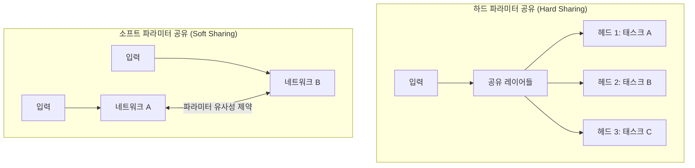
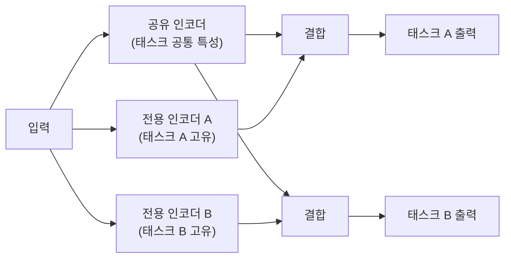
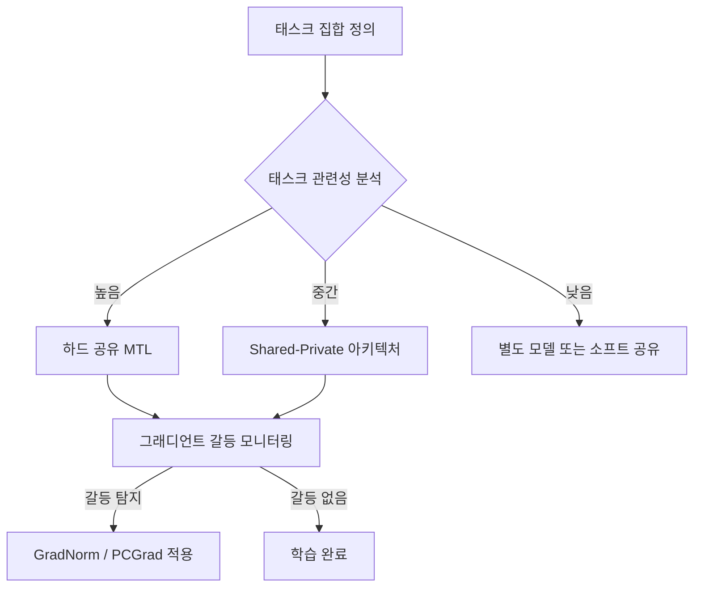

# 멀티태스크 학습 (Multi-Task Learning)

## 개요

멀티태스크 학습(Multi-Task Learning, MTL)은 여러 관련 태스크를 동시에 학습하여 공유 표현(shared representation)을 통해 개별 태스크의 성능을 상호 향상시키는 기계학습 패러다임이다. 단일 태스크만 학습할 때 발생하는 과적합을 방지하고, 관련 태스크들로부터 추가적인 귀납 편향(inductive bias)을 얻는다. Rich Caruana(1997)의 연구에서 체계화되었으며, 현대 NLP에서는 BERT 계열의 사전학습, T5, GPT 등 대형 언어 모델의 근간 원리가 되었다.

## 핵심 동기

단일 태스크 학습의 한계를 MTL이 극복하는 방식:

1. **정규화 효과**: 여러 태스크의 목표를 동시에 충족해야 하므로, 특정 태스크에 과적합되는 현상이 억제된다
2. **데이터 증강**: 한 태스크의 레이블 부족을 다른 태스크의 신호로 보완한다
3. **표현 공유**: 유사 태스크 간 공통 특성을 추출하여 샘플 효율성을 높인다
4. **도메인 적응**: 풍부한 데이터가 있는 보조 태스크가 희소 데이터 주 태스크를 지원한다

## 하드 파라미터 공유 vs. 소프트 파라미터 공유

| 방식 | 구조 | 장점 | 단점 |
|------|------|------|------|
| 하드 공유 | 공통 인코더 + 태스크별 헤드 | 파라미터 효율적, 구현 단순 | 태스크 갈등 발생 가능 |
| 소프트 공유 | 태스크별 네트워크 + 정규화 제약 | 태스크별 유연성 확보 | 파라미터 수 증가 |

현대 NLP에서는 하드 파라미터 공유가 압도적으로 많이 쓰인다. [[supervised-fine-tuning]]에서 언어 모델을 공유 인코더로 두고 태스크별 헤드를 붙이는 방식이 대표적이다.

## Shared-Private 아키텍처

MTL에서 모든 정보를 공유하면 태스크 고유 정보가 손실될 수 있다. 이를 해결하는 Shared-Private 분리 구조:

공유 표현은 태스크 공통의 일반 특성을, 전용 표현은 태스크 고유의 특수 특성을 학습한다. Liu et al.(2017)의 "Adversarial Multi-task Learning for Text Classification"이 대표적 구현이다.

## 음의 전이 (Negative Transfer)

멀티태스크 학습의 가장 큰 위험은 태스크 간 음의 전이(Negative Transfer)다. 두 태스크의 최적 표현이 상충할 때, 한 태스크의 학습이 다른 태스크의 성능을 오히려 저하시키는 현상이다.

음의 전이가 발생하기 쉬운 조건:
- 태스크 간 관련성이 낮거나 목표가 상충
- 태스크별 데이터 양의 극단적 불균형
- 태스크 난이도가 크게 다른 경우

### 완화 방법

- **태스크 가중치 조정**: 그래디언트 노름 기반 GradNorm, 불확실성 기반 가중치(Kendall et al., 2018)
- **태스크 그루핑**: 관련성이 높은 태스크끼리만 묶기 (태스크 유사도 측정 후 클러스터링)
- **Gradients Surgery**: 충돌하는 그래디언트를 투영하여 제거 (PCGrad, Yu et al., 2020)

## LLM과의 관계

현대 대형 언어 모델은 사실상 대규모 멀티태스크 학습의 산물이다. GPT 계열은 사전학습 단계에서 다음 토큰 예측이라는 단일 목표를 사용하지만, 이 목표 자체가 번역, 요약, 추론, 코드 생성 등 수많은 태스크의 신호를 내포한다. [[transfer-learning]]의 관점에서 사전학습된 LLM을 특정 태스크에 적응시키는 것은 MTL로 학습된 공유 표현을 활용하는 과정이다.

## 실무 적용 패턴

## 관련 문서

- [[transfer-learning]] - 사전학습된 표현을 새 태스크에 적응시키는 관련 패러다임
- [[supervised-fine-tuning]] - MTL로 학습된 모델을 단일 태스크에 미세조정
- [[bias-variance-tradeoff]] - MTL이 정규화 효과로 분산을 줄이는 이론적 근거
- [[self-supervised-learning]] - 레이블 없이 보조 태스크를 구성하는 전략
