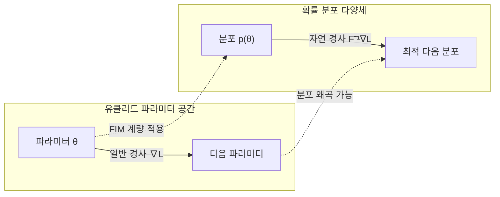

# 자연 경사법 (Natural Gradient)

## 개요

자연 경사법(Natural Gradient)은 Amari(1998)가 제안한 최적화 방법으로, 파라미터 공간이 아닌 **분포 공간(확률 분포의 다양체)** 위에서 경사 하강을 수행한다. 일반적인 경사 하강법이 유클리드 기하학을 가정하는 반면, 자연 경사법은 확률 분포 공간의 **리만 기하학(Riemannian geometry)** 을 고려한다.

핵심 동기는 파라미터의 단순 수치 변화가 확률 분포의 변화량을 왜곡할 수 있다는 점이다. 두 파라미터 집합이 수치적으로 비슷해 보여도 만들어내는 분포는 크게 다를 수 있고, 반대로 수치적으로 크게 달라도 분포는 거의 동일할 수 있다.

## Fisher 정보 행렬

자연 경사법의 핵심 도구는 **Fisher 정보 행렬(Fisher Information Matrix, FIM)** $F$다:

$$F(\theta) = \mathbb{E}_{x \sim p(x|\theta)} \left[ \nabla_\theta \log p(x|\theta) \cdot \nabla_\theta \log p(x|\theta)^\top \right]$$

Fisher 행렬은 파라미터 공간에서의 리만 계량(Riemannian metric)으로 기능하며, **로컬에서 확률 분포가 얼마나 빠르게 변화하는지**를 정량화한다. 즉, FIM은 파라미터 변화에 대한 분포 변화의 민감도다.

## 자연 경사 업데이트 규칙

일반 경사 하강법과 자연 경사법의 업데이트 비교:

| 방법 | 업데이트 규칙 |
|------|-------------|
| 표준 경사 하강 | $\theta \leftarrow \theta - \eta \nabla_\theta \mathcal{L}$ |
| 자연 경사법 | $\theta \leftarrow \theta - \eta F(\theta)^{-1} \nabla_\theta \mathcal{L}$ |

$F^{-1} \nabla \mathcal{L}$ 을 **자연 경사(natural gradient)** 라 부른다. FIM의 역행렬이 파라미터 공간을 분포 공간의 곡률에 맞게 재조정하는 역할을 한다.

## 기하학적 직관

리만 다양체 위에서 최단 경로를 따라 이동하면, 동일한 스텝에서 더 효율적으로 최적점에 도달한다. 자연 경사법이 표준 경사법보다 **수렴 속도가 빠른** 이유다.

## TRPO와 PPO 연결

자연 경사법의 가장 중요한 응용 중 하나는 강화학습의 신뢰 영역 정책 최적화(TRPO)다. TRPO는 정책 업데이트 시 KL 발산을 제약으로 두는데, 이는 자연 경사법의 Fisher 제약과 동치다:

$$\max_\theta \mathcal{L}(\theta) \quad \text{s.t.} \quad D_{\text{KL}}(p_{\text{old}} \| p_\theta) \leq \delta$$

PPO(Proximal Policy Optimization)는 이 제약을 클리핑으로 근사하여 계산 비용을 낮춘다.

## 계산상의 문제

자연 경사법의 가장 큰 약점은 **FIM 역행렬 계산의 비용**이다. 파라미터 수가 $d$라면 FIM은 $d \times d$ 행렬이므로 역행렬 계산이 $O(d^3)$이 된다. 현대 대규모 신경망에서는 사실상 직접 계산이 불가능하다.

이를 해결하기 위한 근사 방법들:

- **K-FAC (Kronecker-Factored Approximate Curvature)**: 레이어별로 FIM을 크로네커 곱으로 분해 ([[ second-order-optimization ]] 참조)
- **Diagonal approximation**: FIM의 대각 원소만 사용
- **Gauss-Newton 근사**: FIM을 가우스-뉴턴 행렬로 대체

## 자연 경사와 2차 최적화의 관계

자연 경사법은 [[second-order-optimization]] 과 깊이 연결된다:

- 뉴턴법은 헤시안 $H^{-1} \nabla L$ 을 사용
- 자연 경사법은 Fisher 역행렬 $F^{-1} \nabla L$ 을 사용
- 가우시안 출력 모델에서 헤시안과 FIM은 근사적으로 동치

즉, 자연 경사법은 **확률 모델에 특화된 뉴턴법**으로 이해할 수 있다.

## 실무 적용 요약

- 강화학습 정책 최적화 (TRPO, Natural Policy Gradient)
- 신경망 레이어 단위 2차 최적화 (K-FAC)
- 연속 학습(Continual Learning)에서 중요 파라미터 보호
- 베이지안 신경망 추론

## 관련 문서

- [[optimization-theory]] - 최적화 이론 기초 및 1차 방법들
- [[gradient-descent-backpropagation]] - 표준 경사 하강법과의 비교
- [[second-order-optimization]] - K-FAC, L-BFGS 등 2차 최적화 방법
- [[kl-divergence]] - 분포 간 거리 측정, TRPO 제약 조건으로 활용
