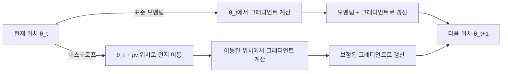

# 네스테로프 가속 그래디언트

## 정의와 배경

네스테로프 가속 그래디언트(Nesterov Accelerated Gradient, NAG)는 Yurii Nesterov가 1983년에 제안한 1차 최적화 알고리즘이다. 볼록(convex) 목적 함수에서 표준 그래디언트 디센트 대비 이론적으로 최적의 수렴률을 달성하며, "추측 후 보정(look-ahead and correct)" 패턴으로 직관적으로 이해할 수 있다.

딥러닝 맥락에서는 표준 모멘텀 SGD의 개선 버전으로 사용되며, Adam의 NAdam 변형 등에도 통합되어 있다.

---

## 표준 모멘텀 vs 네스테로프 모멘텀

### 표준 모멘텀 (Polyak Momentum)

표준 모멘텀은 이전 갱신 방향을 관성으로 활용한다:

$$v_t = \mu v_{t-1} - \eta \nabla f(\theta_t)$$
$$\theta_{t+1} = \theta_t + v_t$$

현재 위치 $\theta_t$에서 그래디언트를 계산한 후, 모멘텀을 더해 갱신한다.

### 네스테로프 모멘텀

네스테로프 방식은 **먼저 모멘텀 방향으로 이동한 위치에서 그래디언트를 계산**한다:

$$v_t = \mu v_{t-1} - \eta \nabla f(\theta_t + \mu v_{t-1})$$
$$\theta_{t+1} = \theta_t + v_t$$

여기서 $\theta_t + \mu v_{t-1}$이 "예측된 미래 위치(lookahead position)"다.

### 핵심 차이



직관적으로: 어디로 갈지 먼저 추측하고(모멘텀 방향으로 이동), 그 위치에서 실수를 보정(그래디언트 계산)한다. 과도한 관성을 미리 제동하는 효과가 있다.

---

## 수렴 이론

### 볼록 함수에서의 최적 수렴률

그래디언트 디센트 계열 알고리즘의 수렴률 비교:

| 알고리즘 | 수렴률 | 비고 |
|---------|--------|------|
| 그래디언트 디센트 | $O(1/T)$ | T: 반복 횟수 |
| 표준 모멘텀 | $O(1/T)$ (실용적으로 빠름) | 이론적 보장은 동일 |
| 네스테로프 가속 | $O(1/T^2)$ | 볼록 함수에서 1차 최적 |

Nesterov는 1차 정보(그래디언트)만 사용하는 알고리즘의 이론적 하한이 $O(1/T^2)$임을 증명하고, NAG가 이 하한을 달성함을 보였다. 즉 NAG는 1차 방법 중 이론적으로 최적이다.

### 강볼록(Strongly Convex) 함수

강볼록 함수에서는 더 강력한 보장이 가능하다:

- 그래디언트 디센트: $O(\exp(-T/\kappa))$ ($\kappa$: 조건수)
- NAG: $O(\exp(-T/\sqrt{\kappa}))$

조건수 $\kappa$가 클수록(ill-conditioned 문제) NAG의 이점이 두드러진다.

---

## PyTorch 구현

PyTorch의 SGD 옵티마이저는 `nesterov=True` 플래그로 NAG를 지원한다:

```python
import torch.optim as optim

# 네스테로프 모멘텀 SGD
optimizer = optim.SGD(
    model.parameters(),
    lr=0.01,
    momentum=0.9,
    nesterov=True
)
```

내부 구현에서는 표준 모멘텀 업데이트와 수치적으로 동등한 재매개변수화(reparametrization)를 사용한다:

```python
# 수치적으로 동등한 NAG 구현 (재매개변수화 형태)
# p: 파라미터 버퍼 (θ + μv 역할)
buf = mu * buf + grad              # 모멘텀 누적
grad_nesterov = grad + mu * buf    # 네스테로프 보정
param = param - lr * grad_nesterov
```

---

## 비볼록 함수에서의 NAG

딥러닝의 목적 함수는 비볼록(non-convex)이므로 NAG의 이론적 보장은 직접 적용되지 않는다. 그러나 실험적으로:

- 표준 모멘텀 대비 초기 수렴 속도가 빠른 경우가 많음
- 과도한 관성 억제로 날카로운 최솟값(sharp minima) 회피에 도움
- 특히 RNN 학습에서 효과적

그러나 Adam 계열이 범용 기본값이 된 이후, NAG 단독 사용은 줄어들었으며 주로 Adam의 NAdam 변형으로 통합되어 사용된다.

---

## NAdam: 네스테로프 + Adam

NAdam (Dozat, 2016)은 Adam에 네스테로프 모멘텀을 통합한 변형이다:

$$\theta_{t+1} = \theta_t - \frac{\eta}{\sqrt{\hat{v}_t} + \epsilon} \left(\beta_1 \hat{m}_t + \frac{(1-\beta_1) g_t}{1-\beta_1^t}\right)$$

PyTorch 구현:

```python
optimizer = optim.NAdam(
    model.parameters(),
    lr=0.002,
    betas=(0.9, 0.999)
)
```

일부 태스크에서 Adam 대비 수렴 속도가 빠르지만, 실용적 차이는 작은 경우가 많다.

---

## 실무 지침

### 언제 NAG를 고려하는가

- **컨벡스 최적화**: 이론적 보장이 필요한 학술 연구
- **단순 CNN 이미지 분류**: SGD+모멘텀 기반 레시피에서 NAG가 Adam 대비 더 나은 일반화를 보이는 경우 존재
- **물리 시뮬레이션, 수치 최적화**: 비 ML 최적화 문제

### 하이퍼파라미터

- **모멘텀 계수** $\mu$: 보통 0.9, 때로는 0.99
- **학습률 스케줄**: 코사인 감쇠(cosine decay) 또는 스텝 감쇠와 함께 사용
- **배치 크기**: 큰 배치에서 모멘텀이 더 중요해짐

### Adam이 선호되는 이유

NAG는 학습률 튜닝에 민감하고 적응적 학습률이 없어, 현대 대규모 모델 학습에서는 AdamW가 사실상 표준이다. NAG는 이론적 이해와 특정 레시피에서 여전히 유효하다.

---

## 관련 문서

- [[adagrad-rmsprop-history]] - 적응적 학습률 옵티마이저 계보
- [[sgd-convergence-theory]] - SGD 수렴 이론과 이론적 하한
- [[optimization-theory]] - 볼록 최적화 이론 기초
- [[sharpness-aware-minimization]] - 모멘텀과 평탄 최솟값의 관계
