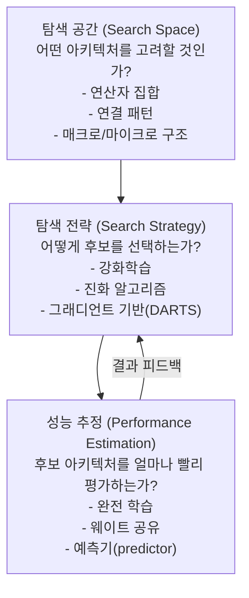
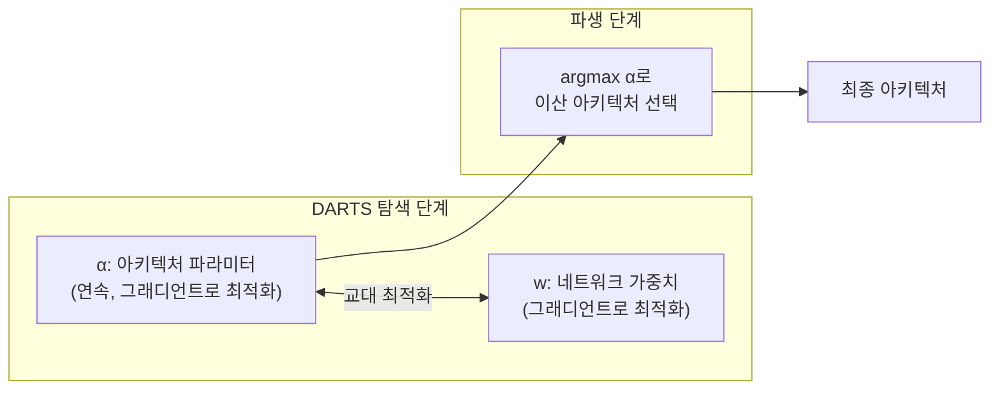

# 신경망 구조 탐색 (Neural Architecture Search, NAS)

신경망 구조 탐색(NAS)은 특정 태스크와 자원 제약 조건에 최적화된 신경망 아키텍처를 **자동으로 발견**하는 방법론이다. 하이퍼파라미터 최적화의 확장판으로 볼 수 있으며, 연산자 선택(convolution vs. attention), 연결 구조(skip connections), 계층 깊이/너비 등을 탐색 공간으로 설정한다. EfficientNet, MobileNetV3, NASNet 등 현재 배포되는 많은 효율적 아키텍처가 NAS로 발견되었다.

## NAS의 세 구성 요소

## 탐색 전략별 분류

### 강화학습 기반 NAS

Google Brain의 초기 NAS(Zoph & Le, 2017)는 컨트롤러 RNN이 아키텍처를 토큰 시퀀스로 생성하고, 검증 정확도를 보상 신호로 REINFORCE를 통해 컨트롤러를 업데이트했다.

- **단점**: 후보 아키텍처를 매번 처음부터 학습해야 해 수천 GPU-시간 필요
- **성과**: NASNet 셀 구조 발견. 당시 SOTA 달성

### 진화 알고리즘 기반 NAS

아키텍처를 "유전체"로 인코딩하고 돌연변이(mutation), 교차(crossover), 선택(selection)으로 세대를 거쳐 발전시킨다. Real et al.(2019)의 AmoebaNet이 대표적.

### DARTS: 미분 가능한 NAS

Liu et al.(2019)이 제안한 DARTS(Differentiable Architecture Search)는 **이산적 아키텍처 선택을 연속 완화(continuous relaxation)**해 그래디언트로 탐색한다.

각 엣지에서 가능한 연산 $o^{(i,j)} \in \mathcal{O}$를 소프트맥스 혼합으로 표현한다:

$$\bar{o}^{(i,j)}(x) = \sum_{o \in \mathcal{O}} \frac{\exp(\alpha_o^{(i,j)})}{\sum_{o'}\exp(\alpha_{o'}^{(i,j)})} \cdot o(x)$$

아키텍처 파라미터 $\alpha$와 가중치 $w$를 **교대 최적화(bilevel optimization)**로 학습한다:
- 내부 최적화: 현재 $\alpha$를 고정하고 $w$를 학습 데이터로 학습
- 외부 최적화: 현재 $w$를 고정하고 $\alpha$를 검증 데이터로 업데이트

탐색 후 $\alpha$가 가장 큰 연산만 남겨 이산 아키텍처로 파생(derive)한다.

## 하드웨어 인식 NAS (Hardware-Aware NAS)

정확도만 최적화하는 NAS의 실용적 한계를 극복하기 위해, 배포 타겟 하드웨어의 **지연 시간(latency), 에너지, 메모리**를 동시에 최적화하는 방향으로 발전했다.

### ProxylessNAS

실제 하드웨어에서 측정한 지연 시간을 미분 가능한 방식으로 목적 함수에 통합:

$$\text{Loss} = \text{CE Loss} + \lambda \cdot E[\text{Latency}]$$

지연 시간을 연산 선택 확률의 가중 합으로 근사해 그래디언트를 통과시킨다.

### Once-for-All (OFA)

하나의 슈퍼넷(supernet)을 학습하고, 다양한 하드웨어/정확도 요구에 맞는 서브네트워크를 탐색 없이 즉시 추출한다.

### MobileNetV3 / EfficientNet

- **MobileNetV3**: NAS + NetAdapt 알고리즘으로 모바일 환경 최적화. Inverted residual + SE 블록
- **EfficientNet**: 복합 스케일링(compound scaling)으로 너비/깊이/해상도를 동시 최적화. [[cnn]]의 대표 효율 아키텍처

## 탐색 공간 설계

| 탐색 공간 유형 | 설명 | 예시 |
|--------------|------|------|
| 마이크로 탐색 | 반복 사용되는 셀(cell) 구조 탐색 | NASNet 셀, DARTS 셀 |
| 매크로 탐색 | 전체 아키텍처 구조 탐색 | NAS(Zoph & Le), AmoebaNet |
| 계층별 탐색 | 각 계층의 연산자/크기 개별 탐색 | ProxylessNAS |
| 트랜스포머 탐색 | 어텐션 헤드, FFN 차원 등 탐색 | AutoFormer, HAT |

[[transformer-architecture]] 기반 NAS는 최근 활발히 연구되는 분야다.

## 성능 추정 가속화

전체 학습 없이 아키텍처를 빠르게 평가하는 방법들:

- **웨이트 공유(weight sharing)**: 슈퍼넷에서 파라미터를 공유해 단일 탐색 비용으로 모든 후보 평가
- **Zero-cost proxies**: 초기화 직후 순방향/역방향 패스 통계로 아키텍처 품질 예측 (학습 불필요)
- **학습 곡선 외삽**: 초기 몇 에폭의 결과로 최종 성능 예측

## CNN과의 관계

[[cnn]] 아키텍처 발전사를 NAS 관점에서 보면, AlexNet → VGG → ResNet → NASNet → EfficientNet은 점진적으로 탐색 공간이 자동화되는 과정이다. 수동 설계(hand-crafted)에서 자동 탐색으로의 패러다임 전환.

## 한계와 비판

1. **재현성 문제**: 탐색 결과가 하드웨어, 랜덤 시드, 구현 세부사항에 민감
2. **탐색 비용**: DARTS 이전 방법들은 수천 GPU-시간 소비. 탄소 발자국 문제
3. **전이 가능성**: 소규모 프록시 태스크에서 찾은 아키텍처가 목표 태스크에서 최적이 아닐 수 있음
4. **DARTS 불안정성**: 그래디언트 기반 탐색이 collapse(모든 skip connection 선택) 경향

## 관련 문서

- [[cnn]] - NAS가 자동화하고자 하는 수동 아키텍처 설계
- [[transformer-architecture]] - NAS가 확장되는 최신 탐색 공간
- [[loss-functions]] - NAS 다목적 최적화에서의 손실 함수 설계
- [[optimization-theory]] - DARTS의 bilevel 최적화 기반
