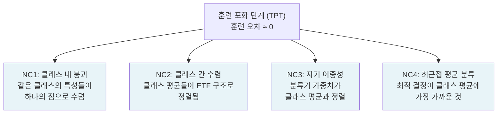

# 신경 붕괴 (Neural Collapse)

## 개요

신경 붕괴(Neural Collapse, NC)는 Papyan et al.(2020)이 발견한 현상으로, 분류(classification) 신경망이 훈련 손실의 포화(terminal phase of training, TPT) 이후에도 계속 훈련될 때 최종 레이어(penultimate layer)의 특성(feature)과 분류기 가중치(classifier weights)가 **정등각 꽉 찬 프레임(Equiangular Tight Frame, ETF)** 구조로 수렴하는 기하학적 현상이다.

## 네 가지 신경 붕괴 특성

신경 붕괴는 다음 네 가지 특성으로 구성된다:

## ETF(Equiangular Tight Frame)란

ETF는 다음 특성을 가진 벡터 집합 $\{m_1, ..., m_C\} \subset \mathbb{R}^d$이다 (C: 클래스 수, d: 특성 차원):

- **등각(equiangular)**: 서로 다른 두 클래스 평균 사이의 코사인 유사도가 모두 동일: $\langle m_i, m_j \rangle = -\frac{1}{C-1}$ for $i \neq j$
- **최대 분리(maximally separated)**: $d \geq C-1$일 때, 이 배열이 클래스 간 최대 분리를 달성하는 유일한 구조
- **정규화**: 모든 클래스 평균의 크기가 동일: $\|m_i\| = \text{const}$

직관적으로, C개의 클래스가 고차원 공간에서 서로 "최대한 균등하게" 배치되는 완벽한 대칭 구조다. 2D에서 3개 클래스라면 정삼각형의 꼭짓점, 3D에서 4개 클래스라면 정사면체의 꼭짓점에 해당한다.

## 왜 ETF로 수렴하는가

신경 붕괴는 [[cross-entropy-loss]] 최소화의 자연스러운 귀결이다. 훈련 손실이 0에 도달(즉 훈련 데이터 완벽 분류)한 이후에도 경사 하강이 계속되면, 손실을 더 낮추기 위해 클래스 간 마진(margin)을 최대화하는 방향으로 특성과 가중치가 재배열된다.

수학적으로, 이 최적화 문제의 전역 최적해(global optimum)가 정확히 ETF 구조임이 증명되었다. 즉 신경망은 훈련 후반부에 암묵적으로 "클래스 간 최대 마진"을 추구한다.

## 실험적 관찰

Papyan et al.(2020)은 다양한 설정에서 신경 붕괴를 확인했다:

| 설정 | 관찰 |
|------|------|
| CIFAR-10, ResNet-18 | TPT 이후 NC1-NC4 모두 관찰 |
| STL-10, VGG-11 | 동일 패턴 |
| 배치 정규화 없음 | NC 발생, 하지만 느림 |
| [[embedding-layers]] 고정 | NC 현상 지연 또는 약화 |

클래스 내 분산(NC1)은 훈련 손실 포화 시점부터 지수적으로 감소하며, ETF 정렬 정도(NC2)는 그 이후 서서히 개선된다.

## 이론적 의의

신경 붕괴는 딥러닝 이론에 중요한 시사점을 제공한다:

1. **최적 분류기의 기하학**: 완벽히 훈련된 분류기의 최종 레이어 특성이 어떤 구조를 가지는지 정확히 기술
2. **전이 학습 설명**: ETF 구조로 수렴한 특성은 새로운 클래스로 전이 시 자연스럽게 활용 가능
3. **불균형 데이터(imbalanced data)**: NC는 균형 데이터를 가정하며, 불균형 시 ETF 대신 다른 구조로 수렴한다는 후속 연구 존재
4. **[[embedding-layers]] 설계**: 최종 레이어 특성의 기하학이 분류 성능에 미치는 영향 이해

## 실무 응용

신경 붕괴 이론은 다음 실무 문제에 응용된다:

- **퓨샷 학습(Few-Shot Learning)**: ETF 구조를 미리 알고 있으면, 새로운 클래스의 프로토타입을 ETF 구조에 맞게 초기화할 수 있다
- **클래스 불균형**: NC 이론에서 불균형 데이터에 최적인 기하학 구조를 유도해 손실 함수 설계에 활용
- **분류기 없는 표현 학습**: ETF 고정 분류기(fixed ETF classifier)를 사용하고 특성 추출기만 학습하면 유사한 성능을 더 빠르게 달성
- **모델 압축**: NC가 발생한 모델의 최종 레이어는 ETF 구조를 알면 압축/근사가 용이

## [[cross-entropy-loss]]와의 관계

[[cross-entropy-loss]]는 신경 붕괴의 직접적인 원인이다. 소프트맥스 크로스엔트로피를 최소화하면서 모델이 암묵적으로 ETF 구조를 학습한다. 이 관찰은 크로스엔트로피가 단순히 분류 성능만이 아니라 특성 공간의 기하학적 구조까지 결정한다는 것을 의미한다.

다른 손실 함수(MSE, focal loss 등)에서도 신경 붕괴가 발생하는지는 활발한 연구 분야다.

## 관련 문서

- [[cross-entropy-loss]] - 신경 붕괴를 유발하는 손실 함수
- [[embedding-layers]] - 최종 레이어 특성 공간 구조
- [[overfitting-regularization]] - 훈련 포화 단계와 일반화
- [[grokking]] - 훈련 후반부의 또 다른 위상 전이 현상
