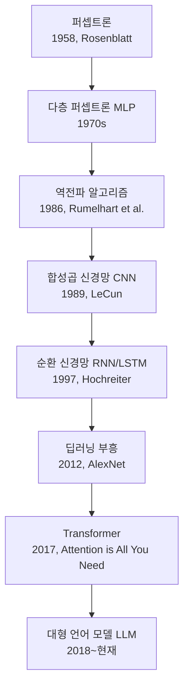
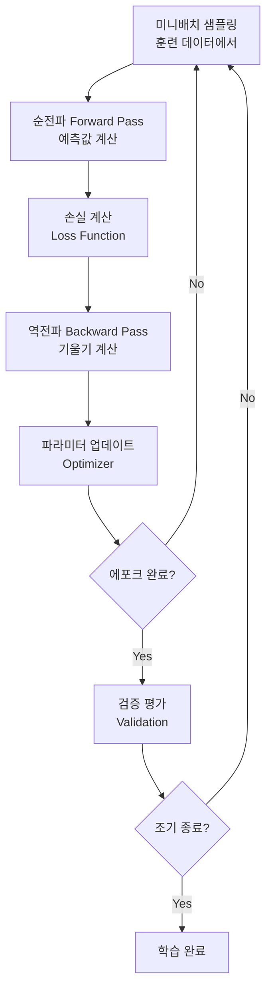

# 신경망 (Neural Network)

신경망(Neural Network)은 인간 뇌의 뉴런 연결 방식에서 영감을 받은 계산 모델이다. 수치 데이터를 입력받아 레이어를 통해 변환하고 출력을 생성한다. 현대 AI의 핵심 기반이며, 충분한 데이터와 파라미터가 주어지면 복잡한 함수를 근사(approximate)할 수 있다.

## 역사적 계보



각 이정표는 단순히 새 아키텍처의 등장이 아니라 그 시대의 한계(기울기 소실, 시퀀스 처리, 연산 병렬화 등)를 해결하는 방향으로 진화해왔다.

## 기본 구성 요소

### 뉴런 (Neuron)

신경망의 최소 단위. 입력 벡터 $x$에 가중치(weight) $w$를 곱하고 편향(bias) $b$를 더한 후 활성화 함수(activation function)를 통과시킨다.

$$z = w^T x + b$$
$$a = f(z)$$

여기서 $f$는 [[activation-functions|활성화 함수]]다.

### 레이어 (Layer)

뉴런들의 집합. 레이어는 크게 세 종류로 구분된다:
- **입력층(Input Layer)**: 원시 데이터 수신, 변환 없음
- **은닉층(Hidden Layer)**: 특징 추출, 1개 이상
- **출력층(Output Layer)**: 최종 예측값 생성

### 완전 연결 레이어 (Fully Connected / Dense Layer)

모든 입력 뉴런이 모든 출력 뉴런과 연결된 기본 레이어. 행렬 곱셈으로 표현:

$$Y = XW + b$$

- $X$: 입력 행렬 $(batch \times in\_features)$
- $W$: 가중치 행렬 $(in\_features \times out\_features)$
- $b$: 편향 벡터 $(out\_features)$

## 활성화 함수

[[activation-functions|활성화 함수]]는 비선형성을 도입하여 신경망이 단순 선형 함수 이상을 표현하게 한다.

| 함수 | 수식 | 범위 | 주요 용도 |
|------|------|------|-----------|
| **Sigmoid** | $\sigma(z) = \frac{1}{1+e^{-z}}$ | (0, 1) | 이진 분류 출력, 옛 은닉층 |
| **Tanh** | $\tanh(z) = \frac{e^z - e^{-z}}{e^z + e^{-z}}$ | (-1, 1) | RNN 은닉 상태 |
| **ReLU** | $\max(0, z)$ | [0, ∞) | 현대 딥러닝 표준 은닉층 |
| **GELU** | $z \cdot \Phi(z)$ | $(-\infty, +\infty)$ | Transformer (BERT, GPT) |
| **Swish** | $z \cdot \sigma(z)$ | $(-\infty, +\infty)$ | 모바일넷 계열 |
| **SoftMax** | $\frac{e^{z_i}}{\sum_j e^{z_j}}$ | (0,1), 합=1 | 다중 분류 출력 |

ReLU 이전 시대에는 Sigmoid/Tanh가 표준이었지만, 기울기 포화(gradient saturation) 문제로 인해 깊은 네트워크에서 [[backpropagation|역전파]] 시 기울기 소실(vanishing gradient)이 발생했다. ReLU는 이를 해결하는 단순한 함수다.

## 손실 함수 (Loss Function)

모델 예측과 실제 정답 간의 오차를 측정한다. [[backpropagation|역전파]]에서 이 오차를 기반으로 기울기를 계산한다.

| 손실 함수 | 수식 | 사용 |
|-----------|------|------|
| MSE | $\frac{1}{N}\sum(y_i - \hat{y}_i)^2$ | 회귀 |
| Binary Cross-Entropy | $-[y \log \hat{y} + (1-y)\log(1-\hat{y})]$ | 이진 분류 |
| Cross-Entropy | $-\sum_c y_c \log \hat{y}_c$ | 다중 분류 |
| Focal Loss | $(1-\hat{y})^\gamma \cdot \text{CE}$ | 클래스 불균형 |

## 학습 프로세스



1. **순전파**: 입력이 레이어를 통과하며 최종 예측값 계산
2. **손실 계산**: 예측값과 실제 레이블 비교
3. **역전파**: [[backpropagation|역전파]]로 각 파라미터의 기울기 계산
4. **파라미터 업데이트**: [[gradient-descent|경사하강법]] 또는 Adam 등으로 가중치 조정

## 주요 아키텍처 계보

### MLP (Multi-Layer Perceptron)

완전 연결 레이어를 여러 층 쌓은 가장 기본적인 심층 신경망. 표 형태 데이터(tabular data)에 강점.

```python
import torch
import torch.nn as nn

class MLP(nn.Module):
    def __init__(self, input_dim: int, hidden_dim: int, output_dim: int):
        super().__init__()
        self.network = nn.Sequential(
            nn.Linear(input_dim, hidden_dim),
            nn.ReLU(),
            nn.Linear(hidden_dim, hidden_dim),
            nn.ReLU(),
            nn.Linear(hidden_dim, output_dim)
        )

    def forward(self, x: torch.Tensor) -> torch.Tensor:
        return self.network(x)
```

### CNN (Convolutional Neural Network)

국소 수용장(local receptive field)과 가중치 공유(weight sharing)를 통해 공간적 패턴을 추출. 이미지 처리의 표준.

**핵심 구성:**
- **Convolution Layer**: 슬라이딩 필터로 특징 맵(feature map) 추출
- **Pooling Layer**: 공간 해상도 축소, 이동 불변성(translation invariance) 획득
- **Batch Normalization**: 각 배치 내 정규화로 학습 안정화

```
입력 이미지 [H × W × C]
    → Conv + ReLU
    → Pooling
    → Conv + ReLU
    → Pooling
    → Flatten
    → FC + Softmax
    → 클래스 확률
```

주요 CNN 모델: LeNet → AlexNet → VGG → ResNet → EfficientNet

### RNN / LSTM (Recurrent Neural Network)

순서가 있는 데이터(시계열, 텍스트)를 처리하기 위해 이전 상태를 현재 입력과 결합.

**RNN의 기본식:**
$$h_t = \tanh(W_h h_{t-1} + W_x x_t + b)$$

**LSTM (Long Short-Term Memory):**
기본 RNN의 장기 의존성(long-range dependency) 학습 한계를 해결하기 위해 Hochreiter & Schmidhuber(1997)가 제안. 게이트(Gate) 메커니즘으로 정보를 선택적으로 기억/망각한다.

| 게이트 | 역할 |
|--------|------|
| Forget Gate | 과거 정보를 얼마나 잊을지 |
| Input Gate | 새 정보를 얼마나 기억할지 |
| Output Gate | 현재 셀 상태를 얼마나 출력할지 |

LSTM → GRU(Gated Recurrent Unit, 간소화) → Attention 기반 방식으로 발전.

### Transformer

2017년 "Attention is All You Need" 논문에서 제안. Self-Attention 메커니즘으로 시퀀스 전체를 병렬 처리하여 RNN의 순차 처리 한계를 극복. [[transformer|Transformer]] 문서 참조.

**Self-Attention의 핵심:**
$$\text{Attention}(Q, K, V) = \text{softmax}\left(\frac{QK^T}{\sqrt{d_k}}\right)V$$

Transformer 이후 등장한 주요 모델 계열:
- **BERT 계열**: 양방향 인코더, 문장 이해
- **GPT 계열**: 자동회귀 디코더, 텍스트 생성
- **T5, BART**: 인코더-디코더, 시퀀스 변환
- **ViT**: 이미지 패치를 Transformer로 처리

## 정규화 기법

과적합(overfitting)을 방지하고 일반화 성능을 향상시키는 기법들:

| 기법 | 설명 | 효과 |
|------|------|------|
| **Dropout** | 학습 시 뉴런을 무작위로 비활성화 | 앙상블 효과 |
| **L2 Regularization (Weight Decay)** | 손실에 $\lambda \|W\|^2$ 추가 | 가중치 크기 억제 |
| **Batch Normalization** | 미니배치 단위로 활성화 정규화 | 빠른 수렴, 학습률 감도 감소 |
| **Layer Normalization** | 각 샘플 내 특징 차원 정규화 | Transformer 표준 |
| **Early Stopping** | 검증 손실 증가 시 학습 중단 | 과적합 방지 |

## 하이퍼파라미터

학습 전 설정하며 학습 중에는 변하지 않는 설정값:

| 하이퍼파라미터 | 일반적 범위 | 영향 |
|----------------|------------|------|
| 학습률 (lr) | 1e-5 ~ 1e-2 | 수렴 속도, 안정성 |
| 배치 크기 | 16 ~ 512 | 메모리, 기울기 노이즈 |
| 에포크 수 | 10 ~ 300 | 학습 충분도 |
| 은닉층 차원 | 64 ~ 4096 | 표현력 |
| 드롭아웃 비율 | 0.1 ~ 0.5 | 정규화 강도 |
| 가중치 초기화 | Xavier, Kaiming | 초기 기울기 흐름 |

## 범용 근사 정리 (Universal Approximation Theorem)

충분히 많은 뉴런을 가진 단일 은닉층 MLP는 연속 함수를 임의의 정확도로 근사할 수 있다. 이론적 보증이지만, "충분히 많은"의 실용적 한계와 학습 가능성은 별개 문제다. 실무에서는 넓은 망 하나보다 깊은 망이 더 효율적인 표현을 학습하는 것으로 알려져 있다.

## PyTorch 기반 전형적 학습 루프

```python
import torch
import torch.nn as nn
from torch.utils.data import DataLoader

def train_epoch(
    model: nn.Module,
    loader: DataLoader,
    optimizer: torch.optim.Optimizer,
    criterion: nn.Module,
    device: torch.device,
) -> float:
    model.train()
    total_loss = 0.0
    for batch_x, batch_y in loader:
        batch_x, batch_y = batch_x.to(device), batch_y.to(device)
        optimizer.zero_grad()
        predictions = model(batch_x)
        loss = criterion(predictions, batch_y)
        loss.backward()           # 역전파: 기울기 계산
        optimizer.step()          # 파라미터 업데이트
        total_loss += loss.item()
    return total_loss / len(loader)
```

## 관련 문서

- [[backpropagation]] - 기울기 계산의 핵심 알고리즘
- [[gradient-descent]] - 파라미터 최적화 방법론
- [[activation-functions]] - 활성화 함수 상세
- [[transformer]] - 현대 딥러닝의 지배적 아키텍처
- [[softmax]] - 분류 출력층의 핵심 함수
