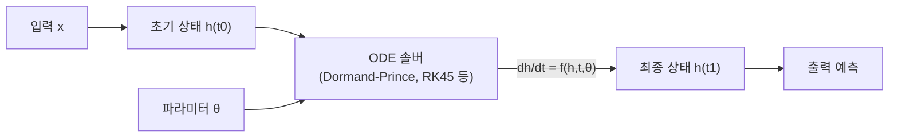

# 신경 미분방정식 (Neural ODE)

Neural ODE(신경 미분방정식)는 신경망의 잔차 연결(residual connection)을 연속 시간 체계로 일반화한 모델 클래스다. 2018년 Chen et al.이 NeurIPS에서 발표했으며, 이산 레이어 스택 대신 **연속 깊이(continuous depth)** 개념을 도입해 역전파와 메모리 효율을 동시에 개선했다.

## 핵심 아이디어: ResNet에서 ODE로

일반 ResNet의 잔차 블록은 다음 점화식을 따른다:

$$h_{t+1} = h_t + f(h_t, \theta_t)$$

스텝 크기 $\Delta t \to 0$으로 극한을 취하면 상미분방정식(ODE)이 된다:

$$\frac{dh(t)}{dt} = f(h(t), t, \theta)$$

상태 $h(t)$는 초기값 $h(t_0)$에서 출발해 ODE 솔버(solver)가 $h(t_1)$까지 적분한다. 신경망은 이 ODE의 **동역학 함수 $f$** 를 파라미터화하는 역할을 한다.

ODE 솔버가 적분 경로를 결정하기 때문에 스텝 수(레이어 수)는 고정되지 않고 솔버의 오차 허용치(tolerance)에 따라 동적으로 결정된다.

## ODE 솔버와 역전파

Neural ODE의 학습은 일반 역전파로 직접 수행할 수 없다. 솔버 내부의 모든 중간 상태를 메모리에 저장하면 O(L) 공간이 필요하기 때문이다. 이를 해결하기 위해 **adjoint method(수반 방법)**를 사용한다.

adjoint 상태 $a(t) = \partial \mathcal{L} / \partial h(t)$를 역방향 ODE로 적분해 그래디언트를 계산한다:

$$\frac{da(t)}{dt} = -a(t)^T \frac{\partial f}{\partial h}$$

이 덕분에 메모리 복잡도가 O(1)로 고정된다. 역방향 적분도 ODE 솔버가 담당하며, 이를 위한 보조 ODE 시스템이 필요하다.

## 주요 속성과 장점

| 속성 | 설명 |
|------|------|
| 연속 깊이 | 레이어 수가 이산적이지 않음. 적분 구간으로 "깊이" 표현 |
| 메모리 효율 | adjoint method로 O(1) 메모리 학습 가능 |
| 적응형 계산 | 솔버가 정밀도에 따라 NFE(함수 평가 횟수) 조절 |
| 역변환 가능성 | 시간을 역방향으로 적분하면 입력을 복원할 수 있음 |

## 시간 복잡도와 NFE

ODE 솔버는 각 스텝에서 신경망 $f$를 한 번 이상 호출한다. 이 호출 횟수를 NFE(Number of Function Evaluations)라고 부른다. 정확도 요건이 높을수록 NFE가 증가해 계산 비용이 늘어난다. 따라서 실용적 Neural ODE 연구에서는 NFE를 줄이는 것이 중요한 주제다.

## 확장과 변형

- **Latent ODE**: 관측이 불규칙한 시계열에 RNN 인코더와 결합. 누락 데이터 처리에 강함
- **Augmented Neural ODE (ANODE)**: 상태 공간을 확장해 표현력 제한을 극복
- **Neural SDE**: 확률론적 미분방정식으로 불확실성 모델링 추가
- **ODE-Net for normalizing flows**: 가역성을 이용한 밀도 추정 ([[ normalizing-flows]] 참조)

## 한계

1. **느린 학습**: ODE 솔버 호출이 반복되므로 이산 ResNet보다 학습이 느림
2. **NFE 제어 어려움**: 복잡한 동역학에서 솔버가 수렴하지 않거나 NFE가 폭증할 수 있음
3. **표현력 제약**: 1-Lipschitz 동역학은 위상 변환 불가. ANODE가 이를 해결하려 시도

## 실무 적용 분야

- **불규칙 시계열 모델링**: 의료 기록, 금융 데이터처럼 관측 간격이 일정하지 않은 데이터
- **연속 정규화 흐름(Continuous Normalizing Flow, CNF)**: [[normalizing-flows]] 의 특수 케이스
- **물리 시뮬레이션**: [[physics-informed-neural-networks]] 와 결합해 물리 법칙 내재화
- **시퀀스 모델**: [[rnn-lstm-gru]] 를 대체하는 연속 시간 대안

## 관련 문서

- [[rnn-lstm-gru]] - 이산 시간 순환 신경망의 기초
- [[normalizing-flows]] - ODE 기반 연속 정규화 흐름
- [[diffusion-models]] - 연속 시간 SDE 관점의 생성 모델
- [[physics-informed-neural-networks]] - ODE/PDE 제약 신경망
- [[loss-functions]] - adjoint 기반 그래디언트와 목적 함수
