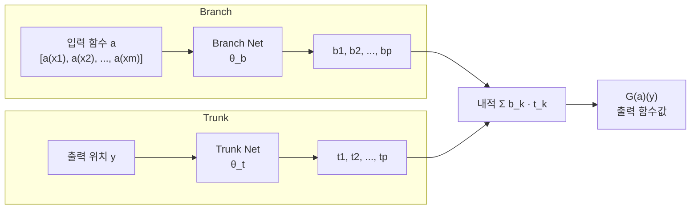
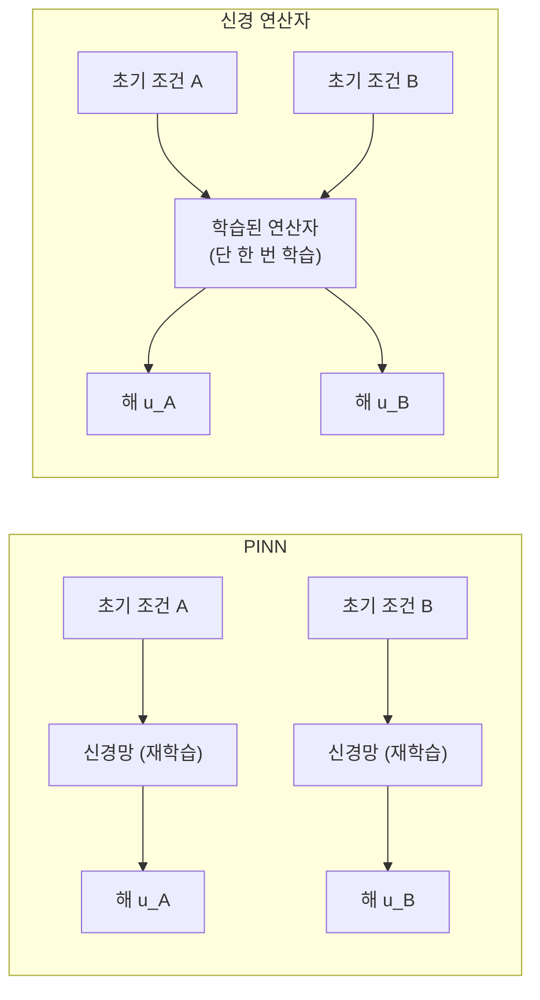

# 신경 연산자

신경 연산자(Neural Operators)는 함수 공간(function space) 사이의 **연산자(operator)**를 신경망으로 학습하는 프레임워크다. 일반적인 신경망이 유한 차원 벡터를 입력받아 벡터를 출력한다면, 신경 연산자는 **함수를 입력받아 함수를 출력**한다. 편미분 방정식(PDE) 풀기, 기후 시뮬레이션, 계산 물리학 등에서 전통 수치 해석기를 대체하는 AI 솔버로 주목받는다.

## 왜 함수 공간인가

기존 물리 시뮬레이션 방법(유한 요소법, 유한 차분법)은 격자(grid) 해상도에 직접 의존한다. 해상도를 바꾸면 재계산이 필요하고, 비용이 격자 크기에 비례한다.

신경 연산자는 **이산화 불변성(discretization invariance)**을 목표로 한다. 즉, 학습 시 사용한 격자와 다른 해상도에서도 추론이 가능하다. 이는 PDE의 파라미터나 초기 조건이 달라질 때마다 빠른 솔버가 필요한 과학 계산의 핵심 요구사항을 충족한다.

## 연산자 학습의 형식적 정의

연산자 $\mathcal{G}: \mathcal{A} \to \mathcal{U}$를 학습하고자 한다. 여기서:
- $\mathcal{A}$: 입력 함수 공간 (예: PDE의 초기 조건, 경계 조건)
- $\mathcal{U}$: 출력 함수 공간 (예: PDE의 해)
- $\mathcal{G}$: 이들 사이의 연산자 (예: PDE 풀이 과정 자체)

훈련 데이터: $\{(a_i, u_i)\}_{i=1}^N$ where $u_i = \mathcal{G}(a_i)$

## DeepONet (Deep Operator Network)

Lu et al. (2019/2021)이 제안한 DeepONet은 **보편 근사 정리의 연산자 버전**(Universal Approximation Theorem for Operators)을 기반으로 한다.

### 아키텍처

DeepONet은 두 신경망의 내적으로 연산자를 근사한다:

$$\mathcal{G}_\theta(a)(y) = \sum_{k=1}^p b_k(a;\, \theta_b) \cdot t_k(y;\, \theta_t)$$

- **Branch 네트워크** $b_k$: 입력 함수 $a$의 센서 값들 $[a(x_1), \ldots, a(x_m)]$ 을 인코딩
- **Trunk 네트워크** $t_k$: 출력 점 $y$의 위치를 인코딩

Branch는 함수의 전역 특성을, Trunk는 공간 위치의 지역 특성을 담당한다. 두 네트워크의 분리 덕분에 **임의의 출력 위치** $y$에서 추론 가능하다.

## 푸리에 신경 연산자 (FNO)

Li et al. (2020)이 제안한 FNO(Fourier Neural Operator)는 푸리에 공간에서 학습 가능한 필터로 전역 합성곱 연산자를 근사한다.

### 핵심 레이어

$$v_{t+1}(x) = \sigma\!\left(W v_t(x) + \left(\mathcal{F}^{-1}\!\left[R_\phi \cdot \mathcal{F}[v_t]\right]\right)(x)\right)$$

- $\mathcal{F}$: 이산 푸리에 변환 (FFT 활용)
- $R_\phi$: 주파수 공간에서의 학습 가능한 복소 가중치 행렬 (저주파 성분만 유지)
- $W$: 국소 선형 변환
- $\sigma$: 비선형 활성화

FNO의 핵심 아이디어는 **전역 합성곱을 주파수 공간의 원소별 곱으로 대체**하는 것이다. FFT 덕분에 계산 복잡도는 $O(n \log n)$이 된다.

### DeepONet vs FNO 비교

| 항목 | DeepONet | FNO |
|------|---------|-----|
| 이론 근거 | 연산자 보편 근사 정리 | 주파수 공간 합성곱 |
| 계산 복잡도 | $O(n \cdot m)$ | $O(n \log n)$ |
| 격자 의존성 | 낮음 (점별 추론) | 중간 (FFT 격자 필요) |
| 강점 | 불규칙 격자, 유연한 입력 | 주기적 구조, 빠른 훈련 |
| 응용 | 다변수 PDE | 유체 역학, 기상 |

## [[physics-informed-neural-networks]]과의 차이

[[physics-informed-neural-networks]](PINN)는 **하나의 PDE 인스턴스**(고정된 초기/경계 조건)를 푸는 데 최적화된다. 즉, PDE 파라미터가 바뀌면 재학습이 필요하다.

신경 연산자는 **PDE 인스턴스 패밀리 전체**를 한꺼번에 학습한다. 초기 조건이 달라져도 단 한 번의 순전파로 해를 얻는다.

## 실제 응용 사례

- **기후 모델링**: 대기 유체 방정식의 빠른 에뮬레이터. NVIDIA FourCastNet이 FNO 기반.
- **재료 과학**: 탄성 방정식의 응력-변형 관계 학습.
- **전자기**: 맥스웰 방정식 솔버 근사.
- **약물 설계**: 분자 동역학 시뮬레이션 가속화.

## [[neural-ode]]와의 관계

[[neural-ode]]는 ODE 형태의 동역학을 신경망으로 파라미터화한다. 신경 연산자는 이보다 더 일반적으로 **임의의 연산자**(ODE/PDE 해 연산자 포함)를 학습할 수 있다. Neural ODE가 특수한 경우라고 볼 수 있다.

## 한계와 도전

1. **대규모 데이터 필요**: 전통 수치해석과의 경쟁에서 시뮬레이션 데이터 생성 비용이 관건.
2. **물리적 일관성 보장 부재**: 질량 보존, 에너지 보존 같은 물리 법칙이 자동으로 보장되지 않는다.
3. **외삽 취약**: 학습 분포 밖의 초기 조건에서 성능 저하.
4. **3D 고해상도**: FFT 비용과 메모리 한계.

## 관련 문서

- [[physics-informed-neural-networks]] - 물리 법칙을 손실에 내재한 신경망
- [[neural-ode]] - ODE 동역학의 신경망 파라미터화
- [[implicit-neural-representations]] - 연속 함수의 신경망 표현
- [[spectral-methods-ml]] - 푸리에/스펙트럼 방법론의 ML 응용
