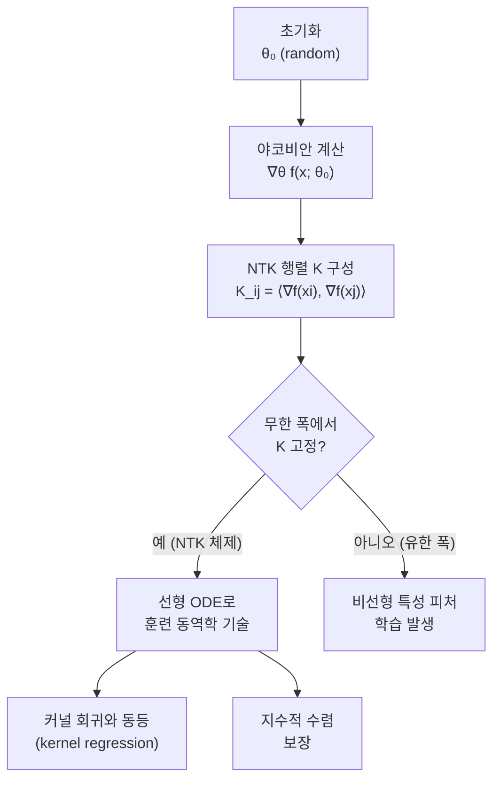

# 신경 접선 커널 (Neural Tangent Kernel)

## 개요

신경 접선 커널(Neural Tangent Kernel, NTK)은 무한 폭(infinite-width) 신경망의 경사 하강 훈련 동역학을 커널 방법(kernel method)으로 정확히 기술할 수 있다는 이론적 프레임워크다. Jacot et al.(2018)이 제안한 이 이론은 신경망이 왜, 어떻게 수렴하는지에 대한 수학적 설명을 제공하며, 딥러닝의 이론적 기반을 강화하는 데 중요한 역할을 한다.

## 핵심 아이디어

신경망 $f(x; \theta)$를 입력 $x$에 대해 파라미터 $\theta$로 정의할 때, 두 입력 $x$와 $x'$ 사이의 NTK는 다음과 같이 정의된다:

$$K(x, x') = \left\langle \nabla_\theta f(x; \theta), \nabla_\theta f(x'; \theta) \right\rangle$$

즉, NTK는 파라미터 공간에서의 야코비안(Jacobian) 내적으로 정의되는 커널이다. 핵심 주장은: **네트워크 폭이 무한대로 갈 때**, 훈련 전 과정에서 NTK가 초기값에서 거의 변하지 않고 고정된다는 것이다.

## 훈련 동역학과의 연결

무한 폭 한계에서 연속 시간 경사 하강(continuous-time gradient descent)의 출력은 다음 선형 ODE를 따른다:

$$\frac{d}{dt} f(X; \theta_t) = -K(X, X) \cdot (f(X; \theta_t) - y)$$

여기서 $K(X, X)$는 훈련 데이터에서 계산된 NTK 행렬이다. 이 ODE의 해는 지수적으로 수렴하며, 수렴 속도는 $K$의 최소 고유값에 의해 결정된다.

## 커널 회귀와의 동등성

무한 폭 신경망이 NTK 체제에 있을 때, 훈련 완료 후 새로운 입력 $x_*$에 대한 예측은 커널 회귀와 수학적으로 동등하다:

$$f_\infty(x_*) = K(x_*, X) \cdot K(X, X)^{-1} \cdot y$$

이는 신경망 훈련이 특정 조건 하에서 비모수적 커널 방법으로 완전히 분석 가능함을 의미한다.

## NTK 체제의 특성 및 한계

| 특성 | NTK 체제 (무한 폭) | 실제 유한 폭 신경망 |
|------|-------------------|-------------------|
| 파라미터 변화량 | 매우 작음 (lazy training) | 크고 동적 |
| 피처 학습 | 없음 (고정된 랜덤 피처) | 존재 (표현 학습) |
| 수렴 보장 | 수학적으로 보장 | 경험적으로만 관찰 |
| 일반화 | 커널 회귀와 동등 | 더 복잡한 귀납적 편향 |
| 실제 성능 | 현대 딥러닝 대비 열세 | 우세 |

NTK 이론의 중요한 한계는 실제로 사용하는 유한 폭 네트워크에서는 피처 학습(feature learning)이 발생한다는 점이다. 이 피처 학습이야말로 딥러닝의 실용적 강점인데, NTK 체제는 이를 포착하지 못한다.

## Maximal Update Parametrization (muP)과의 관계

Greg Yang 등은 NTK 이론을 발전시켜 피처 학습이 일어나는 체제인 muP(Maximal Update Parametrization)를 제안했다. muP는 폭이 커져도 피처 학습이 유지되도록 파라미터화를 조정하며, 작은 모델에서 찾은 최적 하이퍼파라미터를 큰 모델로 전이(transfer)할 수 있게 한다. 이는 [[scaling-laws]] 연구와 직접 연결된다.

## 이론적 의의

1. **수렴 증명**: 과잉 파라미터화된 신경망이 전역 최솟값에 수렴할 수 있음을 이론적으로 보여줌
2. **초기화의 중요성**: [[weight-initialization]] 방법이 NTK의 스펙트럼에 영향을 미침을 설명
3. **깊이와 폭의 역할**: 네트워크 구조가 커널 형태를 어떻게 결정하는지 분석 가능
4. **일반화 이해**: 커널 회귀 관점에서 신경망의 일반화를 분석하는 새로운 도구 제공

## 실무 적용 관점

NTK는 주로 이론 연구에서 활용되지만, 실무적 시사점도 존재한다:

- **학습률 스케일링**: 폭에 따라 학습률을 어떻게 조정해야 하는지에 대한 지침 제공
- **하이퍼파라미터 전이**: muP를 통해 소형 모델에서 대형 모델로 최적 설정 전이
- **아키텍처 선택**: 어떤 구조가 더 나은 커널 스펙트럼을 가지는지 이론적 분석 가능
- **과잉 파라미터화 이해**: [[double-descent]] 현상과 연관된 이론적 기반 제공

## 관련 문서

- [[scaling-laws]] - 모델 크기와 성능 관계, muP와의 연결
- [[weight-initialization]] - NTK 스펙트럼에 영향을 주는 초기화 방법
- [[bias-variance-tradeoff]] - NTK가 재정의하는 고전적 편향-분산 프레임워크
- [[double-descent]] - 과잉 파라미터화와 NTK의 관계
