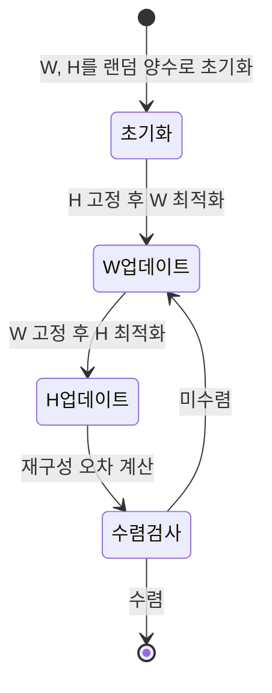

# 비음수 행렬 분해 (NMF)

## 개요

비음수 행렬 분해(Non-negative Matrix Factorization, NMF)는 비음수(non-negative) 행렬 $V \in \mathbb{R}^{m \times n}_{\geq 0}$를 두 개의 비음수 행렬의 곱으로 근사하는 기법이다:

$$V \approx WH, \quad W \in \mathbb{R}^{m \times r}_{\geq 0}, \quad H \in \mathbb{R}^{r \times n}_{\geq 0}$$

$r$은 분해 계수(rank)로 보통 $r \ll \min(m, n)$이다. Lee & Seung (1999)이 Nature에 발표한 논문으로 대중화되었으며, **비음수 제약이 부품 기반(parts-based) 표현을 자동으로 학습**한다는 특성으로 주목받았다.

PCA(주성분 분석)나 ICA(독립 성분 분석)와 달리 NMF는 더하기만 허용하고 빼기는 허용하지 않는다. 이는 자연 데이터(이미지, 텍스트 빈도, 음향 스펙트로그램)의 비음수 구조와 일치한다.

## 수학적 정식화

### 목적 함수 (Frobenius 노름)

$$\min_{W \geq 0, H \geq 0} \|V - WH\|_F^2 = \min_{W \geq 0, H \geq 0} \sum_{i,j} (V_{ij} - (WH)_{ij})^2$$

### KL 발산 버전

행렬 원소를 확률로 해석할 때 적합한 목적 함수:

$$\min_{W \geq 0, H \geq 0} D_\text{KL}(V \| WH) = \sum_{i,j} \left(V_{ij} \log \frac{V_{ij}}{(WH)_{ij}} - V_{ij} + (WH)_{ij}\right)$$

### 정규화 NMF

희소성 추가:

$$\min_{W, H \geq 0} \|V - WH\|_F^2 + \alpha \|W\|_1 + \beta \|H\|_1$$

## 최적화 알고리즘

비음수 제약 때문에 일반 경사 하강을 직접 적용하기 어렵다. 두 가지 주요 방법이 있다.

### 1. 곱셈 업데이트 규칙 (Multiplicative Update Rules)

Lee & Seung (1999)이 제안한 방법. 비음수를 자동으로 유지하는 우아한 업데이트:

**Frobenius 노름 최소화**:

$$H \leftarrow H \odot \frac{W^\top V}{W^\top W H}$$

$$W \leftarrow W \odot \frac{V H^\top}{W H H^\top}$$

- $\odot$: 원소별 곱 (Hadamard product)
- 분수도 원소별 나눗셈
- 분자와 분모가 모두 비음수 → $W, H$의 비음수성 보존

**KL 발산 최소화**:

$$H \leftarrow H \odot \frac{W^\top (V / WH)}{\mathbf{1}^\top W}$$

$$W \leftarrow W \odot \frac{(V / WH) H^\top}{W \mathbf{1}^\top}$$

수렴이 느리지만 구현이 간단하고 비음수를 항상 유지한다.

### 2. ALS (교대 최소 이분 제곱, Alternating Least Squares)

$W$와 $H$ 중 하나를 고정하고 다른 하나를 최소 이분 제곱으로 최적화, 교대 반복:

1. **H 업데이트** ($W$ 고정): $H = \arg\min_{H \geq 0} \|V - WH\|_F^2$
   - 비음수 제약 없으면: $H = (W^\top W)^{-1} W^\top V$
   - 비음수 제약 포함: 열별로 비음수 최소 이분 제곱(NNLS) 풀기

2. **W 업데이트** ($H$ 고정): $W = \arg\min_{W \geq 0} \|V - WH\|_F^2$
   - 행별로 NNLS 풀기

ALS는 곱셈 업데이트보다 빠르게 수렴하는 경우가 많다.



ALS 알고리즘의 상태 전이: W와 H를 교대로 업데이트하며 수렴까지 반복.

## 비음수 제약의 효과: 부품 기반 표현

### 얼굴 이미지 예시 (Lee & Seung 1999)

CBCL 얼굴 데이터셋으로 비교:

- **PCA**: 기저 이미지가 음수 포함, 전체 얼굴과 유사한 형태 ("전체론적")
- **VQ(벡터 양자화)**: 각 얼굴 = 단 하나의 템플릿 선택
- **NMF**: 기저 이미지가 눈, 코, 입, 눈썹 등 **얼굴 부품**으로 분해됨

비음수 제약 → 더하기만 가능 → 부품의 합으로만 표현 → 직관적·해석 가능한 표현.

## 텍스트 분석: 잠재 의미 분석 비교

| 방법 | 비음수 | 희소성 | 해석 가능성 |
|------|--------|--------|------------|
| SVD / LSA | 아니오 | 낮음 | 낮음 |
| NMF | 예 | 중간 | 높음 |
| LDA | 예 | 예 (디리클레) | 높음 |

TF-IDF 행렬에 NMF를 적용하면:
- $W$: 문서-토픽 행렬 (각 문서의 토픽 구성비)
- $H$: 토픽-단어 행렬 (각 토픽의 단어 분포)

LDA(Latent Dirichlet Allocation)와 유사한 결과를 더 단순한 방법으로 달성.

### 사이킷런 예시 (의사코드)

```python
from sklearn.decomposition import NMF

model = NMF(n_components=10, init='nndsvd', max_iter=200)
W = model.fit_transform(tfidf_matrix)  # 문서-토픽
H = model.components_                   # 토픽-단어
```

## 음원 분리: 음악/음성

스펙트로그램(spectrogram)은 시간-주파수-진폭의 비음수 행렬이다. NMF로 분리:

- $V$: 혼합 신호의 스펙트로그램 ($\text{주파수} \times \text{시간}$)
- $W$: 스펙트럼 기저 (각 음원의 주파수 패턴)
- $H$: 시간 활성화 (각 기저의 시간별 강도)

드럼, 베이스, 멜로디를 분리하거나 노이즈를 제거하는 데 사용된다.

## 고급 변형

### Semi-NMF

$W$만 비음수 제약, $H$는 자유:

$$V \approx WH, \quad W \geq 0$$

클러스터링 해석과 연결된다. $H$의 열이 소프트 클러스터 할당.

### Convex-NMF

$W$의 열이 $V$의 열의 볼록 결합이어야 하는 제약. 원형(prototypical) 패턴 추출.

### NTF (Non-negative Tensor Factorization)

3차원 이상 텐서로 확장. 예: 사용자-아이템-시간 텐서 분해로 시간별 추천 시스템.

### Online NMF

미니배치를 순차 처리. 스트리밍 데이터나 대용량 데이터셋에 적용 가능.

## 수렴 성질과 한계

### 국소 최솟값

NMF의 목적 함수는 $W$와 $H$ 각각에 대해서는 볼록이지만, 동시에는 비볼록이다. 곱셈 업데이트와 ALS 모두 국소 최솟값에 수렴할 수 있다.

### 초기화의 중요성

무작위 초기화가 결과에 크게 영향을 미친다. 개선된 초기화 방법:

- **NNDSVD(Non-negative Double Singular Value Decomposition)**: SVD 기반 초기화로 수렴 가속

### 유일성 (Uniqueness)

NMF 분해는 일반적으로 유일하지 않다. $(WH) = (WA^{-1})(AH)$로 스케일 모호성이 있다. 충분한 희소성이나 볼록 조건에서는 조건부 유일성이 성립한다.

## 실무 지침

1. **계수 $r$ 선택**: 실루엣 점수, 재구성 오차 곡선의 팔꿈치(elbow), 도메인 지식 활용
2. **정규화**: 과적합 방지와 희소성 증가를 위해 $L_1$ 항 추가 검토
3. **스케일링**: 입력 행렬을 TF-IDF, 로그 스케일 등으로 전처리
4. **초기화**: `nndsvd` 또는 `nndsvda`가 무작위 초기화보다 대개 우월
5. **다중 시작**: 다른 초기값으로 여러 번 실행 후 최적 결과 선택

## 관련 문서

- [[em-algorithm-gmm]] - EM 알고리즘: NMF의 확률론적 해석과 연결
- [[representation-learning-theory]] - 표현 학습 이론
- [[sparse-coding-dictionary-learning]] - 희소 코딩과의 관계: 희소 NMF
- [[gradient-descent-backpropagation]] - 경사 기반 NMF 최적화
- [[optimization-theory]] - 교대 최소화의 수렴 이론
