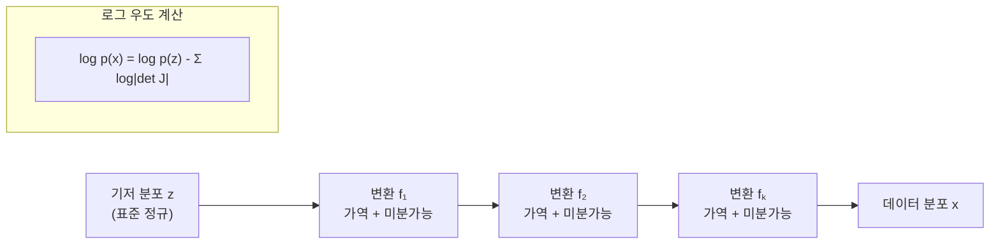

# 정규화 흐름 (Normalizing Flows)

정규화 흐름(Normalizing Flows, NF)은 단순한 기저 분포(보통 표준 정규분포)를 일련의 **가역적이고 미분 가능한 변환(invertible + differentiable)** 으로 복잡한 데이터 분포로 변환하는 생성 모델 패러다임이다. VAE([[autoencoders-vae]])나 GAN([[gans]])과 달리 **정확한 로그-우도(log-likelihood)를 직접 계산**할 수 있다는 것이 핵심 강점이다.

## 변수 변환 공식

확률 변수 $z \sim p_z(z)$에 가역 함수 $f: z \mapsto x$를 적용하면, 변환된 분포의 밀도는 다음과 같다:

$$p_x(x) = p_z(f^{-1}(x)) \left|\det \frac{\partial f^{-1}}{\partial x}\right|$$

또는 $f$를 기준으로:

$$\log p_x(x) = \log p_z(z) - \log \left|\det J_f(z)\right|$$

$J_f$는 $f$의 야코비안(Jacobian) 행렬이다. 변환을 $K$번 합성하면:

$$\log p_x(x) = \log p_z(z_0) - \sum_{k=1}^{K} \log \left|\det J_{f_k}(z_{k-1})\right|$$

## 핵심 설계 요건

정규화 흐름이 작동하려면 각 변환 $f_k$가 다음 두 조건을 모두 만족해야 한다:

1. **가역성(Invertibility)**: $f_k^{-1}$가 존재하고 효율적으로 계산 가능
2. **야코비안 행렬식 계산 가능성**: $\log |\det J_{f_k}|$를 효율적으로 계산 가능 (완전 행렬식은 $O(d^3)$ 비용)

## 주요 흐름 아키텍처

### Coupling Flows (결합 흐름)

차원을 두 파티션으로 나누어 한쪽이 다른 쪽을 조건부로 변환한다. 야코비안이 삼각 행렬이 되어 행렬식 계산이 $O(d)$로 줄어든다.

- **RealNVP**: 아핀 결합 레이어(affine coupling layer). 이미지 생성에 효과적
- **GLOW**: RealNVP를 확장해 1x1 가역 컨볼루션 추가

### Autoregressive Flows (자기회귀 흐름)

각 차원이 이전 차원들에 조건부로 변환된다. 야코비안이 자동으로 삼각 행렬이 된다.

- **MAF (Masked Autoregressive Flow)**: 샘플링이 순차적으로 느리지만 우도 계산 빠름
- **IAF (Inverse Autoregressive Flow)**: 우도 계산은 느리지만 샘플링 병렬화 가능

### Continuous Normalizing Flows (연속 정규화 흐름)

ODE 솔버로 연속 변환을 정의. [[neural-ode]] 기반의 확장 모델이다.

$$\frac{d z(t)}{dt} = f(z(t), t)$$

야코비안 추적도 보조 ODE로 계산하므로 이산 흐름과 달리 구조 제약이 없다.

### 주요 아키텍처 비교

| 아키텍처 | 우도 계산 | 샘플링 | 표현력 |
|----------|----------|--------|--------|
| RealNVP / GLOW | 빠름 | 빠름 | 중간 |
| MAF | 빠름 | 느림 | 높음 |
| IAF | 느림 | 빠름 | 높음 |
| CNF (Neural ODE) | 중간 | 중간 | 매우 높음 |

## 학습 방법

정규화 흐름은 **최대 우도 추정(MLE)**으로 직접 학습한다:

$$\mathcal{L}(\theta) = \mathbb{E}_{x \sim p_{\text{data}}} [\log p_\theta(x)]$$

이는 KL 발산 $D_{KL}(p_{\text{data}} \| p_\theta)$를 최소화하는 것과 동일하다. VAE와 달리 Evidence Lower Bound(ELBO) 같은 대리 목적 함수가 필요 없다.

## 생성 모델과의 비교

| 모델 | 정확한 우도 | 샘플 품질 | 학습 안정성 | 잠재 공간 의미 |
|------|------------|----------|------------|--------------|
| Normalizing Flow | 가능 | 보통 | 안정 | 명확 |
| VAE ([[autoencoders-vae]]) | ELBO만 | 보통 | 안정 | 명확 |
| GAN ([[gans]]) | 불가 | 높음 | 불안정 | 불명확 |
| Diffusion ([[diffusion-models]]) | 역시 ELBO | 매우 높음 | 안정 | 불명확 |

## 응용 분야

- **밀도 추정**: 이상 탐지(anomaly detection), 확률 밀도를 정확히 알아야 하는 시나리오
- **베이지안 추론**: 사후 분포(posterior)를 흐름으로 근사 (variational inference 대안)
- **데이터 증강**: 학습 데이터를 샘플로 확장
- **스코어 기반 생성**: [[score-matching-diffusion]] 과 CNF를 결합한 하이브리드

## 실무 한계

1. **차원의 저주**: 고차원 데이터(고해상도 이미지)에서 야코비안 행렬식 계산 비용
2. **구조 제약**: 이산 흐름은 가역성을 보장하기 위해 아키텍처 설계가 제한됨
3. **샘플 품질**: GAN이나 Diffusion 모델 대비 시각적 품질이 낮은 경향

## 관련 문서

- [[autoencoders-vae]] - 잠재 변수 기반 생성 모델 비교 (VAE)
- [[diffusion-models]] - 확률 흐름 ODE와의 연결
- [[continuous-normalizing-flow]] - CNF 상세: Neural ODE 기반 연속 흐름
- [[score-matching-diffusion]] - NF와 스코어 매칭의 이론적 연결
- [[neural-ode]] - 연속 정규화 흐름의 기반 수학
- [[gans]] - 경쟁 생성 모델 비교
