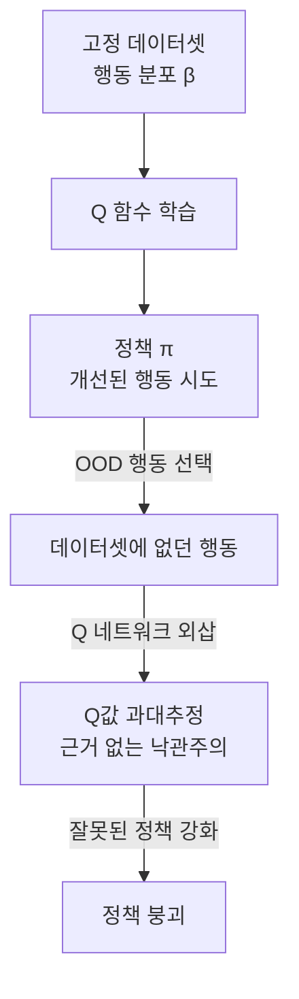
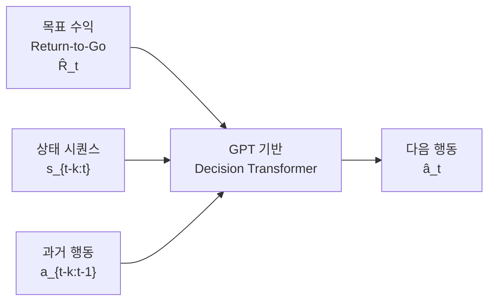
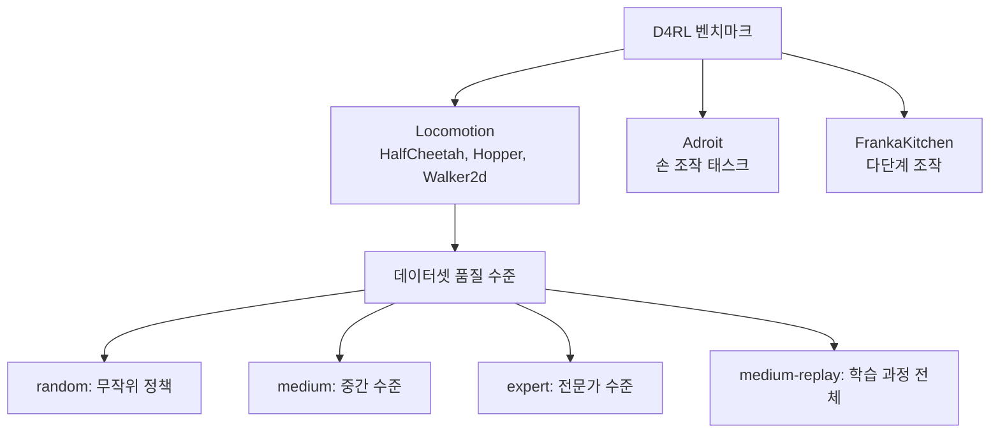

# 오프라인 강화학습 (Offline Reinforcement Learning)

## 핵심 개념

**오프라인 RL(Offline Reinforcement Learning)**, 또는 **배치 RL(Batch RL)**은 환경과의 실시간 상호작용 없이, **사전에 수집된 고정 데이터셋**에서만 정책을 학습하는 강화학습 패러다임이다.

온라인 RL이 "행동하면서 배운다(learn by doing)"라면, 오프라인 RL은 "기록된 경험에서 배운다(learn from logged data)"이다. 의료, 자율주행, 로보틱스 등 실시간 상호작용이 위험하거나 비용이 큰 도메인에서 핵심 기술로 주목받는다.

## 핵심 문제: OOD 행동의 Q값 과대추정

오프라인 RL의 가장 큰 난관은 **분포 이탈(Out-of-Distribution, OOD) 문제**다.

**왜 발생하는가**: Q 함수는 데이터셋의 행동-상태 쌍에서만 신뢰할 수 있게 학습된다. 정책이 개선 과정에서 데이터셋에 없는 행동을 선택하면, Q 함수는 이를 낙관적으로 과대추정하고, 이 잘못된 신호가 정책을 더욱 악화시킨다.

## 주요 해결 알고리즘

### 1. CQL - 보수적 Q-학습 (Conservative Q-Learning)

**CQL**(Kumar et al. 2020)은 OOD 행동의 Q값에 **하한 패널티**를 부여하여 과대추정을 억제한다.

$$\mathcal{L}_{\text{CQL}}(Q) = \underbrace{\mathbb{E}_{(s,a,s') \sim D}\left[(Q(s,a) - r - \gamma Q(s', a'))^2\right]}_{\text{표준 Bellman 오류}} + \underbrace{\alpha \left(\mathbb{E}_{s \sim D, a \sim \mu}[Q(s,a)] - \mathbb{E}_{(s,a) \sim D}[Q(s,a)]\right)}_{\text{CQL 패널티}}$$

CQL 패널티는 정책이 선호하는 행동($\mu$)의 Q값을 낮추고 데이터셋 행동의 Q값을 높여, Q 함수가 데이터셋 분포 내에서만 높은 값을 갖도록 강제한다.

### 2. IQL - 암묵적 Q-학습 (Implicit Q-Learning)

**IQL**(Kostrikov et al. 2021)은 OOD 행동에 직접 접근하지 않고, **Expectile Regression**으로 가치 함수를 학습한다.

$$\mathcal{L}_\tau(Q) = \mathbb{E}_{(s,a) \sim D}\left[\mathcal{L}_\tau^2(V(s) - Q(s,a))\right]$$

여기서 $\mathcal{L}_\tau^2(u) = |\tau - \mathbf{1}(u < 0)| \cdot u^2$는 비대칭 손실이다.

$\tau$를 높게 설정(예: 0.7-0.9)하면 가치 함수가 낙관적 근삿값을 향해 학습되지만, 실제로 OOD 행동을 평가하지 않으므로 안전하다.

### 3. TD3+BC - 행동 복제 정규화

**TD3+BC**(Fujimoto & Gu, 2021)는 단순하지만 강력하다. TD3의 정책 업데이트에 **행동 복제(BC) 정규화 항**을 추가한다.

$$\pi = \arg\max_a \lambda Q(s,a) - (a - \pi_\beta(s))^2$$

여기서 $\lambda$는 두 목표 사이의 균형을 맞추는 스케일링 계수다. 정책이 데이터셋의 행동 분포에서 크게 벗어나지 않도록 제약한다.

### 4. Decision Transformer - 시퀀스 모델링으로의 전환

**Decision Transformer**(Chen et al. 2021)는 오프라인 RL을 완전히 다른 관점으로 재해석한다. RL 문제를 **조건부 시퀀스 생성** 문제로 변환한다.

원하는 미래 보상 합계(Return-to-Go)를 조건으로 주면, 트랜스포머가 그 수준의 성과를 달성하는 행동을 생성한다. Bellman 방정식을 전혀 사용하지 않으므로 OOD 문제 자체가 없다.

## 알고리즘 비교

| 알고리즘 | 접근 방식 | 장점 | 단점 |
|---------|----------|------|------|
| **CQL** | Q값 하한 패널티 | 이론 보장, 높은 성능 | 하이퍼파라미터 민감 |
| **IQL** | Expectile 회귀 | 안정적, OOD 접근 없음 | 표현력 제한 가능 |
| **TD3+BC** | BC 정규화 | 단순, 구현 용이 | 데이터 품질에 의존 |
| **Decision Transformer** | 시퀀스 모델링 | OOD 문제 없음 | 서브옵티멀 궤적에서 한계 |
| **MOPO/MOReL** | 모델 기반 + 비관주의 | 불확실 영역 회피 | 세계 모델 오류 |

## D4RL 벤치마크

**D4RL(Datasets for Deep Data-Driven Reinforcement Learning)**(Fu et al. 2020)은 오프라인 RL 알고리즘의 표준 벤치마크다.

주목할 점: **medium-expert** 데이터(중간 + 전문가 혼합)에서 CQL, IQL이 전문가 수준을 넘어서는 결과가 나오기도 한다. 데이터에서 최적 행동 패턴을 추출하는 능력을 보여준다.

## 실세계 적용 도메인

**의료**:
- EHR(전자 건강 기록)에서 치료 정책 학습
- 실험 불가능한 환자에게 직접 시행 불가한 치료를 먼저 시뮬레이션
- 패혈증 치료 최적화, ICU 의사결정 지원

**자율주행**:
- 사고·아슬아슬한 상황 데이터에서 회피 정책 학습
- 로그 데이터(수십억 마일 주행 기록) 활용
- 실제 도로에서 위험한 상황을 반복 실험 불필요

**로보틱스**:
- 인간 시연 데이터에서 조작 정책 학습
- 실로봇 상호작용 비용 절감
- [[act-action-chunking-transformer]] 등 모방 학습과 교집합

**금융**:
- 과거 시장 데이터에서 트레이딩 정책 학습
- 온라인 RL의 탐색 과정에서 발생하는 손실 회피

## 오프라인-온라인 전환

실용적 관점에서 오프라인 RL은 종종 온라인 파인튜닝의 **초기화**로 사용된다:

1. 오프라인 RL로 좋은 초기 정책 학습 (안전하고 빠름)
2. 이 정책을 기반으로 제한적 온라인 탐색 (더 안전한 탐색 가능)
3. 온라인 데이터를 오프라인 버퍼에 추가하며 반복 개선

## 관련 문서

- [[sac-soft-actor-critic|soft-actor-critic-sac]] - 오프라인 변형(CQL)의 기반 알고리즘
- [[model-based-rl]] - MOPO/MOReL 등 모델 기반 오프라인 RL
- [[behavior-cloning]] - 오프라인 RL의 특수 케이스 (보상 없는 모방)
- [[decision-transformer]] - 시퀀스 모델링 기반 오프라인 RL
- [[multi-agent-rl|multi-agent-rl-marl]] - 멀티에이전트 오프라인 RL
