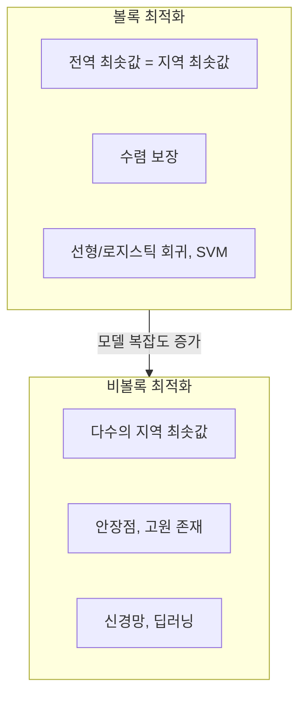
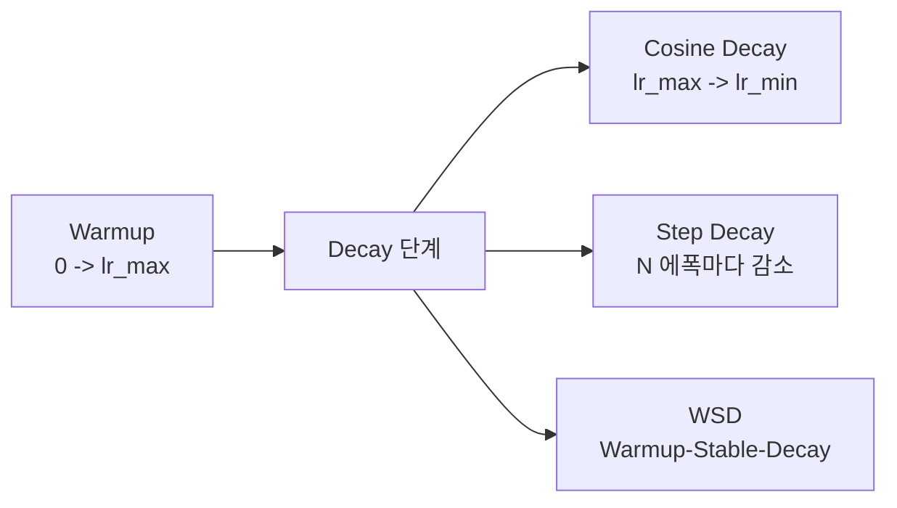

# 최적화 이론 (Optimization Theory)

ML 모델의 학습은 곧 최적화 문제다. [[loss-functions|손실 함수]]를 정의하고, 그 값을 최소화하는 파라미터를 찾는 과정이 학습의 본질이다.

## 최적화 문제의 분류

### 볼록 최적화 (Convex Optimization)

볼록 함수에서는 모든 지역 최솟값이 전역 최솟값이다. 선형 회귀, 로지스틱 회귀, SVM 등 전통 ML 알고리즘의 목적 함수가 볼록 함수다.

**특성:**
- 전역 최적해가 존재하고 찾을 수 있음이 보장된다
- 수렴 속도에 대한 이론적 보장이 강하다
- 볼록 함수의 합, 스칼라 곱도 볼록 함수다

### 비볼록 최적화 (Non-Convex Optimization)

딥러닝의 손실 함수는 비볼록이다. 수많은 지역 최솟값, 안장점(saddle point), 고원(plateau)이 존재한다.

**현실적 접근:**
- SGD와 그 변형이 비볼록 환경에서도 좋은 지역 최솟값을 찾는다
- 최근 연구는 "충분히 넓은 신경망에서 대부분의 지역 최솟값은 전역 최솟값에 가깝다"는 결과를 보여준다
- 안장점 탈출에 모멘텀이 효과적이다



## SGD와 변형

### 기본 SGD

전체 데이터셋 대신 무작위 샘플(미니배치)로 기울기를 추정한다:

```
theta <- theta - lr * gradient(L, mini_batch)
```

- 전체 배치 기울기 하강보다 훨씬 빠른 반복
- 노이즈가 안장점 탈출에 도움을 줄 수 있다
- 수렴은 느리지만 반복당 비용이 낮다

### 모멘텀 (Momentum)

이전 업데이트 방향의 관성을 유지한다:

```
v <- beta * v + gradient
theta <- theta - lr * v
```

- 진동을 줄이고 수렴을 가속화한다
- 안장점과 좁은 골짜기에서 탈출에 효과적

### 적응적 학습률 방법들

| 옵티마이저 | 핵심 아이디어 | 등장 시기 |
|-----------|-------------|-----------|
| AdaGrad | 자주 업데이트된 파라미터의 학습률을 줄인다 | 2011 |
| RMSProp | AdaGrad의 기울기 누적 감소를 해결 | 2012 |
| [[optimizer-selection|Adam]] | RMSProp + 모멘텀. 가장 널리 사용 | 2014 |
| AdamW | Adam + 올바른 가중치 감쇠 (weight decay) | 2017 |
| Lion | 부호 기반 업데이트, Adam보다 메모리 효율적 | 2023 |

Adam이 현재까지 가장 보편적인 선택이다. 하지만 LLM 학습에서는 AdamW가 표준이며, Lion은 메모리 절약이 중요한 대규모 모델에서 주목받고 있다.

## 학습률 (Learning Rate)

학습률은 모델 학습에서 가장 중요한 하이퍼파라미터 중 하나다.

- **너무 크면**: 발산하거나 최솟값 주위를 진동
- **너무 작으면**: 수렴이 극도로 느려진다
- **적정값**: 빠르면서도 안정적인 수렴

### 학습률 스케줄링

고정 학습률 대신 학습 과정에서 동적으로 조절한다:



- **Warmup**: 처음에 학습률을 점진적으로 올린다. 초기 불안정성을 방지
- **Cosine Decay**: 코사인 곡선을 따라 부드럽게 감소. LLM 학습의 표준
- **Step Decay**: 특정 에폭마다 학습률을 일정 비율로 줄인다
- **WSD (Warmup-Stable-Decay)**: 워밍업 후 안정 구간을 거쳐 감소. 최근 대규모 모델에서 사용

## 볼록 최적화 이론의 실용적 가치

딥러닝이 비볼록이라 해도, 볼록 최적화 이론은 여전히 중요하다:

- 수렴 속도 분석의 기본 도구 (O(1/t), O(1/t^2) 등)
- 정규화 항의 볼록성이 학습 안정화에 기여
- 서브그래디언트, 라그랑주 쌍대성 등의 개념이 ML 전반에 등장
- SVM의 쌍대 문제가 커널 트릭을 가능하게 한다

## 관련 문서
- [[sophia-optimizer]] -- Sophia 옵티마이저 - 헤시안 대각선 근사 2차 LLM 옵티마이저
- [[schedule-free-optimizer]] -- Schedule-Free 옵티마이저
- [[lamb-lars-optimizer]] -- LAMB/LARS 옵티마이저
- [[gradient-flow-optimization]] -- 그래디언트 흐름 최적화 이론

- [[gradient-descent-backpropagation]] -- 기울기 계산의 구체적 메커니즘
- [[loss-functions]] -- 최적화 대상이 되는 목적 함수
- [[overfitting-regularization]] -- 정규화를 통한 최적화 문제 변형
- [[linear-algebra-for-ml]] -- 행렬 미분과 최적화의 연결

## 참고 자료

- [Stochastic Gradient Descent - Wikipedia](https://en.wikipedia.org/wiki/Stochastic_gradient_descent)
- [Optimizers in Deep Learning - Analytics Vidhya](https://www.analyticsvidhya.com/blog/2021/10/a-comprehensive-guide-on-deep-learning-[[optimizer-selection|optimizer]]s/)
- [Optimization for Deep Learning: An Overview (Ruoyu Sun)](https://ise.ncsu.edu/wp-content/uploads/sites/9/2020/08/Optimization-for-deep-learning.pdf)
