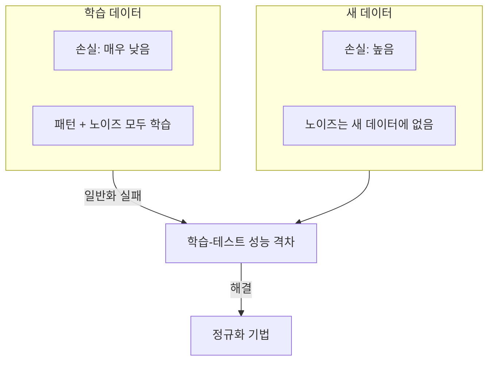
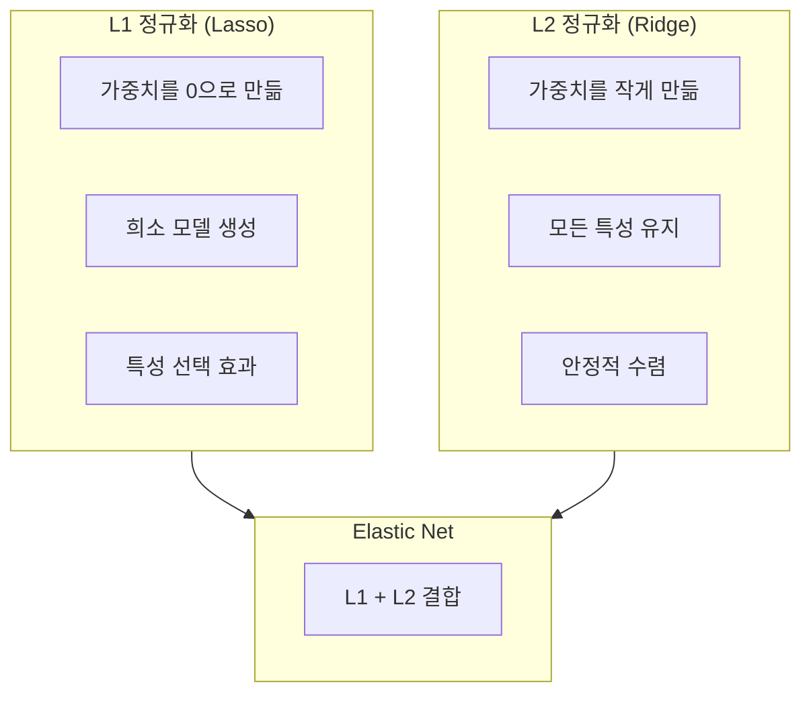

# 과적합과 정규화 (Overfitting & Regularization)

과적합은 모델이 학습 데이터의 노이즈까지 암기하여 새 데이터에 일반화하지 못하는 현상이다. 정규화는 모델의 복잡도에 제약을 가해 과적합을 방지하는 기법들의 총칭이다.

## 과적합이란



과적합의 징후:
- 학습 손실은 계속 감소하지만 검증 손실은 증가하기 시작
- 학습 정확도와 검증 정확도의 격차가 점점 커짐
- [[bias-variance-tradeoff|편향-분산]] 관점에서 높은 분산 상태

과적합 위험이 높은 상황:
- 학습 데이터가 적을 때
- 모델이 과도하게 복잡할 때 (파라미터 >> 데이터)
- 학습 시간이 너무 길 때
- 특성이 너무 많을 때

## L1 정규화 (Lasso)

[[loss-functions|손실 함수]]에 가중치 절대값의 합을 추가한다:

```
L_total = L_original + lambda * sum(|w_i|)
```

**특성:**
- 일부 가중치를 정확히 0으로 만든다 (희소성, sparsity)
- 자동 특성 선택 효과: 불필요한 특성의 가중치가 0이 된다
- [[feature-engineering|특성 공학]]에서 특성 선택 방법으로도 활용
- 모델 해석 가능성 향상

**[[probability-statistics-for-ml|확률론적 해석]]**: 가중치에 라플라스 사전확률을 적용한 MAP 추정과 동치

## L2 정규화 (Ridge)

손실 함수에 가중치 제곱의 합을 추가한다:

```
L_total = L_original + lambda * sum(w_i^2)
```

**특성:**
- 가중치의 크기를 줄이지만 0으로 만들지는 않는다
- 모든 특성이 고르게 기여하도록 유도
- 수치적으로 더 안정적 (미분이 연속)
- 신경망에서는 "가중치 감쇠(weight decay)"라고 부른다

**확률론적 해석**: 가중치에 가우시안 사전확률을 적용한 MAP 추정과 동치

## L1 vs L2 비교



| 속성 | L1 (Lasso) | L2 (Ridge) |
|------|-----------|-----------|
| 페널티 | 절대값 합 | 제곱 합 |
| 가중치 효과 | 0으로 수축 가능 | 작게 수축 |
| 특성 선택 | 자동 수행 | 수행하지 않음 |
| 해 유일성 | 불보장 | 유일 |
| 적합 상황 | 특성이 많고 관련 없는 것이 다수 | 모든 특성이 관련 있을 때 |

## 드롭아웃 (Dropout)

학습 중 뉴런을 무작위로 비활성화한다:

- 각 미니배치에서 뉴런의 p% (보통 20-50%)를 무작위로 끈다
- 특정 뉴런에 대한 의존을 방지하여 앙상블 효과를 만든다
- 추론 시에는 모든 뉴런을 사용하되 출력에 (1-p)를 곱한다
- Transformer에서는 attention dropout, residual dropout 등 다양한 위치에 적용

## 조기 종료 (Early Stopping)

검증 손실이 더 이상 감소하지 않으면 학습을 중단한다:

- 별도의 검증 세트에서 성능을 모니터링
- patience: 개선 없이 기다리는 에폭 수
- 가장 검증 손실이 낮았던 시점의 모델을 저장
- 구현이 간단하고 거의 모든 상황에서 효과적

## 데이터 증강 (Data Augmentation)

기존 데이터에 변환을 적용하여 학습 데이터를 인위적으로 늘린다:

**이미지:**
- 회전, 뒤집기, 크롭, 색상 변환, 노이즈 추가
- Mixup: 두 이미지와 레이블을 혼합
- CutMix: 이미지의 일부를 다른 이미지로 교체

**텍스트:**
- 동의어 치환, 역번역 (back-translation)
- 문장 순서 셔플, 무작위 삭제/삽입

**장점:**
- 모델이 불변 특성을 학습하도록 유도
- 효과적으로 학습 데이터 크기를 늘림
- 도메인 지식을 반영한 증강이 가능

## 기타 정규화 기법

- **배치 정규화 (Batch Normalization)**: 레이어 입력을 정규화하여 학습을 안정화하고 과적합도 줄인다
- **레이어 정규화 (Layer Normalization)**: Transformer의 표준 정규화 방법
- **가중치 제한 (Weight Constraint)**: 가중치 노름의 상한을 설정
- **레이블 스무딩 (Label Smoothing)**: 원-핫 레이블을 부드럽게 만들어 과신(overconfidence)을 방지

## 정규화 선택 가이드

| 상황 | 권장 기법 |
|------|----------|
| 선형 모델, 불필요 특성 많음 | L1 (Lasso) |
| 신경망 일반 | L2 (Weight Decay) + Dropout |
| 이미지 데이터, 데이터 부족 | 데이터 증강 |
| 학습 시간 최적화 | 조기 종료 |
| Transformer | Layer Norm + Dropout + Label Smoothing |
| 확신이 없을 때 | L2 + 조기 종료 (가장 안전한 조합) |

## 관련 문서

- [[bias-variance-tradeoff]] -- 정규화는 분산을 줄여 일반화를 개선
- [[loss-functions]] -- 정규화 항이 추가되는 기본 손실 함수
- [[cross-validation-model-evaluation]] -- 과적합 여부를 진단하는 평가 방법
- [[probability-statistics-for-ml]] -- 정규화와 베이즈 추정(MAP)의 관계
- [[gradient-descent-backpropagation]] -- 정규화가 기울기에 미치는 영향
- [[feature-engineering]] -- L1 정규화의 특성 선택 효과

## 참고 자료

- [Overfitting: L2 Regularization - Google for Developers](https://developers.google.com/machine-learning/crash-course/overfitting/regularization)
- [Fighting Overfitting with L1 or L2 Regularization - Neptune.ai](https://neptune.ai/blog/fighting-overfitting-with-l1-or-l2-regularization)
- [Regularization in Machine Learning - Dev.to](https://dev.to/zeromathai/regularization-in-machine-learning-how-to-actually-prevent-overfitting-l1-l2-dropout-1dph)
