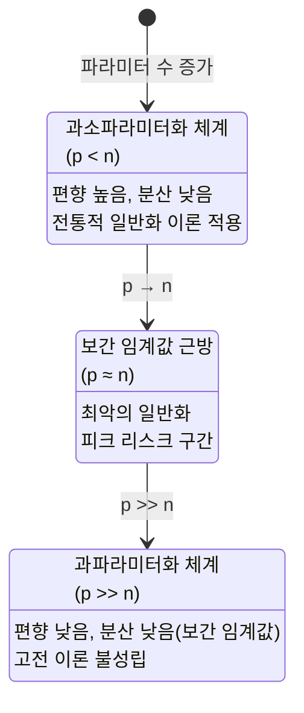

# 과파라미터화와 보간

과파라미터화(Overparameterization)는 모델의 파라미터 수가 훈련 데이터 수보다 훨씬 많은 상황이다. 고전 통계학은 이를 과적합의 원인으로 경고했지만, 현대 딥러닝은 수천억 개의 파라미터를 가진 모델이 뛰어난 일반화를 보임을 실증했다. 이 역설을 설명하는 이론이 **보간(Interpolation)**과 **이중 하강(Double Descent)**이다.

## 보간 임계값 (Interpolation Threshold)

**보간**이란 훈련 데이터를 훈련 손실이 0이 되도록 완벽하게 맞추는 것이다. 모델이 보간 능력을 가지려면 파라미터 수 $p$가 훈련 샘플 수 $n$을 초과해야 한다.

$$p \geq n \quad \Rightarrow \quad \text{훈련 데이터 보간 가능}$$

이 경계점을 **보간 임계값(Interpolation Threshold)**이라 한다. $p/n = 1$ 근방에서 일반화 성능이 가장 나쁘며, $p \gg n$이 되면 다시 개선된다.

## 이중 하강 (Double Descent)

[[double-descent]] 현상은 모델 복잡도를 증가시킬 때 테스트 오차가 **두 번의 하강**을 보이는 패턴이다.

**고전 U자 곡선**: 편향-분산 트레이드오프에 따라 과소적합 → 최적 → 과적합의 U자 형태.

**이중 하강 곡선**: 위의 U자가 끝나는 지점(보간 임계값)에서 테스트 오차가 급등했다가, $p \gg n$에서 다시 감소하는 제2의 하강이 나타난다.

$$\text{테스트 오차} \approx f(p/n) = \begin{cases} \text{U자 감소} & p/n < 1 \\ \text{급등 피크} & p/n \approx 1 \\ \text{다시 감소} & p/n \gg 1 \end{cases}$$

### 왜 이중 하강이 발생하는가

$p = n$ 근방에서 보간 해(interpolating solution)가 유일하게 결정되며, 이 유일한 해는 훈련 노이즈를 완벽히 암기하여 일반화가 나쁘다.

$p \gg n$에서는 보간 해가 무한히 많다. 경사하강법(특히 최소 노름 해(minimum-norm solution))은 이들 중 가장 "간단한" 해를 선택하는 암묵적 정규화를 수행한다. 이 해가 실제로 일반화가 좋다.

## 양성 과적합 (Benign Overfitting)

[[benign-overfitting]] 은 과파라미터화된 모델이 훈련 노이즈를 완벽히 암기(보간)하면서도 테스트 오차가 낮은 현상이다.

Bartlett et al. (2020)의 이론적 조건: 선형 회귀에서 양성 과적합이 발생하려면:

1. **효과적 랭크(effective rank)** $r^* = \text{tr}(\Sigma) / \|\Sigma\|_2$가 충분히 커야 한다.
2. 나머지 고유값들의 합이 지배적 고유값보다 충분히 커야 한다.
3. 노이즈 크기가 제한적이어야 한다.

직관적으로, 데이터가 많은 방향으로 분산되어 있으면(isotropic-like), 최소 노름 보간이 각 방향에서 노이즈를 평균화하여 정보를 보존한다.

### 딥러닝에서의 양성 과적합

딥러닝 모델의 암묵적 정규화(implicit regularization)는 훈련 과정에 내재되어 있다:

- **경사하강법**: 큰 학습률과 노이즈는 넓고 평평한 최솟값(flat minima)을 선호
- **Early stopping 없이 수렴**: 최소 노름 방향의 암묵적 바이어스
- **배치 크기**: 작은 배치는 노이즈가 많아 보다 일반화 가능한 해를 선택

## 파라미터 수 vs 에폭 이중 하강

이중 하강은 파라미터 수뿐 아니라 **훈련 에폭 수**에서도 나타난다. 훈련이 진행될수록:

1. 초반: 유용한 패턴 학습 (테스트 오차 감소)
2. 보간 임계 시점: 노이즈 암기 시작 (테스트 오차 증가)
3. 장기 훈련: 일반화 가능한 해로 재정렬 (테스트 오차 재감소)

이것이 충분히 긴 훈련이 때때로 더 나은 일반화를 주는 이유이며, [[grokking]] 현상의 또 다른 측면이다.

## 실무적 함의

| 질문 | 이전 통념 | 과파라미터화 이론 |
|------|----------|----------------|
| 모델이 충분히 크면? | 과적합 위험 | 양성 과적합 가능 |
| 훈련 손실 0이면? | 실패(과적합) | 보간 체계일 수 있음 |
| 정규화 필요? | 항상 필요 | 암묵적 정규화로 대체 가능 |
| Early stopping? | 필수 | 충분한 훈련이 나을 수 있음 |

특히 LLM처럼 수천억 파라미터 모델은 명백히 보간 임계값 훨씬 우측에 있으며, 이 체계의 일반화 이론이 더 적합하다.

## 관련 문서

- [[double-descent]] - 이중 하강 현상 상세 분석
- [[benign-overfitting]] - 양성 과적합 이론과 조건
- [[bias-variance-tradeoff]] - 고전 편향-분산 프레임워크
- [[implicit-regularization]] - 경사하강법의 암묵적 정규화
- [[grokking]] - 장기 훈련 후 지연된 일반화
- [[loss-landscape]] - 최솟값의 기하학과 일반화
