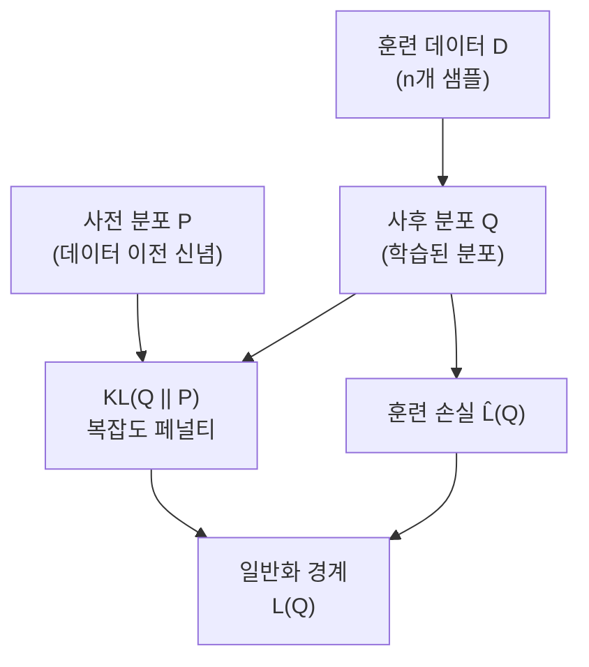

# PAC-Bayes 일반화 경계

PAC-Bayes 경계(PAC-Bayes Bounds)는 확률적 예측기(stochastic predictor)에 대한 일반화 오차 상한을 제공하는 이론 프레임워크다. 고전적인 [[pac-learning]] 이론과 베이즈 통계를 결합하여, **모든 가능한 가중치 분포**에 대해 높은 확률로 성립하는 경계를 유도한다. 최근 딥러닝 일반화 이해와 [[sharpness-aware-minimization]](SAM) 같은 최적화 알고리즘의 이론적 근거로 주목받고 있다.

## 핵심 아이디어: 확률적 가중치

고전 일반화 이론은 단일 가중치 벡터 $\theta$를 분석하지만, PAC-Bayes는 **가중치에 대한 사후 분포** $Q(\theta)$ 를 분석한다.

- **사전 분포(Prior)** $P$: 데이터를 보기 전에 정한 분포 (예: 초기화와 유사한 가우시안)
- **사후 분포(Posterior)** $Q$: 학습 후 얻은 파라미터 분포
- **확률적 예측기**: 각 예측마다 $Q$에서 가중치를 샘플링

실제 추론에서는 가중치를 매번 샘플링하기 어렵지만, 이론적 분석 도구로서 일반화를 설명하는 데 강력하다.

## McAllester의 PAC-Bayes 경계

가장 널리 쓰이는 형태는 다음과 같다. $n$개 훈련 샘플에 대해, 확률 $1 - \delta$로:

$$\mathcal{L}(Q) \leq \hat{\mathcal{L}}(Q) + \sqrt{\frac{KL(Q \| P) + \ln(n/\delta)}{2n}}$$

여기서:
- $\mathcal{L}(Q)$: 실제(기대) 위험 (일반화 오차)
- $\hat{\mathcal{L}}(Q)$: 훈련 위험 (경험적 손실)
- $KL(Q \| P)$: 사후-사전 분포 간 KL 발산
- $n$: 훈련 데이터 크기

핵심 메시지는 **일반화 오차 = 훈련 오차 + KL 패널티**라는 구조다.

## 플랫 최솟값과의 연결

PAC-Bayes 경계는 왜 **플랫한(flat) 최솟값**이 더 좋은 일반화를 보이는지를 이론적으로 설명한다.

$Q$를 학습된 가중치 $\theta^*$ 중심의 가우시안 $\mathcal{N}(\theta^*, \sigma^2 I)$ 로 설정하면:

$$KL(Q \| P) \approx \frac{\|\theta^* - \theta_0\|^2}{2\sigma_P^2} + \frac{d \cdot \sigma^2}{2\sigma_P^2} - \frac{d}{2}\ln\sigma^2 + \text{상수}$$

플랫한 최솟값이란 $\sigma^2$를 크게 해도 훈련 손실이 크게 변하지 않는 지점이다. 이때:
- $\sigma^2$를 늘릴수록 훈련 손실 $\hat{\mathcal{L}}(Q)$ 는 비슷하게 유지
- $KL$ 패널티는 $\sigma^2$의 특정 최적값에서 최소화

반면 샤프한(sharp) 최솟값은 $\sigma^2$ 를 조금만 키워도 훈련 손실이 폭발하므로 경계가 느슨해진다.

이 연결이 [[sharpness-aware-minimization]] 의 이론적 배경이다.

## 고전 일반화 이론과의 차이

| 항목 | VC 차원/Rademacher | PAC-Bayes |
|------|-------------------|-----------|
| 분석 대상 | 단일 가설 클래스 | 사후 분포 $Q$ |
| 파라미터 의존성 | 파라미터 수에 비례 증가 | $KL(Q\|P)$에 의존 |
| 딥러닝 설명력 | 매우 느슨함 | 더 타이트함 (실증적) |
| 계산 가능성 | 대부분 계산 불가 | 일부 경우 계산 가능 |

고전 이론은 파라미터가 많을수록 일반화가 나빠진다고 예측하지만, 딥러닝에서는 과파라미터화 모델이 오히려 잘 일반화한다. PAC-Bayes는 $KL(Q\|P)$ 이 작게 유지되면 파라미터 수와 무관하게 좋은 경계를 줄 수 있어 이 패러독스를 부분적으로 해결한다.

## 실무적 활용

### 학습 목표로서의 PAC-Bayes

PAC-Bayes 경계를 직접 최소화하면 일반화가 더 좋은 모델을 학습할 수 있다. Dziugaite & Roy (2017)는 이 접근으로 MNIST에서 계산 가능한 비자명(non-vacuous) 경계를 처음으로 달성했다.

### SAM과의 관계

[[sharpness-aware-minimization]] 은 PAC-Bayes 경계 최소화의 실용적 근사로 볼 수 있다. SAM의 perturbation 반경 $\rho$ 는 $Q$의 분산 $\sigma^2$ 에 해당한다.

### 베이즈 딥러닝 연결

변분 추론(Variational Inference)의 ELBO 목적함수는 PAC-Bayes 경계와 구조적으로 유사하다. $KL(Q\|P)$ 가 정규화 항으로 등장하는 공통 패턴을 공유한다.

## 한계

1. **경계의 느슨함**: 실제 테스트 오차보다 훨씬 큰 경계를 줄 수 있다. 실용적 예측 도구로 쓰기 어렵다.
2. **사전 분포 선택 의존성**: 잘못된 $P$ 선택은 의미 없는 경계로 이어진다.
3. **확률적 예측기**: 실제 모델은 결정론적이므로 이론과 실제의 간극이 있다.

## 관련 문서

- [[pac-learning]] - PAC 학습의 기본 프레임워크
- [[sharpness-aware-minimization]] - 플랫 최솟값 기반 최적화
- [[loss-landscape]] - 손실 지형과 최솟값 형태
- [[bayesian-inference]] - 베이즈 통계와 사후 분포
- [[double-descent]] - 과파라미터화 일반화 현상
