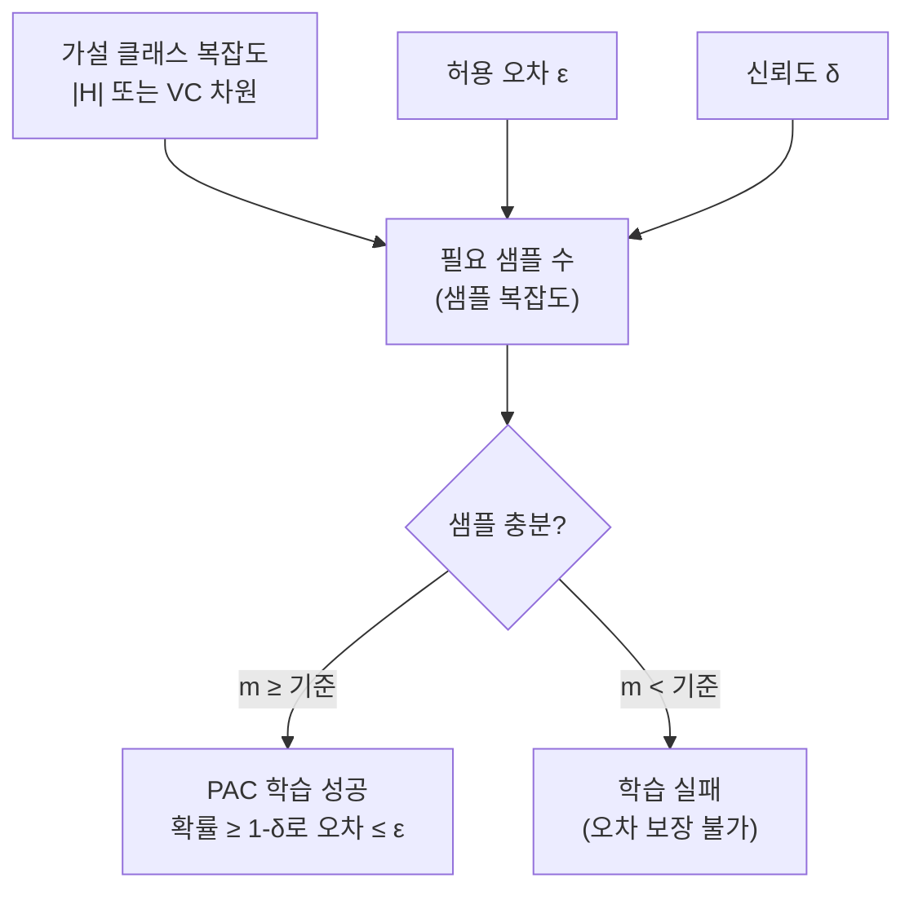

# PAC 학습 이론 (Probably Approximately Correct)

## 개요

PAC 학습(Probably Approximately Correct Learning)은 Leslie Valiant(1984)가 제안한 계산 학습 이론(Computational Learning Theory)의 핵심 프레임워크다. "얼마나 많은 훈련 샘플이 있어야 충분히 좋은 가설을 학습할 수 있는가"라는 질문에 수학적으로 답한다. Valiant는 이 연구로 2010년 튜링상을 수상했다.

PAC 학습의 핵심 주장: **유한한 샘플로, 높은 확률(P)로, 근사적으로 정확한(AC) 가설을 학습할 수 있다.**

## 형식적 정의

다음 조건을 만족하면 개념 클래스 $C$는 PAC 학습 가능(PAC-learnable)하다:

알고리즘 $A$가 존재하여, 임의의 개념 $c \in C$와 임의의 분포 $D$에 대해, 정확도 파라미터 $\epsilon > 0$과 신뢰도 파라미터 $\delta > 0$에 대해:

$$P[\text{error}(h) \leq \epsilon] \geq 1 - \delta$$

$m$ 개 이상의 훈련 샘플이 주어지면 위 조건이 만족된다. 여기서 $m$은 $\epsilon$과 $\delta$의 다항 함수여야 한다.

즉:
- **아마도(P)**: 확률 $1 - \delta$ 이상으로
- **근사적으로(A)**: 오차 $\epsilon$ 이하로
- **정확한(C)**: 참 개념에 수렴

## 샘플 복잡도 (Sample Complexity)

PAC 학습의 핵심 질문은 "몇 개의 샘플이 필요한가(샘플 복잡도)"다. 유한 가설 클래스 $H$ ($|H| < \infty$)의 경우:

$$m \geq \frac{1}{\epsilon}\left(\ln|H| + \ln\frac{1}{\delta}\right)$$

- 가설 클래스가 클수록 더 많은 샘플이 필요하다
- $\epsilon$이 작을수록(더 정확한 학습) 샘플이 더 많이 필요하다
- $\delta$가 작을수록(더 높은 신뢰도) 샘플이 더 많이 필요하다

## 무한 가설 클래스: VC 차원의 등장

신경망처럼 연속 파라미터를 가진 무한 가설 클래스에서는 $|H| = \infty$이므로 위 공식이 작동하지 않는다. 이 문제를 해결하기 위해 [[vc-dimension]](Vapnik-Chervonenkis 차원)이 도입된다.

VC 차원을 $d_{VC}$로 표기할 때, Blumer et al.(1989)의 결과:

$$m \geq \frac{1}{\epsilon}\left(4\log_2\frac{2}{\delta} + 8d_{VC}\log_2\frac{13}{\epsilon}\right)$$

VC 차원이 유한하면 무한 가설 클래스도 PAC 학습 가능하다. VC 차원은 [[bias-variance-tradeoff]]에서 모델 복잡도를 정량화하는 이론적 도구로 쓰인다.

## 어그노스틱 PAC 학습 (Agnostic PAC Learning)

기본 PAC 학습은 "참 개념 $c$가 가설 클래스 $H$ 안에 있다"고 가정한다(실현 가능성, realizability). 현실에서는 이 가정이 성립하지 않을 때가 많다.

**어그노스틱 PAC 학습**은 이 가정을 제거한다. 목표는 $H$ 내 최선의 가설 $h^*$에 비해 $\epsilon$만큼만 나쁜 가설을 학습하는 것:

$$\text{error}(h) \leq \min_{h' \in H}\text{error}(h') + \epsilon$$

어그노스틱 PAC 학습에서 샘플 복잡도는 더 커지며, 실제 머신러닝 문제의 이론적 틀로 더 적합하다.

## PAC 학습 불가능성

모든 개념 클래스가 PAC 학습 가능한 것은 아니다.

| 학습 가능성 | 조건 | 예시 |
|-------------|------|------|
| PAC 학습 가능 | VC 차원 유한 | 선형 분류기, 결정 트리 |
| PAC 학습 불가능 | VC 차원 무한 | 임의 부울 함수 전체 |
| 효율적 PAC 학습 가능 | 다항 시간 알고리즘 존재 | k-CNF, 반공간(halfspace) |

## [[cross-validation-model-evaluation]]과의 연결

PAC 이론은 일반화 오차(generalization error)의 상한을 이론적으로 보장하는 반면, 교차 검증은 이를 경험적으로 추정한다. PAC 이론의 샘플 복잡도 바운드는 종종 지나치게 보수적(conservative)이어서, 실무에서는 교차 검증으로 경험적 추정을 선호한다.

두 접근법의 비교:
- **PAC 이론**: 최악의 경우 보장(worst-case guarantee), 분포에 무관(distribution-free)
- **교차 검증**: 데이터에 의존적, 더 타이트한 경험적 추정

## 실무적 함의

PAC 이론이 직접적인 알고리즘 설계에 쓰이기보다는, 다음과 같은 개념적 가이드를 제공한다:

1. **모델 선택**: VC 차원이 낮은 가설 클래스는 더 적은 데이터로 학습 가능
2. **데이터 요구량 추정**: 원하는 $\epsilon, \delta$ 기준으로 필요 샘플 수 하한 계산
3. **오컴의 면도날 정당화**: 더 단순한 가설이 왜 더 적은 샘플로 학습 가능한지 수학적 근거 제공

## 관련 문서

- [[vc-dimension]] - PAC 학습의 무한 가설 클래스를 다루기 위한 복잡도 측도
- [[bias-variance-tradeoff]] - PAC 이론의 일반화 보장과 실무적 트레이드오프
- [[cross-validation-model-evaluation]] - PAC 이론의 경험적 대안
- [[information-theory]] - PAC 바운드 유도에 사용되는 정보 이론적 도구
