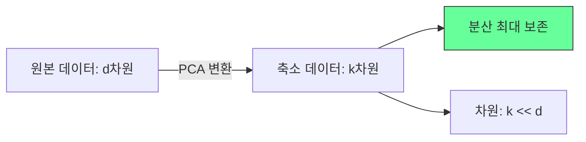
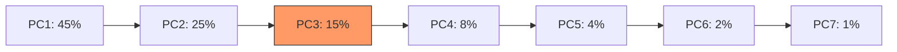

## 개요

주성분 분석(Principal Component Analysis, PCA)은 고차원 데이터에서 분산이 최대인 방향(주성분)을 찾아 저차원으로 투영하는 선형 차원 축소 기법이다. Karl Pearson(1901)이 발명하고 Harold Hotelling(1930년대)이 독립적으로 발전시켰다. 데이터의 본질적 구조를 보존하면서 차원을 줄여, 시각화, 노이즈 제거, [[feature-engineering]]의 전처리, 그리고 계산 비용 절감에 활용된다. [[supervised-unsupervised-reinforcement]]에서 비지도 학습의 대표적 기법이다.

## 핵심 원리

### 분산 최대화

PCA의 핵심 아이디어는 데이터의 **분산이 최대인 방향**을 찾는 것이다. 분산이 크다는 것은 해당 방향에 정보가 많다는 의미이므로, 분산이 큰 방향을 우선적으로 보존하고 분산이 작은 방향을 버려 차원을 줄인다.



### 알고리즘 단계

1. **데이터 중심화(Centering)**: 각 변수에서 평균을 뺀다 (평균 = 0)
2. **공분산 행렬 계산**: C = (1/n) * X^T * X
3. **고유값 분해(Eigendecomposition)**: 공분산 행렬의 고유값(eigenvalue)과 고유벡터(eigenvector)를 구한다
4. **고유벡터 정렬**: 고유값 크기 순으로 고유벡터를 내림차순 정렬
5. **주성분 선택**: 상위 k개 고유벡터를 선택하여 변환 행렬 구성
6. **투영**: 원본 데이터를 변환 행렬에 곱하여 k차원으로 축소

### 수학적 해석

각 주성분(PC)은 원본 변수의 선형 결합이며, 서로 직교(orthogonal)한다:

```
PC1 = w11*x1 + w12*x2 + ... + w1d*xd  (최대 분산 방향)
PC2 = w21*x1 + w22*x2 + ... + w2d*xd  (PC1에 직교, 두 번째 최대 분산)
...
```

고유값은 해당 주성분이 설명하는 분산의 양이며, 전체 분산 대비 비율이 **설명 분산 비율(explained variance ratio)**이다.

## 주성분 수 결정

### 스크리 플롯 (Scree Plot)



각 주성분의 설명 분산 비율을 그래프로 그려, 기울기가 급격히 완만해지는 "팔꿈치(elbow)" 지점에서 주성분 수를 결정한다. [[k-means-clustering]]의 엘보우 방법과 유사한 접근이다.

### 누적 설명 분산

보존하려는 정보량(보통 90-95%)을 기준으로 필요한 주성분 수를 결정한다. 예를 들어 처음 3개 주성분의 누적 설명 분산이 95%이면 나머지 차원을 버려도 5%의 정보만 손실된다.

### Kaiser 기준

고유값이 1보다 큰 주성분만 보존한다. 원본 변수 하나보다 적은 분산을 설명하는 주성분은 의미 없다는 논리다.

## SVD와의 관계

실무에서 PCA는 공분산 행렬의 고유값 분해 대신 **특이값 분해(Singular Value Decomposition, SVD)**로 계산하는 경우가 많다. SVD는 수치적으로 더 안정적이며, 데이터 행렬에 직접 적용 가능하다. scikit-learn의 PCA 구현도 내부적으로 SVD를 사용한다.

## 주의사항과 한계

### 스케일 민감성

PCA는 변수의 스케일에 민감하다. 측정 단위가 다른 변수(예: 키 cm vs 몸무게 kg)가 있으면 스케일이 큰 변수가 주성분을 지배한다. 따라서 PCA 전에 **표준화(standardization)**가 필수적이다. [[feature-engineering]]에서 StandardScaler 등을 적용한다.

### 선형 한계

PCA는 선형 변환만 수행하므로 비선형 구조를 포착하지 못한다. 비선형 차원 축소가 필요하면:

| 기법 | 특성 |
|------|------|
| Kernel PCA | 커널 트릭으로 비선형 매핑 후 PCA |
| t-SNE | 지역 구조 보존 시각화 (2-3차원) |
| UMAP | t-SNE보다 빠르고 전역 구조 보존 |
| Autoencoder | 신경망 기반 비선형 차원 축소 |

### 해석 가능성

주성분은 원본 변수의 선형 결합이므로, 각 주성분이 무엇을 의미하는지 해석하기 어려울 수 있다. 로딩(loading) 행렬을 분석하여 각 주성분에 기여하는 원본 변수를 파악한다.

## 활용 사례

- **시각화**: 고차원 데이터를 2-3차원으로 축소하여 구조 파악. [[k-means-clustering]] 전 탐색적 분석
- **노이즈 제거**: 분산이 작은 주성분(노이즈)을 제거하여 데이터 품질 향상
- **다중공선성 해소**: 상관된 변수를 독립적 주성분으로 변환. [[logistic-regression]]이나 [[support-vector-machines]]의 전처리
- **이미지 압축**: 고해상도 이미지를 적은 주성분으로 표현
- **유전체학/생물정보학**: 수천-수만 유전자 발현 데이터의 패턴 탐색

## 관련 문서
- [[linear-regression]] -- 선형 회귀와 최소제곱법 (Linear Regression & OLS)

- [[feature-engineering]] - PCA를 포함한 특성 변환 기법
- [[supervised-unsupervised-reinforcement]] - 비지도 학습 프레임워크
- [[k-means-clustering]] - PCA로 시각화 후 군집화
- [[support-vector-machines]] - 고차원 전처리로 PCA 활용
- [[logistic-regression]] - 다중공선성 해소를 위한 PCA 전처리
- [[linear-algebra-for-ml]] - 고유값 분해, SVD의 수학적 기반
