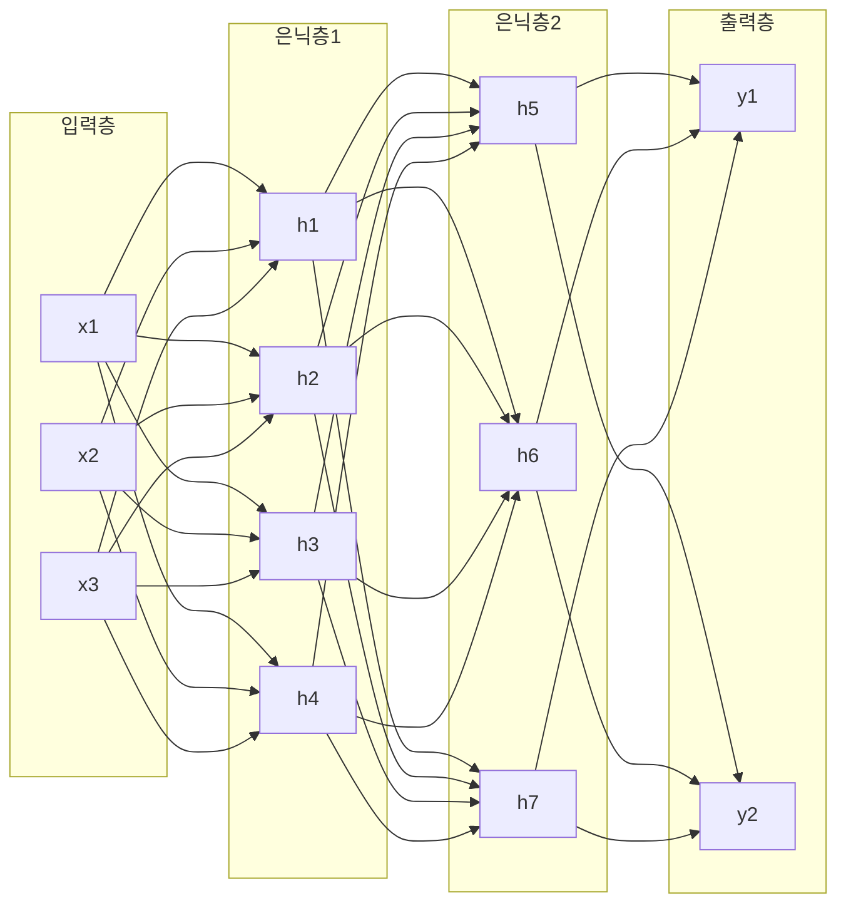

## 개요

퍼셉트론(Perceptron)은 1958년 Frank Rosenblatt가 제안한 가장 단순한 인공 신경망 구조이며, 다층 퍼셉트론(Multi-Layer Perceptron, MLP)은 이를 여러 층으로 확장하여 비선형 문제를 해결할 수 있게 만든 피드포워드 신경망이다. MLP는 현대 딥러닝의 기초를 이루며, 입력층-은닉층-출력층으로 구성된 완전 연결(fully connected) 네트워크 구조를 갖는다. [[activation-functions]]와 [[gradient-descent-backpropagation]]을 결합하여 학습이 이루어진다.

## 단일 퍼셉트론

### 구조

단일 퍼셉트론은 McCulloch & Pitts(1943)의 이진 인공 뉴런 모델에 기반한다. 입력 벡터 x에 가중치 w를 곱하고 편향 b를 더한 뒤 활성화 함수를 적용하는 단순한 구조다.

```
출력 = f(w1*x1 + w2*x2 + ... + wn*xn + b)
```

단일 퍼셉트론은 선형 분류만 가능하다. Minsky & Papert(1969)가 XOR 문제를 풀 수 없음을 증명하면서 신경망 연구는 첫 번째 빙하기(AI Winter)를 맞았다.

### 학습 규칙

퍼셉트론 학습 규칙은 오분류된 샘플에 대해 가중치를 갱신한다. 선형 분리 가능한 데이터에 대해 유한 스텝 내 수렴이 보장된다(퍼셉트론 수렴 정리).

## 다층 퍼셉트론 (MLP)

### 아키텍처

MLP는 3개 이상의 층으로 구성된 피드포워드 네트워크다. 각 뉴런은 다음 층의 모든 뉴런과 가중치로 연결된다.



- **입력층(Input Layer)**: 원시 데이터를 받아들이는 층. 변환 없이 다음 층으로 전달
- **은닉층(Hidden Layer)**: 비선형 [[activation-functions]]를 적용하여 특징을 추출. 층 수와 뉴런 수가 모델 용량을 결정
- **출력층(Output Layer)**: 최종 예측값을 생성. 분류에는 [[logistic-regression]]의 Softmax, 회귀에는 선형 활성화 사용

### 순전파 (Forward Propagation)

입력이 각 층을 순차적으로 통과하며 가중합과 활성화 함수가 반복 적용된다.

```
z[l] = W[l] * a[l-1] + b[l]
a[l] = f(z[l])
```

여기서 l은 층 번호, W는 가중치 행렬, b는 편향 벡터, f는 활성화 함수다.

### 역전파 (Backpropagation)

1986년 Rumelhart, Hinton, Williams가 대중화한 역전파 알고리즘은 연쇄 법칙(chain rule)을 사용해 [[loss-functions]]의 기울기를 출력층에서 입력층 방향으로 계산한다. 이 기울기를 기반으로 [[optimization-theory]]의 경사 하강법이 가중치를 갱신한다.


역전파의 핵심 문제는 기울기 소실(vanishing gradient)과 기울기 폭발(exploding gradient)이다. 깊은 네트워크에서 기울기가 층을 거칠수록 기하급수적으로 작아지거나 커지는 현상으로, [[batch-norm-layer-norm]], [[weight-initialization]], 잔차 연결(skip connection)이 이를 해결한다.

## 범용 근사 정리 (Universal Approximation Theorem)

1989년 Cybenko, 이후 Hornik(1991)이 일반화한 정리로, 충분한 뉴런을 가진 단일 은닉층 MLP가 임의의 연속 함수를 원하는 정밀도로 근사할 수 있음을 증명했다. 단, 정리는 근사 가능성만 보장하고 학습 가능성이나 효율성은 보장하지 않는다. 실제로는 깊은 네트워크(다수 은닉층)가 같은 표현력을 훨씬 적은 파라미터로 달성하여, 현대 딥러닝이 깊이를 추구하는 이론적 배경이 된다.

## 역사적 이정표

| 연도 | 사건 | 인물 |
|------|------|------|
| 1943 | 이진 인공 뉴런 모델 제안 | McCulloch & Pitts |
| 1958 | 퍼셉트론 구조 발표 | Frank Rosenblatt |
| 1969 | 선형 한계 증명 (XOR 문제) | Minsky & Papert |
| 1970 | 역전파 알고리즘 개발 | Seppo Linnainmaa |
| 1986 | 역전파 대중화 | Rumelhart, Hinton, Williams |
| 1989 | 범용 근사 정리 | Cybenko |
| 2003 | 딥러닝 부흥의 시작 | Yoshua Bengio |

## MLP의 한계와 발전

MLP는 모든 뉴런이 완전 연결되어 파라미터 수가 빠르게 증가하며, 입력의 공간 구조나 순서 정보를 활용하지 못한다. 이 한계를 극복하기 위해 [[cnn]](공간 구조), [[rnn-lstm-gru]](순서 구조), [[transformer-architecture]](어텐션 기반)가 발전했다. 하지만 [[dropout]], [[batch-norm-layer-norm]] 같은 정규화 기법과 결합한 MLP는 여전히 많은 태스크에서 강력한 기준선(baseline) 모델이다.

## 관련 문서

- [[activation-functions]] - MLP 비선형성의 핵심
- [[gradient-descent-backpropagation]] - 가중치 학습 알고리즘
- [[weight-initialization]] - 초기 가중치 설정 전략
- [[dropout]] - MLP 과적합 방지 기법
- [[loss-functions]] - 목적 함수 종류와 선택
- [[logistic-regression]] - 단일 뉴런의 분류 모델 해석
