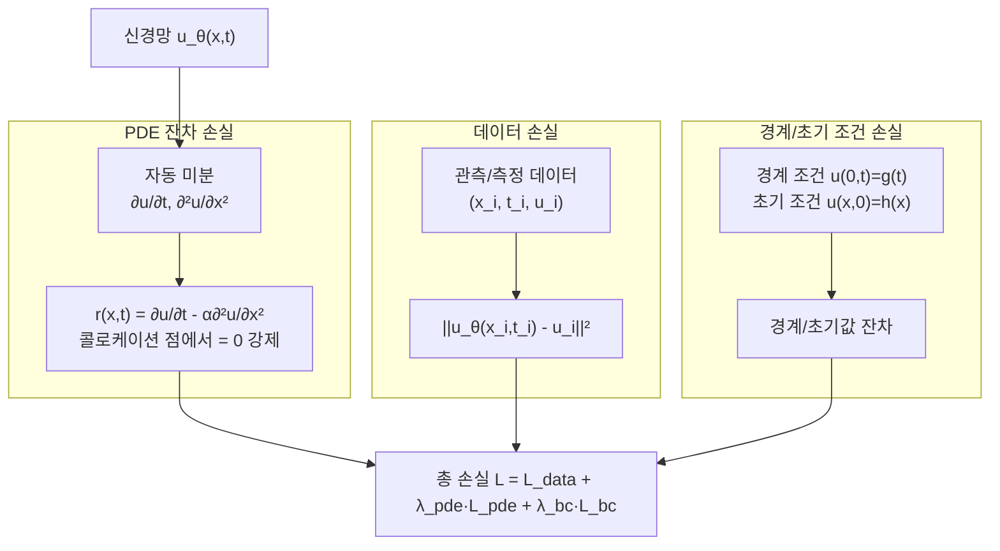
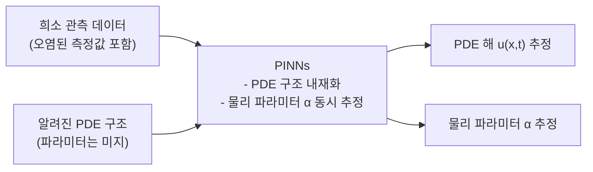

# 물리 정보 신경망 (Physics-Informed Neural Networks, PINNs)

물리 정보 신경망(PINNs)은 신경망의 손실 함수에 **편미분방정식(PDE) 또는 상미분방정식(ODE)을 제약 조건으로 직접 내재화**함으로써 데이터와 물리 법칙을 동시에 학습하는 방법론이다. Raissi et al.(2019)이 *Journal of Computational Physics*에 발표했으며, 데이터가 희소한 과학/공학 시뮬레이션 분야에서 강력한 대안으로 주목받고 있다.

## 핵심 아이디어

전통적 수치 해석(유한 요소법, 유한 차분법)은 PDE의 수치 해를 격자(mesh) 위에서 계산한다. PINNs는 신경망 $u_\theta(x, t)$가 PDE의 해를 직접 근사하도록 학습시킨다.

**열 방정식(Heat Equation) 예시:**
$$\frac{\partial u}{\partial t} - \alpha \frac{\partial^2 u}{\partial x^2} = 0$$

신경망 $u_\theta(x, t)$로 이 해를 근사할 때, 손실 함수는 세 부분으로 구성된다:

$$\mathcal{L} = \underbrace{\mathcal{L}_\text{data}}_{\text{관측 데이터}} + \underbrace{\mathcal{L}_\text{PDE}}_{\text{PDE 잔차}} + \underbrace{\mathcal{L}_\text{BC/IC}}_{\text{경계/초기 조건}}$$

## 손실 함수 상세

**각 손실 항:**

$$\mathcal{L}_\text{PDE} = \frac{1}{N_f} \sum_{i=1}^{N_f} \left|r(x_f^i, t_f^i)\right|^2$$

$$\mathcal{L}_\text{data} = \frac{1}{N_u} \sum_{i=1}^{N_u} \left|u_\theta(x_u^i, t_u^i) - u_i\right|^2$$

$N_f$는 콜로케이션 점(collocation point, PDE 잔차를 계산하는 내부 점) 수이고, $N_u$는 관측 데이터 수다. 자동 미분([[automatic-differentiation]])을 사용해 신경망의 편미분을 계산한다.

## 주요 적용 PDE 유형

| PDE 유형 | 예시 | 응용 분야 |
|----------|------|----------|
| 포물형 (Parabolic) | 열전도 방정식 | 열 해석, 확산 |
| 쌍곡형 (Hyperbolic) | 파동 방정식 | 탄성파, 음향학 |
| 타원형 (Elliptic) | 라플라스/포아송 방정식 | 정적 전자기장, 유체 압력 |
| 유체 역학 | Navier-Stokes 방정식 | CFD, 항공 시뮬레이션 |
| 양자 역학 | 슈뢰딩거 방정식 | 분자 동역학 |

## Neural ODE와의 관계

[[neural-ode]]는 신경망이 ODE의 **동역학 함수를 학습**하는 반면, PINNs는 ODE/PDE의 **해(solution) 자체를 학습**한다.

| 비교 항목 | Neural ODE | PINNs |
|----------|-----------|-------|
| 학습 대상 | ODE의 우변 f(h, t) | ODE/PDE의 해 u(x, t) |
| 물리 지식 활용 | 구조 없음 | PDE를 손실에 명시적 내재화 |
| 용도 | 연속 깊이 모델, 시계열 | 과학 시뮬레이션, 역문제 |

## 역문제(Inverse Problem)에서의 강점

PINNs의 독보적 장점은 **역문제(inverse problem)** 해결이다. 관측 데이터에서 PDE의 미지 파라미터(물리 상수)를 추정하는 것이 가능하다.

예를 들어, 유체의 온도 측정값만 있을 때 열전도율 $\alpha$를 동시에 추정할 수 있다. $\alpha$를 학습 파라미터에 포함하기만 하면 된다.

## 실무 구현 고려사항

### 콜로케이션 점 샘플링

PDE 잔차는 도메인 전체에서 계산해야 한다. 균등 격자보다 **적응형 샘플링(adaptive sampling)**이 효율적이다. 잔차가 큰 영역에 더 많은 점을 배치한다.

### 손실 가중치 밸런싱

$\lambda_\text{pde}$와 $\lambda_\text{bc}$의 균형이 수렴에 결정적이다. 자동 가중치 조정 방법(NTK 기반 자동 가중치 등)이 연구되고 있다.

### 활성화 함수 선택

PDE 미분 계산을 위해 고차 미분 가능한 활성화 함수(tanh, sin)가 ReLU보다 적합하다. tanh가 가장 일반적으로 사용된다.

### Fourier Feature Networks

고주파 솔루션을 가진 PDE에서는 입력에 Fourier 특징 임베딩을 추가해 **스펙트럼 편향(spectral bias)** 문제를 완화한다.

## PINNs의 한계

1. **고차원 PDE**: 차원이 높아질수록 콜로케이션 점 수가 지수적으로 필요 (차원의 저주)
2. **불연속 해**: 충격파(shock wave)처럼 불연속적 해는 표준 PINNs로 처리 어려움
3. **긴 시간 범위**: 시간이 길어질수록 인과 정보 전파가 어려움 → causal training 전략 필요
4. **손실 가중치 민감성**: 하이퍼파라미터 튜닝 부담

## 관련 문서

- [[neural-ode]] - ODE 관점의 신경망 연속화
- [[loss-functions]] - PDE 잔차를 포함한 다목적 손실 설계
- [[automatic-differentiation]] - 편미분 계산의 핵심 기술
- [[gaussian-process]] - 과학적 기계학습의 또 다른 접근법
