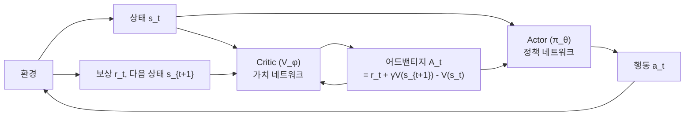

# 정책 경사법과 PPO (Policy Gradient & PPO)

## 정책 경사 정리 (Policy Gradient Theorem)

가치 기반(value-based) 방법과 달리, 정책 경사법(policy gradient)은 정책 $\pi_\theta$를 직접 파라미터화하고 기대 누적 보상을 최대화한다.

$$J(\theta) = \mathbb{E}_{\tau \sim \pi_\theta}\left[\sum_{t=0}^{T} \gamma^t r_t\right]$$

**정책 경사 정리**:

$$\nabla_\theta J(\theta) = \mathbb{E}_{\tau \sim \pi_\theta}\left[\sum_{t=0}^{T} \nabla_\theta \log \pi_\theta(a_t \mid s_t) \cdot G_t\right]$$

여기서 $G_t = \sum_{t'=t}^{T} \gamma^{t'-t} r_{t'}$는 시각 $t$ 이후의 누적 할인 보상(return)이다. 로그 미분 기교(log-derivative trick): $\nabla \log \pi = \frac{\nabla \pi}{\pi}$.

## REINFORCE 알고리즘과 분산 문제

REINFORCE (Williams, 1992)는 완전한 에피소드를 수행한 후 경사를 추정하는 Monte Carlo 방법이다.

```
for each episode:
    실행: τ = (s0, a0, r1, ..., sT) ~ π_θ
    for each timestep t:
        G_t = sum(γ^(t'-t) * r_t' for t' >= t)
        θ += α * ∇_θ log π_θ(a_t | s_t) * G_t
```

**분산(variance) 문제**: 에피소드마다 리턴 $G_t$가 크게 달라 경사 추정치의 분산이 매우 높다. 해결책: **베이스라인(baseline)** 도입.

$$\nabla_\theta J(\theta) = \mathbb{E}\left[\nabla_\theta \log \pi_\theta(a_t \mid s_t) \cdot (G_t - b(s_t))\right]$$

베이스라인 $b(s_t)$가 행동과 무관하면 경사의 기댓값은 유지되면서 분산만 감소한다. 최적 베이스라인: 상태 가치 함수 $V^\pi(s_t)$.

## Actor-Critic 구조



- **Actor**: 정책 $\pi_\theta(a \mid s)$를 학습 — 어드밴티지가 양수인 행동 강화
- **Critic**: 가치 함수 $V_\phi(s)$를 학습 — TD 오차로 베이스라인 역할
- 어드밴티지(advantage): $A_t = Q(s_t, a_t) - V(s_t)$, "이 행동이 평균보다 얼마나 좋은가"

## GAE (Generalized Advantage Estimation)

단일 스텝 TD와 Monte Carlo의 편향-분산 트레이드오프를 조절하는 지수 가중 평균이다 (Schulman et al. 2015).

$$\hat{A}_t^{GAE(\gamma, \lambda)} = \sum_{l=0}^{\infty} (\gamma\lambda)^l \delta_{t+l}$$

여기서 $\delta_t = r_t + \gamma V(s_{t+1}) - V(s_t)$는 TD 잔차(residual)다.
- $\lambda = 0$: 단일 스텝 TD (낮은 분산, 높은 편향)
- $\lambda = 1$: Monte Carlo 리턴 (높은 분산, 낮은 편향)

## PPO의 Clipped Objective

PPO(Proximal Policy Optimization, Schulman et al. 2017)는 신뢰 영역 정책 최적화(TRPO)의 아이디어를 실용적으로 단순화한다. 정책이 한 번에 너무 많이 변하지 않도록 클리핑(clipping)으로 제한한다.

확률비(probability ratio): $r_t(\theta) = \frac{\pi_\theta(a_t \mid s_t)}{\pi_{\theta_{\text{old}}}(a_t \mid s_t)}$

**PPO-Clip Objective**:

$$\mathcal{L}^{CLIP}(\theta) = \mathbb{E}_t\left[\min\left(r_t(\theta) \hat{A}_t, \; \text{clip}(r_t(\theta), 1-\epsilon, 1+\epsilon) \hat{A}_t\right)\right]$$

$\epsilon$은 보통 0.1~0.2. $r_t$가 $[1-\epsilon, 1+\epsilon]$ 범위를 벗어나면 경사가 차단된다.

PPO의 실용적 강점:
- TRPO의 2차 최적화 없이도 안정적 학습
- 다중 에폭(epoch)으로 동일 데이터 재사용 가능
- 구현 간단, 하이퍼파라미터 둔감

## RLHF에서의 PPO

LLM RLHF 파이프라인에서 PPO는 다음 구조로 적용된다.

$$r_{\text{eff}}(x, y) = r_\phi(x, y) - \beta \cdot \log\frac{\pi_\theta(y \mid x)}{\pi_{\text{ref}}(y \mid x)}$$

- $r_\phi$: 보상 모델(reward model) 점수
- $\beta$ KL 페널티: 참조 정책(SFT 모델)에서 벗어나는 것을 제한

## 관련 문서

- [[markov-decision-process]]
- [[q-learning-dqn]]
- [[rlhf-pipeline|RLHF 파이프라인]]
- [[DPO와 선호 학습]]
- [[kl-divergence]]
