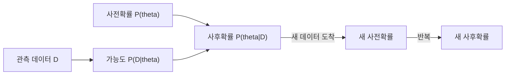
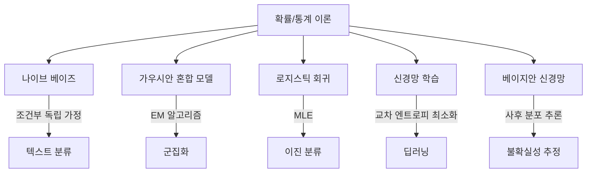

# ML을 위한 확률과 통계 (Probability & Statistics for ML)

머신러닝은 본질적으로 데이터에서 불확실성을 다루는 학문이다. 확률은 불확실성을 수학적으로 표현하는 언어이고, 통계는 데이터로부터 패턴을 추론하는 도구다.

## 왜 ML에 확률/통계가 필요한가

모델이 "이 이미지가 고양이일 확률은 93%"라고 말할 때, 그 93%는 확률론에 기반한다. 학습 데이터에서 패턴을 찾고, 새로운 데이터에 대한 예측의 신뢰도를 정량화하려면 확률과 통계의 도구가 필수적이다.

## 확률의 기본 개념

### 확률 분포 (Probability Distributions)

데이터가 어떤 패턴으로 퍼져 있는지를 수학적으로 기술한다.

**이산 분포:**
- 베르누이 분포: 성공/실패 이진 결과 (스팸 분류의 기본)
- 이항 분포: n번 시행 중 성공 횟수
- 다항 분포: 여러 클래스 분류에서 각 클래스 확률

**연속 분포:**
- 정규 분포 (가우시안): ML에서 가장 많이 가정되는 분포. 중심극한정리에 의해 대부분의 자연 현상에 근사
- 균등 분포: 가중치 초기화에 사용
- 지수/감마 분포: 사건 간 시간 간격 모델링

### 조건부 확률과 독립

- `P(A|B)` = B가 주어졌을 때 A의 확률
- 독립: `P(A,B) = P(A) * P(B)` -- 나이브 베이즈 분류기의 핵심 가정

### 기대값과 분산

- **기대값 E[X]**: 확률 변수의 평균적 결과. [[loss-functions|손실 함수]]의 최소화는 기대 손실의 최소화다
- **분산 Var[X]**: 데이터의 퍼짐 정도. [[bias-variance-tradeoff|편향-분산 트레이드오프]]의 분산이 바로 이것

## 베이즈 정리 (Bayes' Theorem)

확률론에서 가장 중요한 정리:

```
P(theta|D) = P(D|theta) * P(theta) / P(D)
```

- `P(theta|D)`: **사후확률** (posterior) -- 데이터를 본 후 업데이트된 믿음
- `P(D|theta)`: **가능도** (likelihood) -- 파라미터가 주어졌을 때 데이터가 관측될 확률
- `P(theta)`: **사전확률** (prior) -- 데이터를 보기 전 사전 지식
- `P(D)`: **증거** (evidence) -- 정규화 상수



베이즈 정리는 새 데이터가 도착할 때마다 믿음을 업데이트하는 프레임워크다. 스팸 필터, 의료 진단, 추천 시스템 등에서 핵심적으로 활용된다.

## 추정 이론

### 최대가능도추정 (MLE)

데이터가 관측될 확률을 최대화하는 파라미터를 찾는다:

```
theta_MLE = argmax P(D|theta)
```

- 사전확률을 고려하지 않는다 (빈도주의적 접근)
- 데이터가 충분하면 강력하지만, 적으면 과적합 위험
- 로지스틱 회귀, 신경망의 기본 학습 원리

### 최대사후확률추정 (MAP)

MLE에 사전확률을 결합한다:

```
theta_MAP = argmax P(D|theta) * P(theta)
```

사전확률에 가우시안을 사용하면 L2 정규화([[overfitting-regularization|정규화]])와 수학적으로 동일해진다. 즉 **MAP = MLE + 정규화**라는 우아한 관계가 성립한다.

### MLE vs MAP vs 베이즈 추론

| 방법 | 결과 | 불확실성 표현 | 데이터 부족 시 |
|------|------|---------------|----------------|
| MLE | 점 추정치 | 없음 | 과적합 |
| MAP | 점 추정치 + 사전지식 | 제한적 | 사전확률에 의존 |
| 베이즈 추론 | 사후 분포 전체 | 완전한 불확실성 정량화 | 사전확률이 지배 |

## 정보 이론과의 연결

- **엔트로피 H(X)**: 확률 분포의 불확실성 측정. 결정 트리의 분기 기준
- **KL 발산**: 두 확률 분포 사이의 차이. RLHF에서 정책 이탈 페널티로 사용
- **교차 엔트로피**: 예측 분포와 실제 분포의 차이. [[loss-functions|분류 손실 함수]]의 기반

## ML 알고리즘에서의 역할



## 관련 문서

- [[linear-algebra-for-ml]] -- 확률 분포의 행렬 표현
- [[loss-functions]] -- 교차 엔트로피, KL 발산 등 확률 기반 손실 함수
- [[bias-variance-tradeoff]] -- 통계적 추정 오차의 분해
- [[cross-validation-model-evaluation]] -- 통계적 모델 평가 방법
- [[overfitting-regularization]] -- MAP 추정과 정규화의 관계

## 참고 자료

- [Probability & Statistics for ML - Coursera](https://www.coursera.org/learn/machine-learning-probability-and-statistics)
- [Full Explanation of MLE, MAP and Bayesian Inference - Towards Data Science](https://towardsdatascience.com/full-explanation-of-mle-map-and-bayesian-inference-1db9a7fb1d2b/)
- [Bayesian Machine Learning - DataRobot](https://www.datarobot.com/blog/bayesian-machine-learning/)
