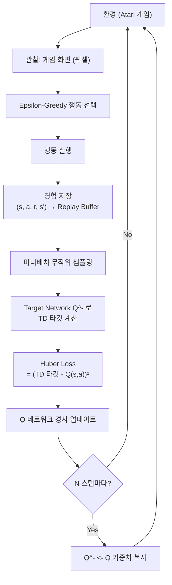

# Q-러닝과 심층 강화 학습 기초 (Q-Learning & DQN)

## Q-러닝 (Q-Learning)

Q-러닝은 Watkins (1989)이 제안한 off-policy 시간차 학습(temporal difference learning) 알고리즘이다. 최적 행동 가치 함수 $Q^*(s, a)$를 직접 학습한다.

**Q-값 업데이트 규칙**:

$$Q(s_t, a_t) \leftarrow Q(s_t, a_t) + \alpha \left[\underbrace{r_{t+1} + \gamma \max_{a'} Q(s_{t+1}, a')}_{\text{TD 타깃}} - Q(s_t, a_t)\right]$$

- $\alpha$: 학습률(learning rate)
- $r_{t+1} + \gamma \max_{a'} Q(s_{t+1}, a')$: Bellman 최적 방정식의 단일 스텝 근사
- **Off-policy**: 행동 정책(behavior policy)과 목표 정책(target policy)이 달라도 무방

## Epsilon-Greedy 탐험

Q-러닝에서 에이전트는 탐험(exploration)과 활용(exploitation)의 균형을 맞춰야 한다.

$$a_t = \begin{cases} \text{무작위 행동} & \text{확률 } \epsilon \\ \arg\max_a Q(s_t, a) & \text{확률 } 1 - \epsilon \end{cases}$$

$\epsilon$을 학습 초반 높게 설정했다가 점진적으로 감소(decay)시키는 전략이 일반적이다.

## DQN: 심층 Q-네트워크 (Deep Q-Network)

Mnih et al. (2013, 2015)의 DeepMind DQN은 CNN(Convolutional Neural Network)으로 Q 함수를 근사하여 Atari 게임에서 인간 수준 성능을 달성했다. 세 가지 핵심 혁신이 있다.

### 1. Experience Replay (경험 재플레이)

- 에이전트의 전이 경험 $(s_t, a_t, r_{t+1}, s_{t+1})$을 리플레이 버퍼(replay buffer)에 저장
- 학습 시 버퍼에서 **무작위 미니배치** 샘플링
- 효과: (1) 시간적으로 연속된 경험의 상관관계(correlation) 제거, (2) 동일 경험 재사용으로 데이터 효율성 향상

### 2. Target Network (목표 네트워크)

- TD 타깃 계산용 네트워크($Q^-$)를 학습 네트워크($Q$)와 분리
- $Q^-$는 일정 주기마다 $Q$의 가중치를 복사받아 업데이트
- 효과: 학습 중 타깃이 급격히 변동하는 이동 타깃(moving target) 문제 완화

### 3. CNN 상태 표현

게임 화면(픽셀)을 4프레임 스택으로 입력하여 속도 정보를 인코딩하고, CNN으로 공간 특징을 추출한다.

## DQN 학습 루프

위 루프는 DQN의 핵심 학습 사이클을 보여준다.

## Deadly Triad (치명적 삼요소)

Sutton & Barto가 지적한 수렴 불안정의 세 원인이 동시에 존재할 때 발산 위험이 높아진다.

1. **함수 근사(function approximation)**: 신경망으로 Q 함수 근사
2. **부트스트래핑(bootstrapping)**: 이전 추정값으로 타깃 계산 (TD 학습)
3. **Off-policy 학습**: 행동 분포와 학습 타깃 분포 불일치

DQN의 Experience Replay와 Target Network는 이 문제를 부분적으로 완화한다.

## Double DQN

표준 DQN은 $\max_{a'} Q^-(s', a')$에서 과대평가(overestimation bias)가 발생한다. Double DQN은 행동 선택과 가치 평가를 분리한다.

$$\text{TD 타깃} = r + \gamma Q^-\left(s', \arg\max_{a'} Q(s', a')\right)$$

- 행동 선택: 온라인 네트워크 $Q$
- 가치 평가: 타깃 네트워크 $Q^-$

## 관련 문서

- [[markov-decision-process]]
- [[policy-gradient-ppo]]
- [[rlhf-pipeline|RLHF 파이프라인]]
