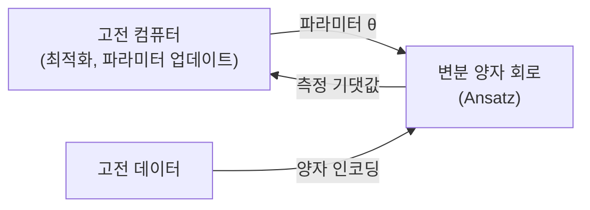

# 양자 기계학습 (Quantum Machine Learning, QML) 기초

## 정의

양자 기계학습(Quantum Machine Learning, QML)은 **양자 컴퓨팅**과 **기계학습**의 교차점에 있는 연구 분야다. 양자 컴퓨터의 중첩(superposition), 얽힘(entanglement), 간섭(interference) 성질을 활용하여 특정 ML 태스크를 더 효율적으로 수행하거나, 고전 컴퓨터로 불가능한 양자 데이터를 학습하는 것을 목표로 한다.

## NISQ 시대 맥락

현재는 **NISQ(Noisy Intermediate-Scale Quantum)** 시대로, 수십~수백 큐비트 규모지만 노이즈가 많은 양자 컴퓨터를 사용한다. 이 환경에서 실용적인 QML은 다음을 전제한다:

- 완전한 오류 수정 없이 노이즈 허용
- 얕은 회로(shallow circuit) 구조
- 고전-양자 하이브리드 최적화



NISQ QML의 표준 패러다임: 고전 컴퓨터가 양자 회로의 파라미터를 최적화하는 하이브리드 루프.

## 핵심 구성 요소

### 1. 데이터 인코딩 (Quantum Encoding)

고전 데이터를 양자 상태로 변환하는 방법:

| 인코딩 방식 | 설명 | 특징 |
|------------|------|------|
| 진폭 인코딩 | $n$ 데이터 포인트를 $\log_2 n$ 큐비트에 인코딩 | 지수적 압축, 준비 비용 |
| 각도 인코딩 | 데이터값을 회전 게이트 각도로 사용 | 단순, 하나의 특성에 하나의 큐비트 |
| 기저 인코딩 | 이진 데이터를 큐비트 기저 상태로 직접 매핑 | 직관적, 계산 기저 |
| IQP 인코딩 | 고전 데이터를 위상에 인코딩 | 커널 방법과 연결 |

### 2. 변분 양자 회로 (Variational Quantum Circuit, VQC)

학습 가능한 파라미터 $\theta$를 가진 양자 회로:

$$|\psi(\theta)\rangle = U(\theta)|0\rangle^{\otimes n}$$

회로 구조(Ansatz) 예시:
- **Hardware Efficient Ansatz**: 기기 연결성에 맞춤 최소 게이트
- **UCCSD**: 양자 화학 에너지 최소화를 위한 물리 동기 구조
- **Data re-uploading**: 고전 데이터를 회로 중간에 반복 삽입

손실 함수는 측정 결과의 기댓값:

$$\mathcal{L}(\theta) = \langle \psi(\theta) | \hat{O} | \psi(\theta) \rangle$$

### 3. 양자 커널 방법 (Quantum Kernel Methods)

양자 특징 맵 $\phi: \mathbf{x} \mapsto |\phi(\mathbf{x})\rangle$을 통해 커널 정의:

$$k(\mathbf{x}, \mathbf{x}') = |\langle \phi(\mathbf{x}') | \phi(\mathbf{x}) \rangle|^2$$

- 고전 SVM에서 양자 커널을 사용 가능
- 양자 컴퓨터가 고전 컴퓨터로 효율적으로 계산할 수 없는 커널 행렬 추정
- 이론적으로는 특정 데이터 분포에서 "양자 우위" 가능성

## 주요 알고리즘

### VQE (Variational Quantum Eigensolver)
- 양자 화학 분자 에너지 최소화
- NISQ에서 가장 성숙한 응용
- 고전 CCSD(T) 대비 복잡한 분자에서 정확도 우위 가능

### QAOA (Quantum Approximate Optimization Algorithm)
- 조합 최적화 문제 (MaxCut, TSP 등) 근사 해
- 고전 알고리즘과의 우위는 아직 불분명
- 파라미터 레이어 수 p에 따라 정확도 향상

### 양자 신경망 (Quantum Neural Networks, QNN)
- VQC를 신경망처럼 사용: 입력 인코딩 + 파라미터 레이어 + 측정
- 분류, 회귀, 생성 모델로 사용 가능

## 주요 라이브러리

### PennyLane (Xanadu)
```python
import pennylane as qml
import numpy as np

dev = qml.device("default.qubit", wires=2)

@qml.qnode(dev)
def circuit(params, x):
    # 데이터 인코딩
    qml.RX(x[0], wires=0)
    qml.RY(x[1], wires=1)
    # 학습 가능 레이어
    qml.RZ(params[0], wires=0)
    qml.CNOT(wires=[0, 1])
    qml.RZ(params[1], wires=1)
    return qml.expval(qml.PauliZ(0))

params = np.array([0.1, 0.2], requires_grad=True)
x = np.array([0.5, 0.3])
print(circuit(params, x))
```

### Qiskit Machine Learning (IBM)
- IBM 양자 컴퓨터와 직접 연동
- `SamplerQNN`, `EstimatorQNN` 클래스 제공
- PyTorch/TensorFlow 통합 지원

## 이론적 도전 과제

### 바렌 평원 문제 (Barren Plateaus)
- 무작위 초기화된 깊은 VQC에서 기울기가 지수적으로 작아지는 현상
- 시스템 크기가 커질수록 훈련 불가능해질 수 있음
- 해결책: 레이어별 학습, 국소 비용 함수, 구조화된 초기화

### 측정 비용
- 기댓값 추정에 많은 양자 회로 반복 샷 수 필요
- 실용적으로 수천~수만 회 측정 필요

### 디퀀타이제이션 (Dequantization)
- 많은 QML 알고리즘이 고전 알고리즘으로 시뮬레이션 가능함을 Tang 등이 증명
- 진정한 양자 우위 달성이 예상보다 어렵다는 회의론

## 양자 우위가 기대되는 영역

현재 이론적으로 유망한 적용 분야:

1. **양자 시뮬레이션**: 분자 구조, 재료 특성 계산 (화학/제약)
2. **양자 데이터 학습**: 양자 센서나 양자 시스템에서 생성된 데이터
3. **특정 커널 방법**: 고전 컴퓨터가 효율적으로 시뮬레이션할 수 없는 커널
4. **샘플링 문제**: 특정 확률 분포에서의 샘플 생성

## 현재 한계와 전망

- **큐비트 수 및 품질**: 실용적 QML에 필요한 오류 수정된 논리 큐비트는 수백만 물리 큐비트 필요 (아직 수십~수백 수준)
- **고전 시뮬레이션 경쟁**: 텐서 네트워크 등 고전 알고리즘이 계속 발전
- **수십 년 이후 예상**: 완전한 오류 수정 및 장점 있는 QML은 2030-2040년대 예측

단기적으로는 **VQE를 통한 양자 화학** 분야에서 가장 먼저 실용적 응용이 기대된다.

## 관련 문서

- [[tensor-networks-ml]] - 양자 영감 고전 알고리즘, QML과 깊은 연관
- [[kernel-methods-rkhs]] - 양자 커널의 고전 기반
- [[optimization-theory]] - 변분 최적화의 일반 이론
- [[energy-based-models]] - 확률적 에너지 모델과의 유사성
