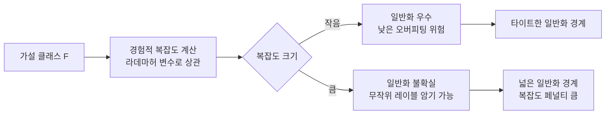

# 라데마허 복잡도와 일반화 경계

## 개요

라데마허 복잡도(Rademacher complexity)는 가설 클래스(hypothesis class)가 무작위 노이즈 레이블에 얼마나 잘 맞출 수 있는지를 측정하는 **데이터 의존적(data-dependent)** 복잡도 측도다. VC 차원(VC dimension)이 분포에 무관한 최악 케이스 측도인 반면, 라데마허 복잡도는 실제 데이터 분포를 반영하므로 더 타이트한 일반화 경계(generalization bound)를 제공한다.

통계학습이론의 핵심 목표는 "훈련 오차가 낮으면 테스트 오차도 낮은가"를 수학적으로 보장하는 것이다. 라데마허 복잡도는 이 질문에 데이터 기반으로 답한다.

## 핵심 정의

### 라데마허 변수 (Rademacher Random Variable)

$\sigma_i$는 $P(\sigma_i = +1) = P(\sigma_i = -1) = 1/2$인 균일 이진 확률 변수다. 이를 **라데마허 확률 변수**라 부른다.

### 경험적 라데마허 복잡도 (Empirical Rademacher Complexity)

고정 샘플 $S = \{x_1, \ldots, x_m\}$에 대한 함수 클래스 $\mathcal{F}$의 경험적 라데마허 복잡도는:

$$\hat{\mathcal{R}}_S(\mathcal{F}) = \mathbb{E}_\sigma \left[ \sup_{f \in \mathcal{F}} \frac{1}{m} \sum_{i=1}^m \sigma_i f(x_i) \right]$$

- $\sigma = (\sigma_1, \ldots, \sigma_m)$: 독립 라데마허 확률 변수 벡터
- $\sup$: 클래스 내 가장 잘 맞추는 함수 선택
- 직관: $f(x_i)$가 무작위 $\pm 1$ 레이블 $\sigma_i$와 얼마나 잘 상관(correlate)하는지 측정

### 라데마허 복잡도 (Rademacher Complexity)

분포 $\mathcal{D}$로부터 추출된 $m$개 샘플에 대한 기댓값:

$$\mathcal{R}_m(\mathcal{F}) = \mathbb{E}_{S \sim \mathcal{D}^m} \left[ \hat{\mathcal{R}}_S(\mathcal{F}) \right]$$

## 일반화 경계 (Generalization Bound)

### 기본 정리

$\mathcal{F}$가 $[0, 1]$에 값을 갖는 함수 클래스이고, $S$가 분포 $\mathcal{D}$에서 i.i.d. 추출된 $m$개 샘플이면, 임의의 $\delta > 0$에 대해 확률 $\geq 1 - \delta$로:

$$\forall f \in \mathcal{F}: \quad R(f) \leq \hat{R}_S(f) + 2\mathcal{R}_m(\mathcal{F}) + \sqrt{\frac{\ln(1/\delta)}{2m}}$$

- $R(f)$: 진짜 위험(true risk) = 분포에 대한 기댓값 손실
- $\hat{R}_S(f)$: 경험적 위험(empirical risk) = 훈련 손실
- $2\mathcal{R}_m(\mathcal{F})$: 복잡도 페널티 항
- $\sqrt{\ln(1/\delta)/(2m)}$: 확률적 신뢰 항

### 경험적 라데마허 버전

$S$에 의존하는 더 타이트한 경계:

$$R(f) \leq \hat{R}_S(f) + 2\hat{\mathcal{R}}_S(\mathcal{F}) + 3\sqrt{\frac{\ln(2/\delta)}{2m}}$$

이 버전은 주어진 데이터셋에서 직접 계산 가능하므로 실용적이다.

## VC 차원과의 관계

VC 차원 $d$를 가진 이진 분류 클래스의 라데마허 복잡도는:

$$\mathcal{R}_m(\mathcal{F}) \leq \sqrt{\frac{2d \ln(em/d)}{m}}$$

- VC 차원 기반 경계보다 라데마허 경계가 항상 더 타이트하거나 동등
- VC는 최악 분포 기준; 라데마허는 실제 분포 기반

위 다이어그램은 라데마허 복잡도가 일반화 경계 품질을 결정하는 흐름을 나타낸다.

## 핵심 성질

### 1. 단조성 (Monotonicity)

$\mathcal{F}_1 \subseteq \mathcal{F}_2$이면 $\mathcal{R}_m(\mathcal{F}_1) \leq \mathcal{R}_m(\mathcal{F}_2)$. 클래스가 클수록 복잡도가 높다.

### 2. 컨벡스 헐 (Convex Hull)

$\mathcal{R}_m(\text{conv}(\mathcal{F})) = \mathcal{R}_m(\mathcal{F})$. 컨벡스 헐은 복잡도를 변화시키지 않는다.

### 3. 리프시츠 합성 (Lipschitz Composition)

$L$-리프시츠 함수 $\phi$에 대해:

$$\mathcal{R}_m(\phi \circ \mathcal{F}) \leq L \cdot \mathcal{R}_m(\mathcal{F})$$

이는 활성화 함수(activation function) 합성 후 복잡도 분석에 사용된다.

### 4. 마스코우 보조정리 (Massart's Lemma)

유한 함수 클래스 $|\mathcal{F}| = N$이면:

$$\mathcal{R}_m(\mathcal{F}) \leq \max_{f \in \mathcal{F}} \|f\|_2 \cdot \frac{\sqrt{2 \ln N}}{m}$$

## 신경망에서의 적용

### 노름 기반 복잡도 (Norm-Based Complexity)

심층 신경망의 라데마허 복잡도는 가중치 행렬의 노름으로 경계를 줄 수 있다. $L$개 레이어, 각 가중치 행렬의 스펙트럼 노름 $\|W_l\|_\sigma$에 대해:

$$\mathcal{R}_m(\mathcal{F}_{\text{NN}}) \leq \frac{B \cdot \prod_{l=1}^{L} \|W_l\|_\sigma}{m} \cdot \sqrt{\sum_{l=1}^{L} \frac{\|W_l\|_F^2}{\|W_l\|_\sigma^2}}$$

이는 **일반화가 파라미터 수가 아닌 노름에 의존**함을 시사한다. 과도하게 큰 신경망도 가중치 노름이 작으면 일반화 가능.

### 실무 함의

- 모델 선택: 검증셋 없이도 라데마허 복잡도로 클래스 비교 가능
- 정규화 이해: L2 정규화가 가중치 노름 제어 → 복잡도 감소로 해석
- 드롭아웃: 랜덤 마스킹으로 유효 클래스 크기 축소 효과

## 계산 방법

경험적 라데마허 복잡도는 몬테카를로(Monte Carlo) 방법으로 추정한다:

1. 라데마허 벡터 $\sigma^{(1)}, \ldots, \sigma^{(T)}$를 $T$회 샘플링
2. 각 시도에서 $\sup_{f \in \mathcal{F}} \frac{1}{m} \sum_i \sigma_i^{(t)} f(x_i)$ 계산
3. $T$개 값의 평균으로 추정

신경망의 경우 $\sup$ 계산이 NP-hard일 수 있어 근사 최적화(예: 경사 상승)를 사용한다.

## 관련 복잡도 측도 비교

| 측도 | 분포 의존 | 계산 가능성 | 용도 |
|------|----------|------------|------|
| VC 차원 | 아니오 (최악) | 어려움 | 이론 분석 |
| 라데마허 복잡도 | 예 (데이터 기반) | 추정 가능 | 실용 경계 |
| 커버링 수 (Covering Number) | 아니오 | 어려움 | 고급 이론 |
| PAC-Bayes 경계 | 예 (사전분포 기반) | 가능 | 베이지안 학습 |

## 관련 문서

- [[vc-dimension]] - VC 차원: 라데마허 복잡도와 비교되는 분포 독립적 복잡도 측도
- [[pac-learning]] - PAC 학습: 일반화 보장의 프레임워크
- [[pac-bayes-bounds]] - PAC-Bayes 경계: 사전분포 기반의 데이터 의존 경계
- [[bias-variance-tradeoff]] - 편향-분산 트레이드오프: 일반화와의 관계
- [[empirical-risk-minimization]] - ERM 이론: 라데마허 복잡도가 핵심 도구로 사용
- [[representation-learning-theory]] - 표현 학습 이론
