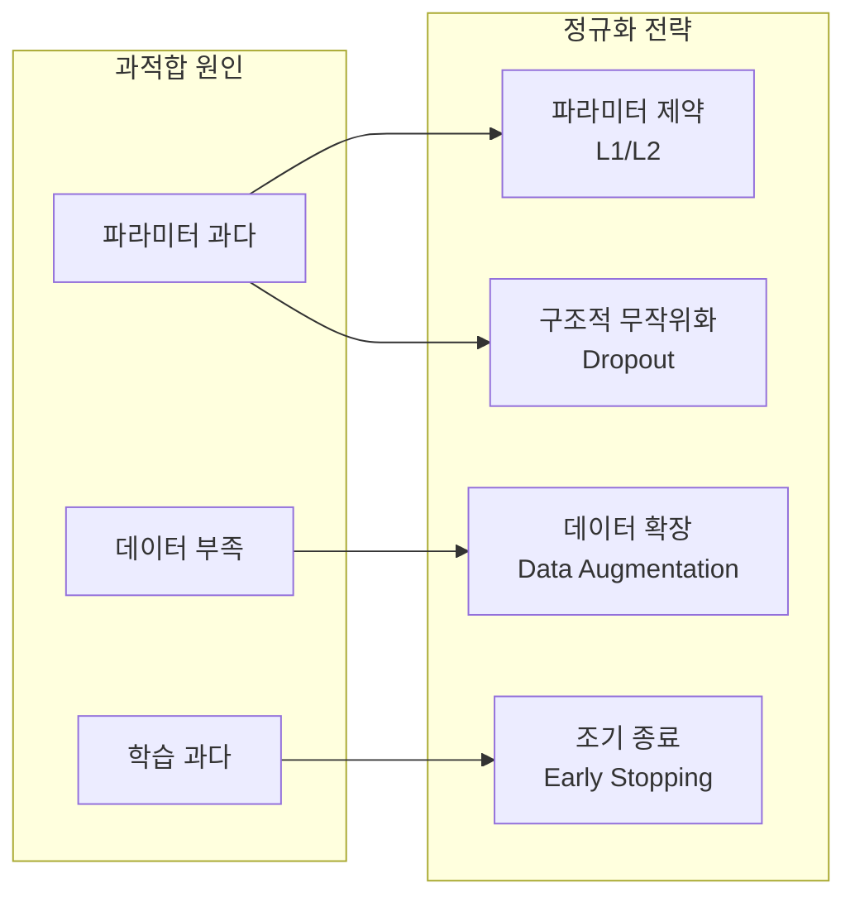
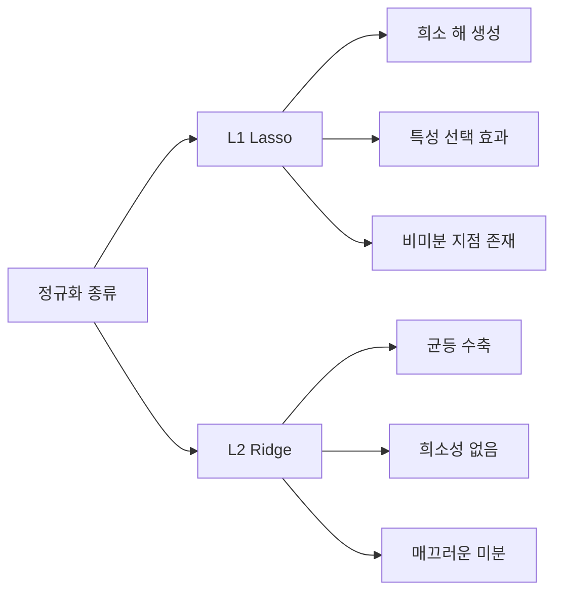
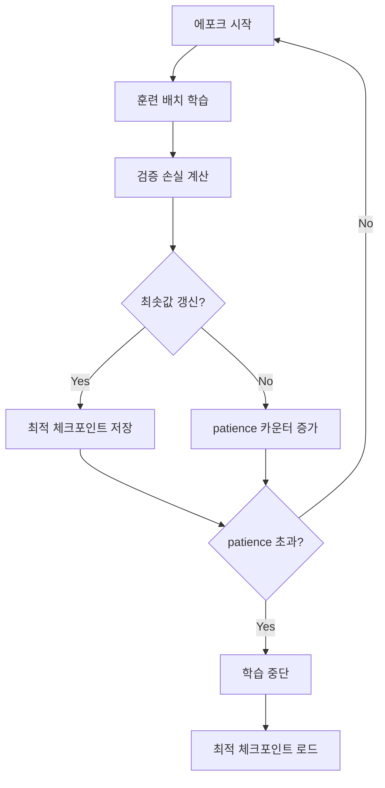
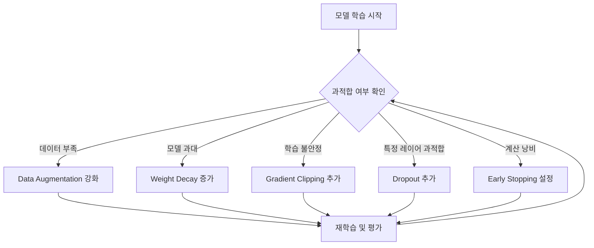

# 정규화 (Regularization)

정규화(regularization)는 모델이 훈련 데이터에 과적합(overfitting)되지 않고 새로운 데이터에도 잘 일반화하도록 유도하는 기법들의 총칭이다. 모델 복잡도를 제한하거나, 학습 과정에 노이즈를 도입하거나, 데이터 다양성을 늘려 과적합을 억제한다.

## 왜 정규화가 필요한가

딥러닝 모델은 수백만 개의 파라미터를 가지며, 충분한 용량이 있다면 훈련 데이터를 거의 완벽히 암기할 수 있다. 이 상태에서 훈련 손실은 낮지만 검증/테스트 손실은 높다 -- 이것이 과적합이다.

[[편향-분산 트레이드오프 (Bias-Variance Tradeoff)]]에서 분석하듯, 모델의 일반화 오류는 편향(bias)과 분산(variance)의 합으로 구성된다. 정규화는 분산을 줄이는 역할을 하며, 약간의 편향 증가를 감수한다.



## L2 정규화 (Ridge / Weight Decay)

### 원리

손실 함수에 가중치 제곱합의 페널티를 추가한다:

$$\mathcal{L}_{reg} = \mathcal{L}_{task} + \frac{\lambda}{2} \sum_i w_i^2$$

$\lambda$ (lambda)는 정규화 강도를 조절하는 하이퍼파라미터다. $\lambda$가 클수록 가중치가 0에 가깝게 수축된다.

### 경사 하강 관점

가중치 업데이트 식에 대입하면:

$$w \leftarrow w - \eta \frac{\partial \mathcal{L}}{\partial w} - \eta \lambda w$$
$$w \leftarrow (1 - \eta\lambda) \cdot w - \eta \frac{\partial \mathcal{L}}{\partial w}$$

매 스텝마다 가중치에 $(1 - \eta\lambda)$를 곱하는 것과 동일하다. 이를 **weight decay**라고도 부른다. PyTorch의 `optimizer` 인자 `weight_decay`가 바로 이것이다.

### 기하학적 해석

L2 정규화는 파라미터 공간에서 원점 근처의 공(ball)으로 해를 제한한다. 손실 함수의 등고선과 제약 집합의 교점이 해가 된다.

### 특성

- 가중치를 0에 가깝게 줄이지만 정확히 0으로 만들지는 않는다 (희소성 없음)
- 수치적으로 안정적이며 미분 가능
- 대부분의 딥러닝 모델에서 기본 정규화 수단으로 사용

## L1 정규화 (Lasso)

### 원리

$$\mathcal{L}_{reg} = \mathcal{L}_{task} + \lambda \sum_i |w_i|$$

### 특성

- L2와 달리 일부 가중치를 **정확히 0**으로 만든다 (희소성 유도)
- 희소한 가중치 구조는 특성 선택(feature selection)과 모델 해석에 유리
- 0에서 미분 불가능하므로 subgradient 또는 proximal 방법을 사용
- 딥러닝보다 선형 모델, 통계적 회귀에서 더 자주 사용

### L1 vs L2 비교



### Elastic Net

L1과 L2를 결합:

$$\mathcal{L}_{reg} = \mathcal{L}_{task} + \lambda_1 \sum_i |w_i| + \frac{\lambda_2}{2} \sum_i w_i^2$$

희소성과 안정성을 동시에 얻는다.

## 드롭아웃 (Dropout)

### 원리

학습 시 각 뉴런을 확률 $p$로 무작위 비활성화한다. [[드롭아웃]] 페이지에서 자세히 다루며, 여기서는 정규화 관점만 요약한다.

$$\tilde{h}_i = h_i \cdot m_i, \quad m_i \sim \text{Bernoulli}(1-p)$$

추론 시에는 모든 뉴런을 활성화하고 출력을 $(1-p)$로 스케일하거나, 학습 시 활성화를 $\frac{1}{1-p}$로 스케일하는 **inverted dropout**을 사용한다.

### 왜 정규화 효과가 있는가

1. **앙상블 해석**: 드롭아웃은 $2^n$개의 부분 네트워크를 동시에 학습하는 것과 동치다. 추론 시 이들의 평균을 사용하는 효과.
2. **공동 적응 억제**: 특정 뉴런 집합이 서로에게 의존하는 co-adaptation을 방지
3. **노이즈 추가**: 학습에 무작위성을 주입해 강건성 향상

### 적용 범위

- **완전연결층**: 원래 제안된 위치. $p=0.5$ 권장
- **합성곱층**: 채널 단위 드롭아웃(DropBlock, SpatialDropout)
- **Transformer**: 어텐션 가중치 드롭아웃, 잔차 연결 후 드롭아웃
- **언어 모델**: 일반적으로 $p=0.1$ (GPT), $p=0.1$ (BERT)

```mermaid
stateDiagram-v2
    state "학습 단계" {
        [*] --> 전진계산
        전진계산 --> 드롭아웃마스크생성
        드롭아웃마스크생성 --> 마스킹된전진계산
        마스킹된전진계산 --> 역전파
        역전파 --> [*]
    }
    state "추론 단계" {
        [*] --> 전체뉴런활성화
        전체뉴런활성화 --> 스케일조정
        스케일조정 --> [*]
    }
```

## 조기 종료 (Early Stopping)

### 원리

검증 손실(validation loss)을 모니터링하다가 일정 에포크 동안 개선되지 않으면 학습을 중단한다.



### 구현 세부사항

- `patience`: 개선 없이 기다릴 에포크 수. 일반적으로 5-20
- `min_delta`: 개선으로 인정할 최소 변화량
- `restore_best_weights`: 종료 시 최적 가중치로 복원

```python
class EarlyStopping:
    def __init__(self, patience: int = 10, min_delta: float = 1e-4):
        self.patience = patience
        self.min_delta = min_delta
        self.best_loss = float("inf")
        self.counter = 0

    def step(self, val_loss: float) -> bool:
        if val_loss < self.best_loss - self.min_delta:
            self.best_loss = val_loss
            self.counter = 0
            return False  # 계속
        self.counter += 1
        return self.counter >= self.patience  # True면 중단
```

### 주의사항

- 검증 손실이 noisy하면 이동평균을 적용하거나 patience를 늘린다
- 학습률 스케줄러와 상호작용에 주의 (cosine annealing은 자체적으로 종료 시점이 있음)
- 실제로는 정규화보다 **계산 효율** 측면에서 더 중요한 경우가 많다

## 데이터 증강 (Data Augmentation)

훈련 데이터에 변환을 적용해 유효 데이터셋 크기를 늘리는 방법이다. [[데이터 증강 (Data Augmentation)]] 페이지에서 자세히 다루며, 여기서는 정규화 관점을 요약한다.

### 분류별 대표 기법

**이미지 도메인**
- Random Crop, Horizontal Flip, Color Jitter, Gaussian Blur
- Mixup: 두 샘플을 보간 $\tilde{x} = \lambda x_i + (1-\lambda) x_j$
- CutMix: 한 이미지의 일부를 다른 이미지로 교체
- AutoAugment: 강화학습으로 증강 정책 자동 탐색
- RandAugment: AutoAugment를 단순화한 버전

**텍스트 도메인**
- 역번역(Back-translation)
- 동의어 교체, 무작위 삽입/삭제
- EDA (Easy Data Augmentation)

**오디오 도메인**
- Time Stretch, Pitch Shift, SpecAugment (주파수/시간 마스킹)

### 왜 정규화 효과가 있는가

데이터 증강은 모델이 입력의 특정 세부사항(예: 정확한 위치, 색상)에 의존하지 못하도록 강제한다. 불변성(invariance)을 주입하는 것과 동일하다.

## 배치 정규화 (Batch Normalization)과의 구분

[[배치 정규화와 레이어 정규화 (BatchNorm, LayerNorm, RMSNorm)]]는 이름에 "정규화"가 있지만, 여기서 다루는 정규화(regularization)와는 목적이 다르다:

| 구분 | 배치 정규화 | 정규화 (Regularization) |
|------|-------------|-------------------------|
| 주 목적 | 학습 안정화, 수렴 가속 | 과적합 방지 |
| 작동 방식 | 레이어 입력 분포 정규화 | 파라미터/학습과정 제약 |
| 부수 효과 | 약한 정규화 효과도 있음 | - |

배치 정규화는 부수적으로 정규화 효과를 가지지만, 그것이 주 목적이 아니다.

## 기타 정규화 기법

### Label Smoothing

하드 레이블 $[0, 0, 1, 0, ...]$ 대신 소프트 레이블을 사용:

$$y_{smooth} = (1 - \epsilon) \cdot y_{hard} + \frac{\epsilon}{K}$$

$K$는 클래스 수, $\epsilon$은 보통 0.1. 모델이 과신(overconfidence)하지 않도록 한다.

### Stochastic Depth (DropPath)

ResNet 스타일 모델에서 전체 잔차 블록을 무작위 스킵. DeiT, Swin Transformer 등에서 사용.

$$x_{l+1} = x_l + b_l \cdot F_l(x_l)$$

$b_l \sim \text{Bernoulli}(p_l)$. 깊이를 확률적으로 줄여 얕은 앙상블 효과.

### Gradient Clipping

그래디언트 폭발 방지를 위해 그래디언트의 노름이 임계값을 넘으면 스케일:

$$\nabla \leftarrow \frac{\text{max\_norm}}{\max(\|\nabla\|, \text{max\_norm})} \cdot \nabla$$

RNN, Transformer 학습에서 필수적이다. 엄밀히는 안정화 기법이지만 실질적으로 과적합 방지에도 기여한다.

### Weight Tying

언어 모델에서 임베딩 행렬과 출력 투영 행렬을 공유. 파라미터 수를 줄여 정규화 효과를 낸다.

## 정규화 기법 조합 전략

실제 모델 학습에서는 여러 기법을 조합하며, 조합 순서와 강도가 중요하다.



### 도메인별 권장 조합

| 도메인 | 주요 정규화 조합 |
|--------|-----------------|
| 이미지 분류 | Weight Decay + Data Augmentation + Label Smoothing + Stochastic Depth |
| 언어 모델 | Weight Decay + Dropout + Gradient Clipping |
| Transformer 전반 | Weight Decay (AdamW) + Dropout + Label Smoothing |
| 소규모 데이터셋 | 강한 Data Augmentation + Dropout + Early Stopping |

## 정규화와 [[암묵적 정규화 (Implicit Regularization)]]

SGD와 같은 최적화 알고리즘은 명시적 정규화 없이도 평평한 최솟값(flat minima)을 선호하는 경향이 있다. 이를 암묵적 정규화라 한다. 실제로 배치 크기, 학습률, 옵티마이저 선택이 암묵적 정규화 강도를 결정한다.

명시적 정규화와 암묵적 정규화는 서로 보완적이다. 지나치게 강한 명시적 정규화는 오히려 수렴을 방해할 수 있다.

## 실무 관점

### 언제 어떤 기법을 선택하는가

1. **항상 기본 포함**: Weight Decay (AdamW의 `weight_decay=0.01~0.1`), Early Stopping
2. **이미지**: Data Augmentation은 거의 필수. Mixup, CutMix 효과적
3. **텍스트**: Dropout (`p=0.1`), Label Smoothing (`ε=0.1`)
4. **소규모 데이터**: Dropout 강도 높임 (`p=0.3~0.5`), Transfer Learning 병행
5. **대형 모델**: 강한 Weight Decay, 데이터 증강 우선. Dropout은 선택적

### 디버깅 팁

- 검증 손실이 훈련 손실 대비 급격히 발산 시: 정규화 강도를 단계적으로 높임
- 모델이 수렴하지 않을 때: 정규화가 너무 강할 가능성. `lambda` 또는 `dropout_rate` 낮춤
- Learning curve를 항상 플롯: 훈련/검증 손실의 gap 추이로 상태 진단

## 관련 문서

- [[dropout-original-paper]] -- 드롭아웃 원 논문 (Srivastava et al. 2014)
- [[neural-network]] -- 신경망 기초와 과적합 발생 구조
- [[data-augmentation]] -- 데이터 증강 기법 상세
- [[편향-분산 트레이드오프 (Bias-Variance Tradeoff)]] -- 정규화의 통계적 근거
- [[암묵적 정규화 (Implicit Regularization)]] -- SGD의 암묵적 정규화 효과
- [[드롭아웃]] -- 드롭아웃 심화
- [[과적합과 정규화 (Overfitting & Regularization)]] -- 정규화 개요 페이지 (교차 링크)
