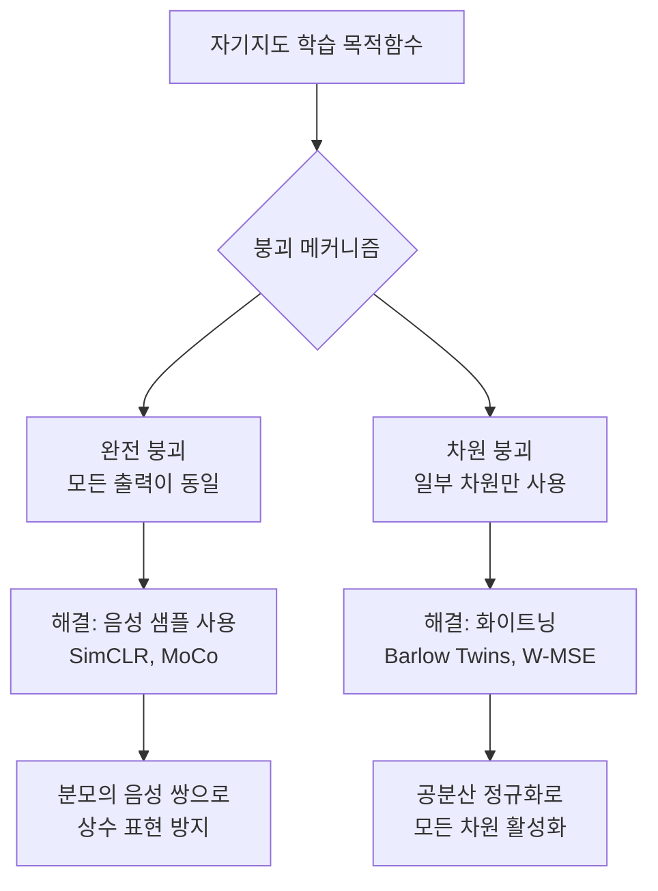

# 표현 학습 이론

표현 학습 이론(Representation Learning Theory)은 좋은 표현(representation)이 무엇인지를 수학적으로 정의하고, 어떻게 하면 그런 표현을 배울 수 있는지를 연구하는 분야다. [[self-supervised-learning]], [[contrastive-learning]] 등 현대 딥러닝 패러다임의 이론적 토대를 제공한다.

## 좋은 표현의 조건

이론 연구자들이 합의하는 세 가지 핵심 조건이 있다.

### 1. 불변성 (Invariance)

표현이 태스크에 관련 없는 변환에 강건해야 한다.

$$z(T(x)) \approx z(x) \quad \forall T \in \mathcal{T}$$

예시: 이미지 분류에서 회전, 색상 변환, 크롭 후에도 동일한 표현. 대조 학습의 양성 쌍(positive pair)은 바로 이 불변성을 훈련 신호로 활용한다.

**형식적 정의**: 변환 그룹 $\mathcal{T}$에 대해 표현 $z$가 불변이면 $\mathbb{E}_{T \sim \mathcal{T}}[\|z(T(x)) - z(x)\|^2] \approx 0$.

### 2. 분리성 (Disentanglement)

데이터 생성 요인(generative factors)들이 표현의 서로 다른 차원에 독립적으로 인코딩되어야 한다.

$$z = [z_1, z_2, \ldots, z_k] \quad \text{where } z_i \perp z_j \text{ for } i \neq j$$

이상적인 분리 표현에서 $z_1$은 모양, $z_2$는 색상, $z_3$은 위치 등 독립적 요인을 담는다. 분리된 표현은 해석 가능하고, 조합적 일반화(compositional generalization)에 강하다.

분리성의 정량적 지표로 **상호 정보(Mutual Information)** 기반 측도(MIG, DCI 등)가 쓰인다.

### 3. 차원 붕괴 방지 (Dimensional Collapse Prevention)

표현이 저차원 부분공간에 붕괴하지 않고 임베딩 공간을 충분히 활용해야 한다.

차원 붕괴(Dimensional Collapse)란 표현의 공분산 행렬의 효과적 랭크(effective rank)가 작아지는 현상이다. 극단적으로는 모든 샘플이 하나의 점으로 붕괴하는 **모드 붕괴**가 발생한다.

## 대조 학습의 이론적 분석

[[contrastive-learning]] 은 불변성과 분리성을 동시에 달성하려는 실용적 접근이다. Arora et al. (2019)의 이론 분석:

$$\mathcal{L}_{\text{contrastive}} = \mathbb{E}\left[\log \frac{e^{z_i^\top z_j / \tau}}{\sum_k e^{z_i^\top z_k / \tau}}\right]$$

이 손실 함수를 최적화하면 표현이 **클래스 조건부 평균에 수렴**한다는 것이 증명된다 (클래스 레이블이 데이터 증강의 동등류를 정의할 때).

## 차원 붕괴의 원인과 해결책

### 주요 방법별 붕괴 방지 전략

| 방법 | 전략 | 메커니즘 |
|------|------|---------|
| SimCLR | 음성 샘플 | 같은 배치 내 다른 샘플들 밀어냄 |
| MoCo | 모멘텀 인코더 | 안정적인 타겟으로 음성 품질 향상 |
| BYOL | EMA 타겟 + 예측기 | 음성 샘플 없이 비대칭 구조로 붕괴 방지 |
| Barlow Twins | 교차 상관 행렬 | 차원 간 상관 제거 (분리성 직접 강제) |
| VICReg | 분산-불변성-공분산 | 세 가지 손실 항으로 명시적 제어 |

### Barlow Twins의 정보-이론적 해석

Barlow Twins의 목적함수:

$$\mathcal{L} = \sum_i (1 - C_{ii})^2 + \lambda \sum_{i \neq j} C_{ij}^2$$

첫 항은 불변성을, 둘째 항은 분리성을 강제한다. 교차 상관 행렬 $C_{ij} = \text{corr}(z^A_i, z^B_j)$ 를 항등 행렬에 근접하게 만드는 것이 목표다.

## 불변성 vs 분리성 트레이드오프

이 두 조건은 때로 충돌한다. 강한 불변성(예: 색상에 불변)을 강제하면 색상 관련 태스크에 필요한 분리성이 손실될 수 있다. 이 트레이드오프는 **증강 전략 선택**으로 조절한다:

- 강한 증강 (더 강한 불변성) - 색상 지터링, 그레이스케일
- 약한 증강 (더 많은 정보 보존) - 크롭만, 플립만

[[self-supervised-learning]] 의 성능이 증강 선택에 매우 민감한 이유가 이 트레이드오프 때문이다.

## 프로빙(Probing)으로 표현 품질 평가

학습된 표현에 선형 분류기를 끼워(probing) 다운스트림 성능을 측정한다. 이 **선형 평가(linear evaluation)** 프로토콜은 표현의 선형 분리성을 정량화한다.

$$\text{선형 평가 정확도} = \max_{W, b} \text{Acc}(W \cdot z + b)$$

단, 선형 평가만으로는 분리성을 완전히 측정할 수 없다. 표현이 단일 태스크에 과적합될 수 있기 때문이다. 다중 태스크 프로빙이나 개념 활성화 벡터(TCAV) 같은 보완 방법이 필요하다.

## 관련 문서

- [[self-supervised-learning]] - 레이블 없는 표현 학습 패러다임
- [[contrastive-learning]] - 불변성 학습의 대표적 구현
- [[feature-learning-theory]] - 훈련 체계와 표현 변화
- [[information-bottleneck]] - 정보 이론 관점의 표현 압축
- [[neural-collapse]] - 분류 학습의 수렴 기하학
