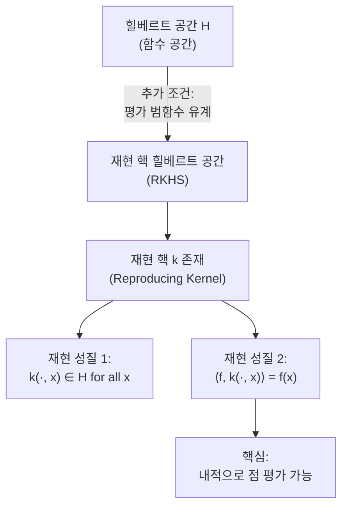
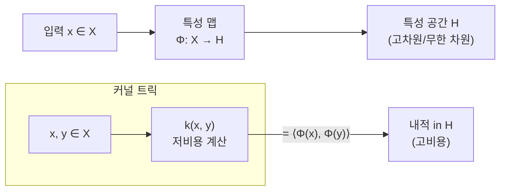
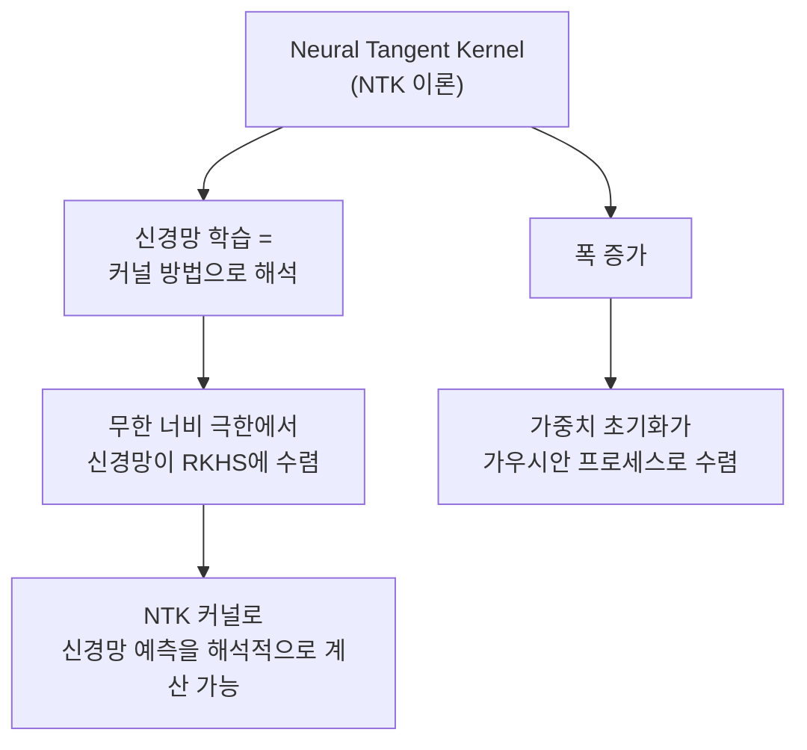
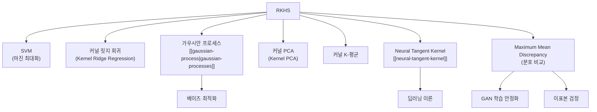

# 재현 핵 힐베르트 공간 (Reproducing Kernel Hilbert Space, RKHS)

재현 핵 힐베르트 공간(Reproducing Kernel Hilbert Space, RKHS)은 함수들로 이루어진 힐베르트 공간(Hilbert Space)으로, 모든 평가 범함수(evaluation functional)가 유계(bounded)라는 특수한 성질을 가진다. 머신러닝에서 [[kernel-methods]], [[gaussian-process|gaussian-processes]], 나아가 [[neural-tangent-kernel]] 이론의 수학적 토대를 제공한다.

---

## 힐베르트 공간 기초

RKHS를 이해하려면 먼저 힐베르트 공간을 알아야 한다.

**힐베르트 공간(Hilbert Space)이란?**
- 내적(inner product)이 정의된 벡터 공간
- 내적으로 유도된 거리에 대해 완비(complete)인 공간
- 유한 차원 유클리드 공간 $\mathbb{R}^n$의 무한 차원 일반화

**예시**
- $L^2[0,1]$: 제곱 적분 가능한 함수들의 공간
- $\ell^2$: 제곱 합이 유한한 수열의 공간
- $\mathbb{R}^n$: 유클리드 공간 (유한 차원 힐베르트 공간)

---

## RKHS 정의

함수 공간 $\mathcal{H}$가 입력 공간 $\mathcal{X}$ 위의 RKHS라면, 모든 $x \in \mathcal{X}$에 대해 **평가 범함수(evaluation functional)**

$$L_x: \mathcal{H} \to \mathbb{R}, \quad L_x(f) = f(x)$$

가 유계(bounded)이다. 즉 상수 $C_x$가 존재해서 $|f(x)| \leq C_x \|f\|_\mathcal{H}$가 모든 $f \in \mathcal{H}$에 대해 성립한다.



---

## 재현 핵 (Reproducing Kernel)

RKHS $\mathcal{H}$에는 항상 **재현 핵(reproducing kernel)** $k: \mathcal{X} \times \mathcal{X} \to \mathbb{R}$이 유일하게 대응된다.

**재현 성질 (Reproducing Property)**

$$\langle f, k(\cdot, x) \rangle_\mathcal{H} = f(x) \quad \forall f \in \mathcal{H}, x \in \mathcal{X}$$

특히 $f = k(\cdot, y)$를 대입하면:

$$\langle k(\cdot, y), k(\cdot, x) \rangle_\mathcal{H} = k(x, y)$$

이 성질이 "재현"이라는 이름의 유래다. 핵 함수가 내적을 통해 점 평가를 "재현"한다.

---

## 커널 함수 조건

함수 $k: \mathcal{X} \times \mathcal{X} \to \mathbb{R}$이 RKHS의 재현 핵이 되려면 다음 두 조건이 필요충분하다:

1. **대칭성**: $k(x, y) = k(y, x)$
2. **양반정치성(Positive Semi-Definiteness, PSD)**:
   $$\sum_{i,j} c_i c_j k(x_i, x_j) \geq 0 \quad \forall n, x_1, \ldots, x_n \in \mathcal{X}, c_1, \ldots, c_n \in \mathbb{R}$$

---

## Mercer 정리

**Mercer 정리(Mercer's Theorem)**는 커널 함수를 특성 공간(feature space) 내적으로 해석할 수 있음을 보장한다.

$k$가 대칭이고 PSD인 적분 핵이라면:

$$k(x, y) = \sum_{i=1}^{\infty} \lambda_i \phi_i(x) \phi_i(y)$$

여기서 $\lambda_i \geq 0$은 고유값, $\phi_i$는 대응하는 고유함수다.

**실무적 의미**: 커널 $k(x, y)$를 계산하는 것이 무한 차원 특성 공간 $\phi(x)$에서의 내적 $\langle \phi(x), \phi(y) \rangle$과 동일하다.



이를 **커널 트릭(Kernel Trick)**이라 한다: 명시적 특성 맵 없이 고차원 내적을 계산.

---

## 주요 커널 함수

### 선형 커널 (Linear Kernel)

$$k(x, y) = x^T y$$

- 특성 맵: 항등 변환 $\phi(x) = x$
- 선형 SVM에 해당

### 다항 커널 (Polynomial Kernel)

$$k(x, y) = (x^T y + c)^d$$

- 차수 $d$인 다항 특성 공간에 대응

### RBF/가우시안 커널 (Radial Basis Function)

$$k(x, y) = \exp\left(-\frac{\|x - y\|^2}{2\sigma^2}\right)$$

- 무한 차원 특성 공간에 대응
- 가장 널리 쓰이는 커널

```python
import numpy as np

def rbf_kernel(X1, X2, sigma=1.0):
    """
    RBF 커널 행렬 계산
    X1: (n, d), X2: (m, d) -> K: (n, m)
    """
    # ||x1 - x2||^2 = ||x1||^2 + ||x2||^2 - 2 x1^T x2
    sq_dists = (
        np.sum(X1**2, axis=1, keepdims=True)
        + np.sum(X2**2, axis=1)
        - 2 * X1 @ X2.T
    )
    return np.exp(-sq_dists / (2 * sigma**2))
```

### Matern 커널

$$k(x, y) = \frac{2^{1-\nu}}{\Gamma(\nu)} \left(\frac{\sqrt{2\nu} \|x-y\|}{\ell}\right)^\nu K_\nu\left(\frac{\sqrt{2\nu} \|x-y\|}{\ell}\right)$$

- 매개변수 $\nu$로 함수 평활도(smoothness) 조절
- [[gaussian-process|gaussian-processes]]에서 표준으로 사용

---

## Representer Theorem

RKHS에서의 정규화 최적화 문제는 **항상 훈련 데이터의 선형 조합으로 표현되는 해**를 가진다.

**Representer Theorem**: 정규화 손실 최소화 문제

$$\min_{f \in \mathcal{H}} \sum_{i=1}^{n} L(y_i, f(x_i)) + \lambda \|f\|_\mathcal{H}^2$$

의 최적해는 다음 형태다:

$$f^*(x) = \sum_{i=1}^{n} \alpha_i k(x_i, x)$$

```python
import numpy as np
from scipy.linalg import solve

def kernel_ridge_regression(X_train, y_train, X_test, kernel_fn, lambda_reg=1e-3):
    """
    커널 릿지 회귀: Representer Theorem 적용
    f*(x) = sum_i alpha_i * k(x_i, x)
    """
    n = X_train.shape[0]

    # 훈련 커널 행렬 K (n x n)
    K = kernel_fn(X_train, X_train)

    # 정규화 최소제곱: (K + lambda * I) alpha = y
    alpha = solve(K + lambda_reg * np.eye(n), y_train)

    # 예측: K_test @ alpha
    K_test = kernel_fn(X_test, X_train)  # (m x n)
    predictions = K_test @ alpha

    return predictions, alpha
```

---

## SVM과 RKHS

서포트 벡터 머신(SVM)은 RKHS에서의 마진 최대화로 해석된다.

커널 SVM의 결정 함수:

$$f(x) = \sum_{i \in \text{SV}} \alpha_i y_i k(x_i, x) + b$$

```python
from sklearn.svm import SVC
from sklearn.preprocessing import StandardScaler

def train_kernel_svm(X_train, y_train, kernel="rbf", C=1.0, gamma="scale"):
    """
    RBF 커널 SVM 학습
    """
    scaler = StandardScaler()
    X_scaled = scaler.fit_transform(X_train)

    model = SVC(kernel=kernel, C=C, gamma=gamma)
    model.fit(X_scaled, y_train)

    return model, scaler
```

---

## 가우시안 프로세스와 RKHS

[[gaussian-process|gaussian-processes]](GP)는 RKHS와 밀접하게 연결된다.

GP의 공분산 함수 = RKHS의 재현 핵. GP 사후 평균은 RKHS에서의 커널 릿지 회귀 해와 동일하다.

```python
from sklearn.gaussian_process import GaussianProcessRegressor
from sklearn.gaussian_process.kernels import RBF, WhiteKernel

def gaussian_process_regression(X_train, y_train, X_test):
    """
    RBF 커널 기반 가우시안 프로세스 회귀
    """
    kernel = RBF(length_scale=1.0) + WhiteKernel(noise_level=0.1)

    gpr = GaussianProcessRegressor(
        kernel=kernel,
        alpha=1e-6,
        normalize_y=True,
    )
    gpr.fit(X_train, y_train)

    # 예측 평균 = RKHS 커널 릿지 회귀 해
    y_pred, y_std = gpr.predict(X_test, return_std=True)

    return y_pred, y_std
```

---

## Neural Tangent Kernel (NTK)

[[neural-tangent-kernel]](NTK)은 무한 너비 신경망이 훈련 시 어떻게 동작하는지를 설명하는 RKHS 기반 이론이다.



**NTK 정의**

파라미터 $\theta$를 가진 신경망 $f_\theta(x)$에 대해:

$$k_\text{NTK}(x, x') = \langle \nabla_\theta f_\theta(x), \nabla_\theta f_\theta(x') \rangle$$

**의미**: 무한 너비 신경망의 경사 하강법 학습은 NTK 커널을 갖는 RKHS에서의 커널 회귀와 동일하다. 이를 통해 딥러닝의 이론적 이해가 크게 진전됐다.

---

## RKHS와 머신러닝의 연결 지도



---

## Maximum Mean Discrepancy (MMD)

두 확률 분포의 거리를 RKHS에서 측정하는 방법. GAN 학습, 분포 시프트 탐지에 활용.

$$\text{MMD}^2(P, Q) = \|\mu_P - \mu_Q\|_\mathcal{H}^2$$

여기서 $\mu_P = \mathbb{E}_{x \sim P}[k(\cdot, x)]$는 커널 평균 임베딩이다.

```python
def mmd_rbf(X, Y, sigma=1.0):
    """
    RBF 커널 기반 MMD 제곱 계산
    X: (n, d), Y: (m, d)
    """
    n, m = X.shape[0], Y.shape[0]

    K_xx = rbf_kernel(X, X, sigma)
    K_yy = rbf_kernel(Y, Y, sigma)
    K_xy = rbf_kernel(X, Y, sigma)

    # 비편향 MMD 추정량
    mmd_sq = (
        K_xx.sum() / (n * (n - 1))
        + K_yy.sum() / (m * (m - 1))
        - 2 * K_xy.mean()
    )
    return mmd_sq
```

---

## 실용적 관점: 언제 커널 방법을 쓰는가

| 상황 | 권장 방법 | 이유 |
|-----|---------|------|
| 소규모 데이터 (< 10K) | 커널 SVM, GP | 딥러닝 대비 샘플 효율 좋음 |
| 수식/이론 필요 | GP | 예측 불확실성 정량화 |
| 특성 공학 어려운 비정형 데이터 | 커널 메서드 | 도메인 커널 설계로 구조 반영 |
| 대규모 데이터 (> 100K) | 딥러닝 | 커널 행렬 $O(n^2)$ 비용 문제 |

**대규모 확장 방법**
- Random Fourier Features (RFF): RBF 커널의 저차원 근사
- Sparse GP: 유도점(inducing point)으로 GP 확장

```python
from sklearn.kernel_approximation import RBFSampler

def random_fourier_features(X_train, X_test, n_components=1000, gamma=0.1):
    """
    RBF 커널의 Random Fourier Feature 근사
    대규모 데이터에서 커널 트릭 근사
    """
    rff = RBFSampler(gamma=gamma, n_components=n_components, random_state=42)
    X_train_rff = rff.fit_transform(X_train)
    X_test_rff = rff.transform(X_test)

    return X_train_rff, X_test_rff
```

---

## 왜 중요한가

**통합된 이론적 틀**
RKHS는 SVM, GP, 커널 PCA 등 다양한 알고리즘을 하나의 수학적 언어로 통합한다. "이 알고리즘이 왜 동작하는가"를 설명하는 이론적 기반이다.

**딥러닝 이해의 열쇠**
NTK 이론을 통해 딥러닝의 이론적 분석이 가능해졌다. 무한 너비 네트워크는 커널 방법으로 완전히 분석 가능하고, 이는 유한 너비 네트워크 이해의 출발점이다.

**분포 비교 도구**
MMD는 GAN의 학습 목표, 도메인 적응, 2-표본 검정 등에 쓰이는 강력한 분포 거리 측정 도구다.

---

## 관련 문서

- [[kernel-methods]] - SVM, 커널 PCA 등 커널 기반 알고리즘
- [[gaussian-process|gaussian-processes]] - RKHS의 확률론적 관점
- [[neural-tangent-kernel]] - 무한 너비 신경망과 RKHS의 연결
- [[support-vector-machine]] - RKHS 마진 최대화 분류기
- [[functional-analysis]] - RKHS의 수학적 기반
- [[maximum-mean-discrepancy]] - RKHS 기반 분포 비교
