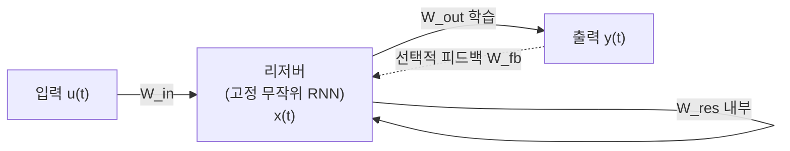

# 리저버 컴퓨팅과 에코 상태 네트워크 (Reservoir Computing & Echo State Networks)

## 정의

**리저버 컴퓨팅(Reservoir Computing, RC)**은 고정된(학습하지 않는) 무작위 순환 신경망 - 리저버(reservoir) - 에 입력을 투사하고, **출력 레이어만 학습**하는 계산 패러다임이다. 복잡한 시간적 패턴을 고차원 비선형 공간으로 변환한 뒤, 선형 판독(readout)으로 원하는 출력을 추출한다.

두 가지 주요 구현이 있다:
- **에코 상태 네트워크(Echo State Network, ESN)**: Jaeger(2001), 이산 시간 RNN 기반
- **액체 상태 머신(Liquid State Machine, LSM)**: Maass(2002), 생물학적 스파이킹 뉴런 기반

## 핵심 아이디어: 왜 리저버를 고정하는가

전통적인 RNN은 역전파 시간(BPTT)을 통해 모든 가중치를 학습해야 하는데, 기울기 소실/폭발 문제가 심각하다. RC는 이 문제를 우회한다:

- 리저버는 입력을 고차원 비선형 시간 표현으로 변환하는 **고정 커널** 역할
- 출력 가중치만 학습 = 선형 회귀나 Ridge regression으로 해결 가능
- 학습 속도 극적으로 단축, 기울기 문제 완전 회피



리저버는 내부에서 무작위 순환 연결로 풍부한 동역학을 만들고, 출력 레이어만 지도 학습으로 조정된다.

## ESN의 수학적 구조

### 상태 방정식

$$\mathbf{x}(t+1) = f\left(W_{\text{in}} \mathbf{u}(t+1) + W_{\text{res}} \mathbf{x}(t) + W_{\text{fb}} \mathbf{y}(t)\right)$$

- $\mathbf{u}(t)$: 입력 신호
- $\mathbf{x}(t)$: 리저버 상태 (수백~수천 차원)
- $\mathbf{y}(t)$: 출력
- $W_{\text{in}}$: 입력 가중치 (무작위 고정)
- $W_{\text{res}}$: 리저버 순환 가중치 (무작위 고정)
- $W_{\text{fb}}$: 출력 피드백 가중치 (선택적, 무작위 고정)
- $f$: 비선형 활성화 (보통 tanh)

### 출력 계산

$$\mathbf{y}(t) = W_{\text{out}} \cdot [\mathbf{x}(t); \mathbf{u}(t)]$$

출력 가중치 $W_{\text{out}}$만 최소제곱법(Ridge regression)으로 학습:

$$W_{\text{out}} = \mathbf{Y}_{\text{target}} \cdot \mathbf{X}^\top (\mathbf{X} \mathbf{X}^\top + \beta \mathbf{I})^{-1}$$

## 에코 상태 속성 (Echo State Property)

리저버가 제대로 동작하려면 **에코 상태 속성(Echo State Property, ESP)**을 만족해야 한다:

> 서로 다른 초기 조건에서 시작한 리저버 상태가 충분한 시간 후 동일한 입력 이력에 대해 동일한 상태로 수렴해야 한다.

실용적인 조건: 리저버 가중치 행렬의 **스펙트럼 반경(spectral radius) $\rho(W) < 1$**

- $\rho(W) \ll 1$: 빠른 망각, 단기 의존성만 포착
- $\rho(W) \approx 1$: 경계 조건, 장기 기억 + 불안정 경계
- $\rho(W) > 1$: 카오스 발생 가능, ESP 위반 위험

## 하이퍼파라미터 설계

| 파라미터 | 역할 | 전형적 범위 |
|----------|------|-------------|
| 리저버 크기 N | 표현 용량 | 100 ~ 10,000 |
| 스펙트럼 반경 | 기억 vs 반응성 균형 | 0.8 ~ 1.0 |
| 입력 스케일 | 입력 비선형성 정도 | 0.1 ~ 1.0 |
| 희소성(sparsity) | 내부 연결 밀도 | 1% ~ 10% |
| 리크 레이트(leaky rate) | 상태 갱신 속도 | 0.1 ~ 1.0 |

리크 통합(Leaky Integration) ESN에서 상태 방정식:

$$\mathbf{x}(t+1) = (1-\alpha)\mathbf{x}(t) + \alpha \cdot f(W_{\text{in}}\mathbf{u}(t+1) + W_{\text{res}}\mathbf{x}(t))$$

$\alpha$ (리크 레이트)를 줄이면 리저버가 과거 입력을 더 오래 기억한다.

## 카오스 예측 응용

ESN은 특히 카오스 시스템 예측에 뛰어난 성능을 보인다:

### 로렌츠 시스템 예측
- 로렌츠 어트랙터, 마코비(Mackey-Glass) 방정식 등 카오스 신호 단기 예측
- 소규모 ESN으로 LSTM 수준 이상의 성능 달성 가능
- Jaeger의 원래 논문에서 NARMA10, 로렌츠 예측 SOTA 달성

### 자율 예측 모드
리저버를 자율 발생기로 실행:
1. 실제 데이터로 출력 가중치 학습
2. 예측 단계에서 출력을 다시 입력으로 피드백
3. 학습된 동역학을 자율적으로 재현

## 딥 리저버 컴퓨팅

복수 리저버를 계층적으로 쌓아 계층별 시간 스케일을 다르게 설정:

- 하위 레이어: 빠른 동역학, 단기 패턴
- 상위 레이어: 느린 동역학, 장기 패턴
- 최상위 출력 레이어만 학습

## 장점과 한계

### 장점
- **학습 속도**: 선형 회귀로 해결 가능, GPU 없이도 빠름
- **소규모 데이터**: 비선형 표현 용량이 풍부하므로 적은 훈련 샘플로도 동작
- **하이퍼파라미터 해석 가능**: 스펙트럼 반경 등 물리적 해석 가능
- **이론적 이해**: 동역학 시스템 이론과 연결

### 한계
- **태스크 특화 리저버 부재**: 입력에 맞게 리저버를 조정 불가
- **최적 리저버 설계**: 무작위 초기화로 매번 결과 다름
- **긴 의존성**: 스펙트럼 반경 조건 때문에 매우 긴 기억 어려움
- **확장성**: 리저버가 클수록 메모리 소모 크며, 딥러닝 대비 확장 전략 부족

## 현대적 연관

리저버 컴퓨팅의 아이디어는 현대 ML에서 재발견되고 있다:

- **랜덤 특징(Random Features)**: 커널 근사에서 고정된 무작위 투영
- **Frozen LLM + Linear Head**: 사전학습 LLM을 리저버로 보고 출력 레이어만 학습하는 방식
- **물리 시스템 리저버**: 광자 회로, 기계 시스템을 리저버로 활용하는 물리 리저버 컴퓨팅

## 구현 예시

```python
import numpy as np

class EchoStateNetwork:
    def __init__(self, n_reservoir=500, spectral_radius=0.95,
                 sparsity=0.1, random_state=42):
        rng = np.random.RandomState(random_state)
        W = rng.randn(n_reservoir, n_reservoir)
        # 희소 행렬 생성
        W[rng.rand(*W.shape) > sparsity] = 0
        # 스펙트럼 반경 조정
        rho = np.max(np.abs(np.linalg.eigvals(W)))
        self.W = W * (spectral_radius / rho)
        self.W_in = rng.randn(n_reservoir, 1)
        self.W_out = None
        self.n_reservoir = n_reservoir

    def _run_reservoir(self, inputs):
        states = np.zeros((len(inputs), self.n_reservoir))
        x = np.zeros(self.n_reservoir)
        for t, u in enumerate(inputs):
            x = np.tanh(self.W_in.flatten() * u + self.W @ x)
            states[t] = x
        return states

    def fit(self, inputs, targets, warmup=100, ridge=1e-6):
        states = self._run_reservoir(inputs)
        states = states[warmup:]
        targets = targets[warmup:]
        # Ridge 회귀로 출력 가중치 학습
        self.W_out = np.linalg.solve(
            states.T @ states + ridge * np.eye(self.n_reservoir),
            states.T @ targets
        )

    def predict(self, inputs):
        states = self._run_reservoir(inputs)
        return states @ self.W_out
```

## 관련 문서

- [[rnn-lstm-gru]] - 표준 순환 신경망, ESN이 해결하려는 학습 어려움을 가짐
- [[neural-ode]] - 연속 시간 동역학 시스템 신경망
- [[spiking-neural-networks]] - 액체 상태 머신의 생물학적 구현
- [[optimization-theory]] - ESN이 회피하는 최적화 문제들
- [[gradient-descent-backpropagation]] - BPTT를 우회하는 RC의 동기
