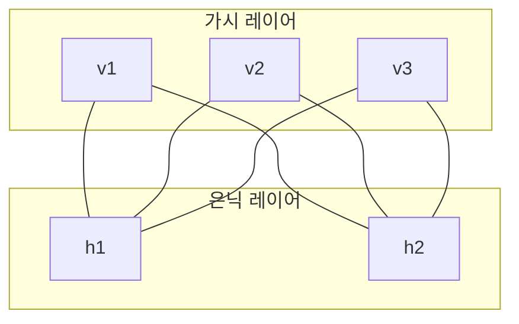

# 제한 볼츠만 머신 (Restricted Boltzmann Machine, RBM)

## 정의

제한 볼츠만 머신(Restricted Boltzmann Machine, RBM)은 가시(visible) 레이어와 은닉(hidden) 레이어 두 층으로 구성된 확률적 생성 모델이다. 볼츠만 머신(Boltzmann Machine)에서 **같은 레이어 내 뉴런 간 연결을 제거(제한)**한 형태로, 이분 그래프(bipartite graph) 구조를 가진다. [[energy-based-models]] 계열의 대표 모델이며, 심층 신뢰 네트워크(Deep Belief Network, DBN)의 핵심 구성 블록으로 사용된다.

## 구조



가시 레이어와 은닉 레이어 사이에만 연결이 존재하고, 같은 레이어 내 뉴런 사이에는 연결이 없다. 이 구조 덕분에 조건부 독립성이 성립하여 효율적인 학습이 가능하다.

## 에너지 함수

RBM의 결합 분포는 에너지 함수로 정의된다:

$$E(\mathbf{v}, \mathbf{h}) = -\mathbf{a}^\top \mathbf{v} - \mathbf{b}^\top \mathbf{h} - \mathbf{v}^\top \mathbf{W} \mathbf{h}$$

- $\mathbf{v}$: 가시 유닛 벡터
- $\mathbf{h}$: 은닉 유닛 벡터
- $\mathbf{W}$: 가시-은닉 가중치 행렬
- $\mathbf{a}$, $\mathbf{b}$: 각 레이어의 편향

결합 확률은 다음과 같이 정의된다:

$$P(\mathbf{v}, \mathbf{h}) = \frac{1}{Z} e^{-E(\mathbf{v}, \mathbf{h})}$$

$Z$는 분배 함수(partition function)로, 모든 가능한 상태에 대한 합산이다.

## 조건부 독립성과 추론

이분 그래프 구조로 인해 다음 조건부 독립성이 성립한다:

- $\mathbf{h}$가 주어졌을 때, 가시 유닛들은 서로 독립: $P(\mathbf{v} | \mathbf{h}) = \prod_i P(v_i | \mathbf{h})$
- $\mathbf{v}$가 주어졌을 때, 은닉 유닛들은 서로 독립: $P(\mathbf{h} | \mathbf{v}) = \prod_j P(h_j | \mathbf{v})$

이진 RBM에서 활성화 확률은 시그모이드 함수로 계산된다:

$$P(h_j = 1 | \mathbf{v}) = \sigma\left(b_j + \sum_i v_i W_{ij}\right)$$

$$P(v_i = 1 | \mathbf{h}) = \sigma\left(a_i + \sum_j W_{ij} h_j\right)$$

## 학습: 대조 발산 (Contrastive Divergence, CD)

정확한 로그 우도 기울기를 계산하려면 분배 함수 $Z$를 알아야 하는데, 이는 계산적으로 불가능하다. Hinton(2002)이 제안한 **대조 발산(Contrastive Divergence, CD-k)** 알고리즘이 이를 근사한다.

### CD-k 알고리즘

1. 데이터 $\mathbf{v}^{(0)}$ 으로 시작
2. 양의 단계(positive phase): $\mathbf{v}^{(0)}$에서 $\mathbf{h}^{(0)}$ 샘플링
3. 음의 단계(negative phase): $\mathbf{h}^{(0)}$에서 $\mathbf{v}^{(1)}$ 재구성, $k$번 반복
4. 가중치 업데이트:

$$\Delta W_{ij} = \eta \left( \langle v_i h_j \rangle_{\text{data}} - \langle v_i h_j \rangle_{\text{recon}} \right)$$

$k=1$인 CD-1도 실용적으로 효과적이며, 학습 수렴 속도가 빠르다.

### 영구적 대조 발산 (Persistent CD, PCD)

CD-k의 한계를 보완하는 방법으로, 샘플링 체인을 여러 배치 간에 유지(persistent)하여 더 정확한 모델 분포 샘플을 얻는다.

## RBM의 변형

| 변형 | 특징 | 사용 사례 |
|------|------|-----------|
| 이진 RBM | $v_i, h_j \in \{0, 1\}$ | 텍스트, 이미지 이진화 |
| 가우시안-이진 RBM | 가시 유닛 실수값, 은닉 이진 | 실수 입력 (이미지 픽셀) |
| 컨볼루션 RBM | 가중치 공유, 공간 구조 보존 | 이미지 생성 |
| 조건부 RBM | 추가 컨텍스트 변수 조건 | 협업 필터링, 시계열 |
| 분류 RBM | 레이블 유닛 추가 | 반지도 분류 |

## 심층 신뢰 네트워크 (DBN)의 빌딩 블록

DBN은 RBM을 층층이 쌓아 사전 학습(pre-training)한 후 미세 조정(fine-tuning)하는 방식으로 구성된다:

1. 첫 번째 RBM을 원본 데이터로 학습
2. 첫 번째 RBM의 은닉 레이어 출력을 두 번째 RBM의 입력으로 사용
3. 반복적으로 층을 쌓아 올림
4. 역전파로 전체 네트워크 미세 조정

이 그리디 층별 사전 학습(greedy layer-wise pretraining) 기법은 Hinton et al. (2006)이 제안하였으며, 딥러닝 부흥의 계기가 되었다.

## 왜 중요한가

- **딥러닝 역사의 전환점**: DBN을 통해 깊은 네트워크 학습이 가능함을 처음 입증
- **에너지 기반 모델의 원형**: 현대 EBM, 확산 모델의 이론적 조상
- **비지도 특징 학습**: 레이블 없이 데이터의 잠재 구조 학습
- **협업 필터링**: Netflix Prize에서 행렬 분해와 경쟁하는 성능 달성

## 한계와 현재 위치

- 분배 함수 계산 불가로 정확한 로그 우도 평가 어려움
- CD 알고리즘의 편향(bias) 문제
- VAE, GAN, 확산 모델 등장 이후 실용적 생성 모델로서의 위상 약화
- 그러나 에너지 기반 모델 연구, 뇌 계산 모델링 분야에서 여전히 이론적 중요성 유지

## 실무 적용

```python
# PyTorch로 간단한 이진 RBM 구현 스케치
import torch
import torch.nn as nn

class RBM(nn.Module):
    def __init__(self, n_visible, n_hidden):
        super().__init__()
        self.W = nn.Parameter(torch.randn(n_visible, n_hidden) * 0.01)
        self.v_bias = nn.Parameter(torch.zeros(n_visible))
        self.h_bias = nn.Parameter(torch.zeros(n_hidden))

    def sample_h(self, v):
        h_prob = torch.sigmoid(v @ self.W + self.h_bias)
        return h_prob, torch.bernoulli(h_prob)

    def sample_v(self, h):
        v_prob = torch.sigmoid(h @ self.W.T + self.v_bias)
        return v_prob, torch.bernoulli(v_prob)

    def contrastive_divergence(self, v0, k=1):
        h0_prob, h0 = self.sample_h(v0)
        v_k, h_k = v0, h0
        for _ in range(k):
            v_k_prob, v_k = self.sample_v(h_k)
            h_k_prob, h_k = self.sample_h(v_k)
        # 양의 단계 - 음의 단계
        pos_grad = v0.T @ h0_prob
        neg_grad = v_k.T @ h_k_prob
        return pos_grad - neg_grad
```

## 관련 문서

- [[energy-based-models]] - RBM이 속하는 에너지 기반 모델 계열
- [[autoencoders-vae]] - 유사한 생성 모델, 변분 오토인코더와의 비교
- [[diffusion-models]] - 현대 생성 모델, RBM의 후계자 계열
- [[gans]] - 또 다른 생성 모델 패러다임
- [[perceptron-mlp]] - 다층 퍼셉트론과의 관계
- [[neural-tangent-kernel]] - 신경망 이론의 또 다른 관점
