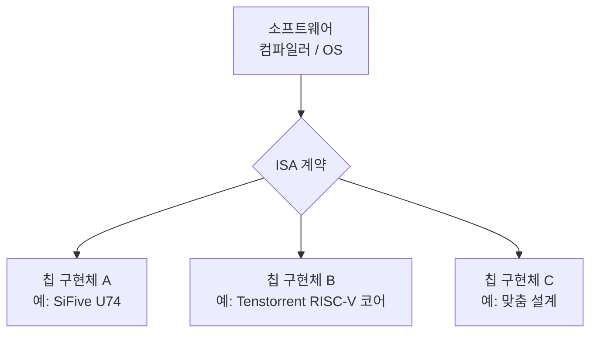
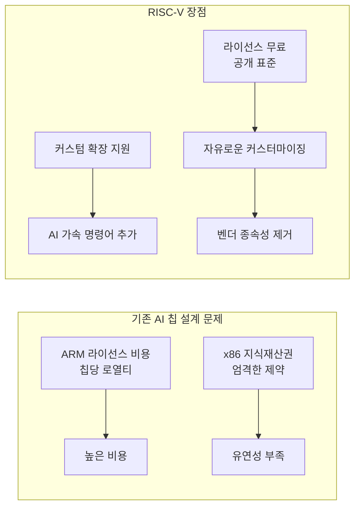
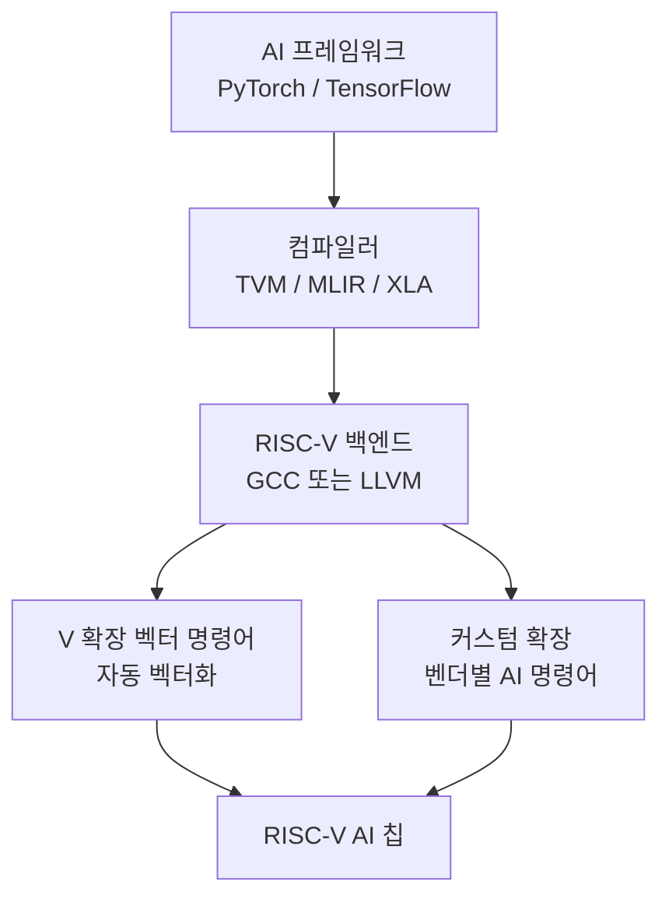
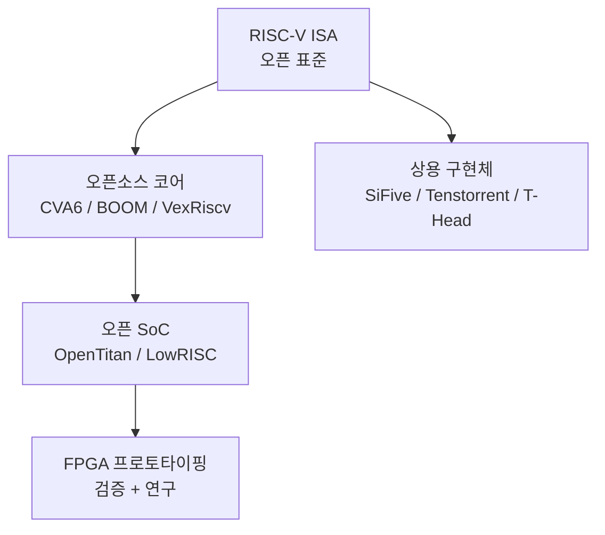

# RISC-V (리스크-파이브)

RISC-V는 UC 버클리에서 2010년에 설계된 오픈소스 명령어 집합 아키텍처(Instruction Set Architecture, ISA)다. 특허·라이선스 비용 없이 누구나 사용, 수정, 배포할 수 있으며, AI 칩 시장에서 전통적인 ARM, x86 독점 구조에 대한 대안으로 주목받고 있다.

## ISA란 무엇인가

ISA는 하드웨어와 소프트웨어 사이의 계약이다. 어떤 연산 명령어가 존재하고, 그 명령어가 어떻게 인코딩되며, 어떤 결과를 내야 하는지 정의한다. 동일한 ISA를 구현한 칩이라면 같은 바이너리 코드를 실행할 수 있다.

RISC-V는 ISA를 정의하지만 구체적인 마이크로아키텍처(파이프라인 깊이, 캐시 크기 등)는 구현자가 자유롭게 결정한다. 이 분리가 오픈소스 생태계 확장의 핵심이다.

## RISC-V의 설계 철학

### RISC(Reduced Instruction Set Computer) 원칙

- 명령어 수 최소화, 각 명령어는 단순한 연산 하나
- 고정 길이 명령어 형식(32비트 기본, 16비트 압축 확장)
- 레지스터 기반 연산 (메모리 직접 연산 지양)
- 파이프라인 구현이 단순해 고주파수 설계 유리

### 모듈식 확장 구조

RISC-V는 기본 ISA에 선택적 확장 모듈을 더하는 방식이다:

| 확장 | 설명 |
|------|------|
| `I` | 정수 연산 기본 (필수) |
| `M` | 곱셈/나눗셈 |
| `F` / `D` | 단정밀도 / 배정밀도 부동소수점 |
| `V` | SIMD 벡터 연산 (AI에 중요) |
| `C` | 압축 16비트 명령어 |
| `Zicsr` | 제어 상태 레지스터 |
| 커스텀 X | 벤더 정의 확장 (AI 가속 명령어 등) |

이 모듈성이 AI 칩 설계자에게 매력적이다. `I+M+V` 기반 코어에 딥러닝 연산에 특화된 커스텀 명령어를 추가해 최적화된 AI 프로세서를 만들 수 있다.

## AI 칩에서 RISC-V가 주목받는 이유

### 주요 동기

1. **비용 절감**: ARM Cortex 코어를 라이선스하면 칩당 수 달러 ~ 수십 달러의 로열티가 발생한다. RISC-V는 무료다.
2. **커스터마이징 자유도**: 벤더가 AI에 특화된 SIMD 명령어, 행렬 연산 가속 명령어를 ISA에 추가할 수 있다.
3. **국가 안보·기술 자주성**: 미국의 수출 규제, ARM의 소프트뱅크 인수 등으로 인해 중국·유럽·한국 등이 RISC-V를 전략적 대안으로 채택하고 있다.
4. **임베디드 제어**: AI 가속기 칩 내부의 마이크로컨트롤러(스케줄러, DMA 컨트롤러 등)로 RISC-V 코어를 내장하는 것이 표준이 되고 있다.

## 대표적 AI 칩 활용 사례

### Tenstorrent Grayskull / Wormhole

[[tenstorrent-grayskull]]는 Jim Keller가 설립한 Tenstorrent의 첫 AI 가속기다. Tenstorrent는 RISC-V를 두 가지 방식으로 활용한다:

- **Tensix 코어 내 RISC-V**: 각 Tensix 코어는 5개의 RISC-V 프로세서를 포함. 이 프로세서들이 행렬 엔진 주변의 제어 로직을 실행
- **소프트웨어 스택**: RISC-V 기반이므로 GCC, LLVM 툴체인을 그대로 활용 가능

### SiFive Performance 코어

SiFive는 RISC-V 전문 설계 회사로, AI 엣지 추론에 특화된 코어를 제공한다. 인텔이 한때 인수를 시도했던 회사이기도 하다.

### 중국 AI 칩 생태계

미국의 엔비디아 GPU 수출 규제 이후 중국 AI 칩 스타트업들이 RISC-V 기반 설계를 적극 채택하고 있다. Cambricon(寒武纪), Biren(壁仞) 등은 RISC-V 제어 코어와 자체 AI 가속 엔진을 조합한다.

## RISC-V 소프트웨어 생태계

AI 응용에 관련된 소프트웨어 스택:

- **GCC/LLVM**: 공식 RISC-V 지원 포함. V 확장(벡터) 자동 벡터화 지원
- **Apache TVM**: RISC-V 타겟 포함, 커스텀 명령어 확장 지원
- **MLIR**: RISC-V 다이얼렉트를 통해 딥러닝 컴파일러 파이프라인 구축 가능
- **Linux**: 5.15 커널부터 RISC-V 공식 지원 (메인라인)

## [[open-hardware]] 생태계 내 위치

RISC-V는 [[open-hardware]] 운동의 핵심이다. 오픈소스 하드웨어 생태계에서 다음 레이어 구조를 형성한다:

RISC-V 재단(RISC-V International)이 표준화를 주도하며, 3,000개 이상의 조직이 회원으로 참여하고 있다.

## RISC-V vs. ARM vs. x86 비교

| 항목 | RISC-V | ARM | x86 |
|------|--------|-----|-----|
| 라이선스 | 완전 오픈소스 | 상업적 라이선스 필요 | 인텔/AMD 독점 |
| 커스텀 확장 | 공식 지원 | 제한적 | 불가 |
| 에코시스템 성숙도 | 성장 중 | 매우 성숙 | 매우 성숙 |
| AI 칩 채택 | 증가 추세 | 많음 (Apple Silicon 등) | 서버 CPU 기반 |
| 임베디드 지배력 | 도전 중 | Cortex-M 지배 | 미미 |

## 현재 한계 및 전망

**한계**:
- CUDA 수준의 AI 소프트웨어 생태계 미형성
- 고성능 서버급 구현체(ARM Neoverse급)의 성숙도 부족
- 기업 채택 시 엔지니어링 역량 확보 어려움

**전망**:
- AI 엣지 추론 칩의 제어 코어로 빠르게 표준화 진행 중
- RISC-V 벡터(V) 확장이 성숙해지며 ML 워크로드 지원 강화
- 지정학적 요인(미-중 반도체 갈등)으로 중국, 유럽, 인도의 채택 급증

## 관련 문서

- [[tenstorrent-grayskull]] - RISC-V 기반 AI 가속기 구현 사례
- [[ai-accelerators]] - 전체 AI 가속기 생태계에서 RISC-V의 위치
- [[open-hardware]] - 오픈소스 하드웨어 생태계 개요
