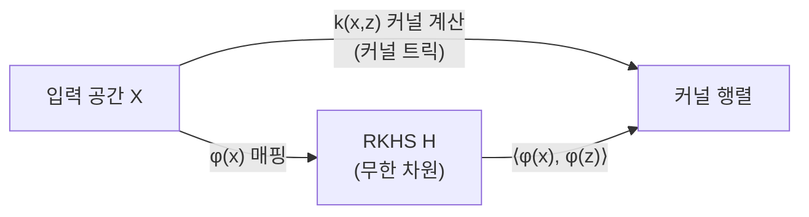
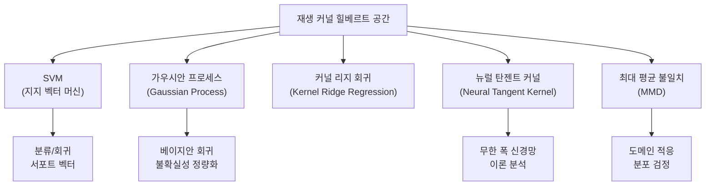

# 재생 커널 힐베르트 공간 (RKHS)

## 한 줄 요약

커널 트릭의 이론적 토대. 입력 공간을 (암묵적으로) 고차원 특징 공간으로 매핑하는 함수들의 힐베르트 공간으로, SVM·가우시안 프로세스·뉴럴 탄젠트 커널이 모두 이 프레임워크 위에 세워진다.

## 힐베르트 공간 복습

**힐베르트 공간(Hilbert space)**은 내적(inner product)이 정의된 완비(complete) 벡터 공간이다. $L^2$ 함수 공간이 대표적 예시. RKHS는 힐베르트 공간 중 특별한 성질을 가진 함수 공간이다.

## RKHS의 정의

힐베르트 공간 $\mathcal{H}$가 $\mathcal{X} \to \mathbb{R}$인 함수들로 이루어져 있을 때, 다음 조건을 만족하면 **재생 커널 힐베르트 공간(Reproducing Kernel Hilbert Space)**이라 한다:

**재생 성질(reproducing property)**:
임의의 $x \in \mathcal{X}$와 $f \in \mathcal{H}$에 대해, 어떤 함수 $k(\cdot, x) \in \mathcal{H}$가 존재해서

$$f(x) = \langle f, k(\cdot, x) \rangle_{\mathcal{H}}$$

를 만족한다. 여기서 $k: \mathcal{X} \times \mathcal{X} \to \mathbb{R}$을 **재생 커널(reproducing kernel)**이라 한다.

다르게 표현하면: 어떤 함수의 점 평가(point evaluation)가 내적 연산으로 표현될 수 있다.

## 커널 함수의 조건

함수 $k: \mathcal{X} \times \mathcal{X} \to \mathbb{R}$가 RKHS의 재생 커널이 되려면 **양정치(positive definite)** 여야 한다:

임의의 $n$, $x_1, \ldots, x_n \in \mathcal{X}$, $c_1, \ldots, c_n \in \mathbb{R}$에 대해

$$\sum_{i=1}^{n}\sum_{j=1}^{n} c_i c_j k(x_i, x_j) \geq 0$$

**Mercer 정리**: 양정치 커널은 항상 어떤 RKHS를 유일하게 정의한다 (역도 성립).

## 대표적인 커널 함수

| 커널 | 수식 | 특성 |
|------|------|------|
| 선형 커널 | $k(x,z) = x^\top z$ | 원래 입력 공간에서의 내적 |
| 다항식 커널 | $k(x,z) = (x^\top z + c)^d$ | 다항식 특징 맵 |
| RBF/가우시안 커널 | $k(x,z) = \exp\left(-\frac{\|x-z\|^2}{2\sigma^2}\right)$ | 무한 차원 특징 공간 |
| 라플라시안 커널 | $k(x,z) = \exp\left(-\frac{\|x-z\|}{\sigma}\right)$ | L1 거리 기반 |
| Matern 커널 | $k(x,z) = \frac{2^{1-\nu}}{\Gamma(\nu)}\left(\frac{\sqrt{2\nu}\|x-z\|}{\ell}\right)^\nu K_\nu(\cdot)$ | 미분 가능성 제어 |

## 커널 트릭의 이론적 기반

**암묵적 특징 맵(implicit feature map)**: RBF 커널은 무한 차원 공간으로의 매핑 $\phi: \mathcal{X} \to \mathcal{H}$를 통해

$$k(x, z) = \langle \phi(x), \phi(z) \rangle_{\mathcal{H}}$$

로 표현되지만, 실제로 $\phi$를 계산할 필요 없이 커널 값만으로 내적을 계산할 수 있다. 이것이 **커널 트릭(kernel trick)**이다.



명시적 고차원 매핑 없이도 커널 계산만으로 내적을 얻는 흐름을 보여준다.

## 표현 정리 (Representer Theorem)

RKHS에서 정규화된 위험 최소화 문제의 해는 항상 **훈련 데이터의 커널 함수 선형 결합**으로 표현된다:

$$f^*(x) = \sum_{i=1}^{n} \alpha_i k(x_i, x)$$

이 정리의 의미: 아무리 복잡한 함수를 RKHS에서 최적화하더라도, 해는 유한 차원 형태로 표현된다. SVM의 서포트 벡터 해석이 바로 이 정리의 결과다.

## RKHS와 주요 ML 방법의 관계



### 가우시안 프로세스 (GP)와의 관계

GP 사전 분포는 커널 함수 $k$로 완전히 정의된다:

$$f \sim \mathcal{GP}(m, k) \Leftrightarrow f \text{는 RKHS } \mathcal{H}_k \text{에서 샘플링}$$

GP 사후 평균은 표현 정리에 따라 훈련 커널의 선형 결합이 된다.

### 뉴럴 탄젠트 커널 (NTK)

무한 폭(infinite width) 신경망은 학습 과정에서 특정 커널 - NTK에 수렴한다:

$$\Theta(x, x') = \mathbb{E}\left[\nabla_\theta f(x, \theta)^\top \nabla_\theta f(x', \theta)\right]$$

NTK 이론을 통해 딥러닝이 왜 잘 작동하는지를 RKHS 프레임워크로 설명할 수 있다.

## MMD (Maximum Mean Discrepancy)

두 분포 $P$, $Q$ 사이의 거리를 RKHS에서 측정:

$$\text{MMD}^2(P, Q) = \|\mu_P - \mu_Q\|_{\mathcal{H}}^2$$

여기서 $\mu_P = \mathbb{E}_{x \sim P}[k(\cdot, x)]$는 **커널 평균 임베딩(kernel mean embedding)**이다.

응용:
- GANs의 훈련 목적 함수 (MMD-GAN)
- 도메인 적응
- 두 분포의 통계적 가설 검정

## 커널 SVM 구현 (간략)

```python
from sklearn.svm import SVC
from sklearn.preprocessing import StandardScaler
import numpy as np

# RBF 커널 SVM
clf = SVC(kernel='rbf', C=1.0, gamma='scale')
clf.fit(X_train, y_train)

# 수동으로 커널 행렬 계산
def rbf_kernel(X, Z, sigma=1.0):
    """k(x,z) = exp(-||x-z||^2 / (2*sigma^2))"""
    dist_sq = np.sum(X**2, axis=1, keepdims=True) \
              + np.sum(Z**2, axis=1) \
              - 2 * X @ Z.T
    return np.exp(-dist_sq / (2 * sigma**2))
```

## 실용적 고려사항

### 커널 선택 가이드

| 상황 | 권장 커널 |
|------|----------|
| 데이터가 선형 분리 가능에 가까움 | 다항식 커널 (낮은 차수) |
| 데이터 구조 불명확 | RBF (가장 일반적) |
| 강한 주기성 | 주기 커널 (Periodic kernel) |
| 문자열/그래프 데이터 | 문자열 커널, 그래프 커널 |
| 함수 데이터 | 적분 커널 |

### 계산 복잡도 문제

커널 행렬 $K_{ij} = k(x_i, x_j)$는 $n \times n$ 크기로 $O(n^2)$ 저장 및 $O(n^3)$ 연산이 필요하다.

대규모 대안:
- **랜덤 특징 근사(Random Features)**: Rahimi & Recht 2007, RBF 커널을 유한 차원 근사
- **Nystrom 근사**: 대표 포인트 선택으로 저랭크 근사
- **불완전 콜레스키 분해**: 희소 근사

```python
# 랜덤 특징 근사 (Random Features) 예시
def random_features_rbf(X, n_components=1000, sigma=1.0):
    """Rahimi & Recht 방식 RBF 커널 근사"""
    n_features = X.shape[1]
    W = np.random.randn(n_features, n_components) / sigma
    b = np.random.uniform(0, 2 * np.pi, n_components)
    Z = np.cos(X @ W + b) * np.sqrt(2 / n_components)
    return Z  # Z @ Z.T ≈ K (RBF 커널 행렬)
```

## 왜 중요한가

- SVM, GP, 커널 회귀는 모두 RKHS 이론 위에 세워진 통합된 프레임워크다
- 딥러닝 이론(NTK, 평균장 이론)이 RKHS를 핵심 도구로 사용
- 비모수(non-parametric) 방법의 수학적 기반을 제공
- 커널 방법은 소규모 데이터에서 딥러닝보다 종종 우수한 성능을 보임

## 관련 문서

- [[support-vector-machines]] - SVM의 RKHS 기반 이해
- [[gaussian-process]] - RKHS와 GP의 직접 연결
- [[bayesian-inference]] - GP 사후 추론
- [[tsne-umap]] - 커널 기반 차원 축소와의 비교
- [[pca]] - 선형 차원 축소 (커널 PCA로 확장 가능)
- [[graph-signal-processing]] - 그래프 커널과의 연계
