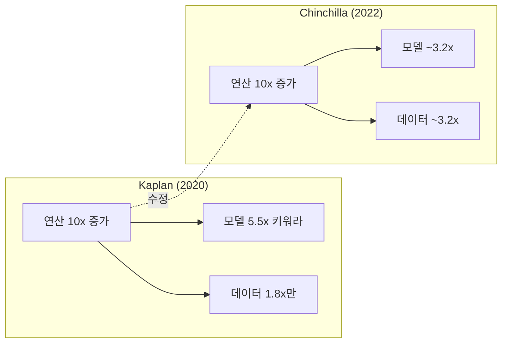

# Neural Scaling Laws (신경망 스케일링 법칙)

## 정의

**스케일링 법칙(Scaling Laws)**은 신경망의 성능이 모델 크기(N), 학습 데이터 양(D), 연산량(C)에 대해 **멱법칙(power law)** 관계를 따른다는 경험적 발견이다. 로그 스케일에서 직선으로 나타나며, 이를 통해 학습 전에 성능을 예측하고 자원 배분을 최적화할 수 있다.

이 발견은 "모델을 더 키우면 더 좋아지는가?"라는 질문에 정량적 답을 제공했고, 현대 LLM 개발의 투자 논리를 지탱하는 핵심 근거가 되었다.

## Kaplan Scaling Laws (2020)

OpenAI의 Kaplan 등이 7자릿수(10^7) 이상의 범위에 걸쳐 실험하여 발견한 핵심 관계:

### 세 가지 멱법칙

```
L(N) ~ N^(-0.076)   -- 파라미터 수와 손실
L(D) ~ D^(-0.095)   -- 데이터 양과 손실
L(C) ~ C^(-0.050)   -- 연산량과 손실
```

L은 테스트 손실(cross-entropy loss), N은 파라미터 수, D는 데이터 토큰 수, C는 연산 FLOP이다.

### 주요 발견

- **아키텍처 독립성**: 네트워크의 너비와 깊이는 넓은 범위에서 성능에 큰 영향이 없다. 총 파라미터 수가 지배적이다
- **대형 모델의 데이터 효율성**: 큰 모델은 같은 양의 데이터에서 더 많이 학습한다(sample efficient)
- **조기 종료 전략**: 연산 예산이 고정되면, 매우 큰 모델을 상대적으로 적은 데이터로 학습하되 수렴 전에 멈추는 것이 최적이라고 주장했다

### Kaplan의 최적 배분 비율

Kaplan 등은 연산 예산 C가 10배 증가할 때 최적 배분이 다음과 같다고 제안했다:

- 모델 크기 N: ~5.5배 증가
- 학습 데이터 D: ~1.8배 증가

이 비율은 "모델 크기를 우선 키워라"는 전략으로 이어졌고, GPT-3(175B)와 같은 초대형 모델 개발의 근거가 되었다.

## Chinchilla Scaling Laws (2022)

DeepMind의 Hoffmann 등은 Kaplan의 결론에 정면으로 도전했다. 400개 이상의 모델(70M-16B 파라미터)을 학습시켜 새로운 최적 비율을 도출했다.

### 핵심 발견: 기존 모델은 학습 부족(undertrained)

> "현재의 대규모 언어 모델은 심각하게 학습이 부족하다."

Kaplan 등의 "모델을 크게 만들어라"라는 처방은 학습 데이터의 중요성을 과소평가했다.

### Chinchilla 최적 비율

연산 예산이 고정일 때, **모델 크기와 학습 토큰 수를 동등하게 스케일링**해야 한다:

```
모델 크기 2배 -> 학습 토큰도 2배

Chinchilla 경험 법칙:
  최적 학습 토큰 수 ~ 20 x 파라미터 수
```

### 실증: Chinchilla vs Gopher

| 항목 | Gopher | Chinchilla |
|------|--------|------------|
| 파라미터 | 280B | 70B |
| 학습 토큰 | 300B | 1.4T |
| 연산량 | 동일 | 동일 |
| MMLU 정확도 | 60.0% | 67.5% |

동일한 연산 예산으로 Chinchilla는 **4배 적은 파라미터**에 **4배 많은 데이터**를 투입하여 모든 벤치마크에서 Gopher를 능가했다. 추론 비용도 4배 절약된다.

## 두 법칙의 비교



핵심 차이:

| 관점 | Kaplan | Chinchilla |
|------|--------|------------|
| 우선순위 | 모델 크기 >> 데이터 | 모델 = 데이터 |
| 수렴 | 조기 종료 권장 | 충분한 학습 권장 |
| 추론 비용 | 고려 안 함 | 작은 모델 = 저렴한 추론 |
| 실무 영향 | GPT-3 (175B) | LLaMA (65B) |

## Chinchilla 이후: 실무적 수정

Chinchilla 법칙도 만능이 아니다. 이후 연구에서 드러난 한계와 수정:

**추론 비용 고려(Inference-Adjusted)**: LLaMA(2023)는 의도적으로 Chinchilla 최적보다 작은 모델을 더 많은 데이터로 학습했다. 학습 비용을 약간 초과하더라도 추론 비용 절감이 더 크기 때문이다. 생산 환경에서 모델은 한 번 학습하고 수백만 번 추론한다.

**데이터 품질 변수**: 스케일링 법칙은 데이터 품질을 상수로 가정하지만, 실제로는 데이터 품질이 지수(exponent)를 바꾼다. 고품질 데이터는 같은 양으로도 더 큰 성능 향상을 낸다.

**반복 학습(Multi-epoch)**: 데이터가 부족하면 같은 데이터를 여러 번 학습하는데, 반복 횟수가 늘수록 효율이 감소한다는 별도의 스케일링 관계가 존재한다.

## 왜 스케일링 법칙이 중요한가

1. **투자 결정의 근거**: 10배 연산에 투자하면 얼마만큼의 성능 향상이 예상되는지 사전 추정 가능
2. **아키텍처보다 스케일**: 아키텍처 세부사항보다 총 파라미터/데이터/연산이 성능을 결정한다는 통찰
3. **학습 전 예측**: 소규모 실험으로 대규모 학습의 결과를 예측(extrapolation)
4. **자원 효율**: 고정 예산에서 모델 크기와 데이터 양의 최적 배분

## 다음에 읽을 페이지

- [[transfer-learning]] -- 사전학습 패러다임: 스케일링의 전제 조건
- [[distributed-training-overview]] -- 대규모 연산을 실현하는 분산 학습 인프라
- [[quantization-model-compression]] -- 학습된 대형 모델을 효율적으로 배포하는 압축 기법

## 출처

- Kaplan et al., "Scaling Laws for Neural Language Models" (2020) - https://arxiv.org/abs/2001.08361
- Hoffmann et al., "Training Compute-Optimal Large Language Models" (Chinchilla, 2022) - https://arxiv.org/abs/2203.15556
- Touvron et al., "LLaMA: Open and Efficient Foundation Language Models" (2023) - https://arxiv.org/abs/2302.13971
