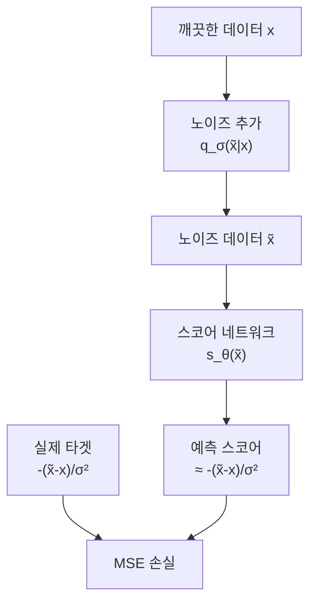
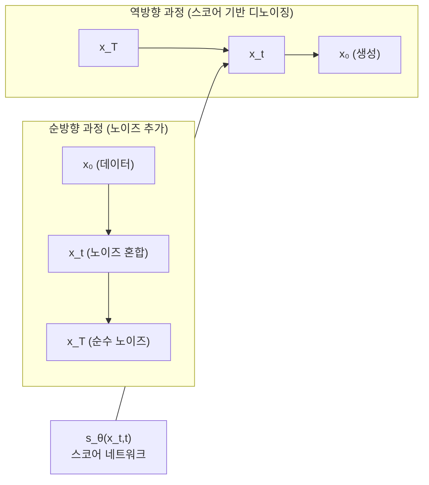

# 스코어 매칭 이론 (Score Matching)

스코어 매칭(Score Matching)은 데이터 분포의 로그 확률 밀도의 그래디언트, 즉 **스코어 함수(score function)**를 직접 추정하는 방법론이다. Aapo Hyvärinen이 2005년에 제안했으며, 분배 함수(partition function) 계산 없이도 분포를 학습할 수 있어 [[energy-based-models]]의 핵심 한계를 극복했다. 현재는 [[diffusion-models]]의 이론적 토대를 이루는 핵심 개념이다.

## 스코어 함수 정의

확률 분포 $p(x)$의 **스코어 함수(Stein score)**는 다음과 같이 정의된다:

$$s(x) = \nabla_x \log p(x)$$

이 함수는 각 데이터 포인트에서 "확률이 높아지는 방향"을 가리키는 벡터 필드다. EBM에서 $p_\theta(x) \propto \exp(-E_\theta(x))$라면 $s_\theta(x) = -\nabla_x E_\theta(x)$가 된다. 스코어를 알면 분배 함수 없이도 랑주뱅 샘플링이 가능하다.

## 스코어 매칭 목적 함수

스코어를 추정하는 신경망 $s_\theta(x)$를 학습하는 목적 함수는 다음 피셔 발산(Fisher Divergence)이다:

$$J(\theta) = \frac{1}{2} \mathbb{E}_{p(x)} \left[\|s_\theta(x) - \nabla_x \log p(x)\|^2\right]$$

문제는 $\nabla_x \log p(x)$를 모른다는 점이다. 스코어 매칭의 핵심 기여는 이를 데이터만으로 계산 가능한 형태로 변환한 것이다:

$$J(\theta) = \mathbb{E}_{p(x)} \left[\text{tr}(\nabla_x s_\theta(x)) + \frac{1}{2}\|s_\theta(x)\|^2\right] + C$$

$\text{tr}(\nabla_x s_\theta(x))$는 야코비안의 대각합(trace)으로, 고차원에서는 계산 비용이 크다.

## 디노이징 스코어 매칭 (DSM)

실용적 스코어 매칭의 핵심 변형. Vincent(2011)가 제안했으며, 노이즈가 추가된 데이터의 스코어를 학습하는 방식으로 야코비안 계산을 회피한다.

$$J_{\text{DSM}}(\theta) = \mathbb{E}_{x \sim p_\text{data}} \mathbb{E}_{\tilde{x} \sim q_\sigma(\tilde{x}|x)} \left[\|s_\theta(\tilde{x}) - \nabla_{\tilde{x}} \log q_\sigma(\tilde{x}|x)\|^2\right]$$

가우시안 노이즈 $q_\sigma(\tilde{x}|x) = \mathcal{N}(\tilde{x}; x, \sigma^2 I)$를 사용하면 최적 스코어가 다음과 같이 단순화된다:

$$\nabla_{\tilde{x}} \log q_\sigma(\tilde{x}|x) = -\frac{\tilde{x} - x}{\sigma^2}$$

즉, 신경망이 **노이즈 방향의 역방향(= 노이즈 제거 방향)**을 예측하는 것과 동일하다.

## 노이즈 레벨의 다중화: NCSN

Yang Song et al.(2019)의 **Noise Conditional Score Network (NCSN)**은 여러 노이즈 레벨 $\{\sigma_i\}_{i=1}^L$에서 동시에 스코어를 학습한다:

$$\mathcal{L}(\theta) = \sum_{i=1}^L \sigma_i^2 \mathbb{E}_{p(x)} \mathbb{E}_{q_{\sigma_i}} \left[\|s_\theta(x, \sigma_i) + \frac{x - \tilde{x}}{\sigma_i^2}\|^2\right]$$

학습 후 어닐링된 랑주뱅 다이나믹스(annealed Langevin dynamics)로 샘플을 생성한다. 큰 노이즈 레벨에서 시작해 점진적으로 작은 노이즈로 이동하면서 정제한다.

## 확산 모델과의 연결

DDPM([[diffusion-models]])과 스코어 매칭은 이론적으로 동일하다.

| DDPM 관점 | 스코어 매칭 관점 |
|-----------|----------------|
| 노이즈 예측 $\epsilon_\theta(x_t, t)$ | 스코어 추정 $s_\theta(x_t, t)$ |
| $x_0$ 예측 목적 함수 | 스코어 매칭 목적 함수 |
| 역방향 과정 | 역 SDE / 확률 흐름 ODE |

Song et al.(2020)의 **Score-based Generative Models** 논문은 확산을 연속 SDE로 통합했다:

$$dx = f(x, t)dt + g(t)dW \quad \text{(순방향 SDE)}$$
$$dx = [f(x,t) - g(t)^2 \nabla_x \log p_t(x)]dt + g(t)d\bar{W} \quad \text{(역방향 SDE)}$$

## 정규화 흐름과의 연결

확률 흐름 ODE(Probability Flow ODE)를 사용하면 스코어 기반 모델도 정확한 로그-우도를 계산할 수 있다. 이는 [[normalizing-flows]]의 연속 버전과 동일한 수학 구조다.

## 실무 요약

- **핵심 가치**: 분배 함수 없이 복잡한 분포의 기하학적 구조(스코어 벡터 필드)를 학습
- **응용**: 이미지/오디오/분자 생성, 인페인팅, 초해상도
- **한계**: 저밀도 영역에서 스코어 추정 부정확 → 확산 과정으로 보완

## 관련 문서
- [[stochastic-processes-ml]] -- 확률 과정과 머신러닝

- [[diffusion-models]] - 스코어 매칭이 실용화된 대표 모델
- [[normalizing-flows]] - 확률 흐름 ODE를 통한 연결
- [[energy-based-models]] - 스코어 매칭이 해결하고자 한 원래 문제
- [[neural-ode]] - 연속 흐름의 수학적 기반
