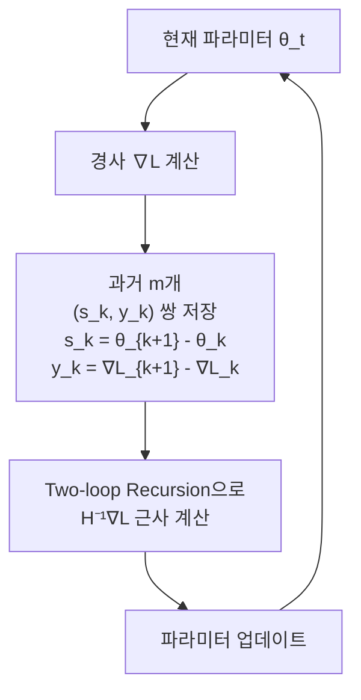
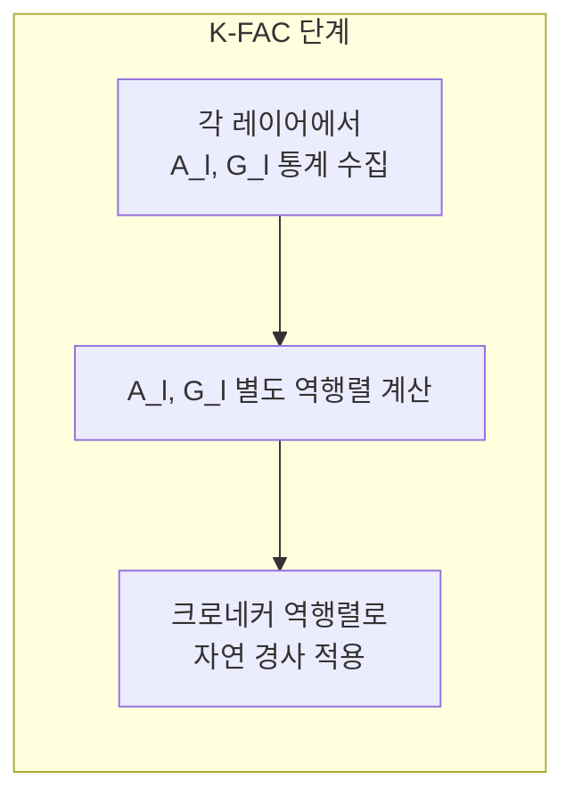

# 2차 최적화 (Second-Order Optimization)

## 개요

2차 최적화(Second-Order Optimization)는 손실 함수의 **2차 미분(헤시안, Hessian)** 정보를 활용하여 더 정확한 업데이트 방향과 크기를 결정하는 최적화 방법이다. 1차 경사 하강법([[gradient-descent-backpropagation]])이 손실 함수를 선형으로 근사하는 반면, 2차 방법은 2차 곡면(포물선)으로 근사하여 더 정밀한 스텝을 계산한다.

## 뉴턴법 (Newton's Method)

가장 기본적인 2차 최적화 방법은 뉴턴법이다:

$$\theta_{t+1} = \theta_t - H^{-1}(\theta_t) \nabla_\theta \mathcal{L}(\theta_t)$$

- $H$: 헤시안 행렬 (손실의 2차 미분, $\frac{\partial^2 \mathcal{L}}{\partial \theta_i \partial \theta_j}$)
- $H^{-1} \nabla \mathcal{L}$: 뉴턴 스텝

헤시안은 파라미터 공간의 **곡률(curvature)** 을 인코딩한다. 손실이 평평한 방향에서는 큰 스텝을, 가파른 방향에서는 작은 스텝을 밟아 최적화 궤적이 훨씬 효율적이다.

### 뉴턴법의 문제점

- 파라미터 수가 $d$이면 헤시안은 $d \times d$, 역행렬 계산은 $O(d^3)$
- 현대 신경망은 수억~수조 개 파라미터 -> 직접 계산 불가능
- 헤시안이 비볼록(non-convex) 손실에서 **음수 고유값**을 가질 수 있어 발산 위험

## L-BFGS (Limited-memory BFGS)

L-BFGS는 헤시안 역행렬을 직접 계산하지 않고, 최근 $m$개의 경사 정보로 **암묵적으로 근사**하는 준뉴턴법(Quasi-Newton)이다.

- 메모리 사용량: $O(md)$ (BFGS의 $O(d^2)$ 대비 대폭 절감)
- 일반적으로 $m = 5 \sim 20$
- 볼록 문제와 소규모 배치에서 특히 효과적
- **전체 배치(full-batch)** 설정에서 주로 사용 (확률적 설정에서는 불안정)

## K-FAC (Kronecker-Factored Approximate Curvature)

K-FAC은 대규모 신경망에서 사용 가능한 자연 경사법([[natural-gradient]])의 실용적 근사다. 레이어별로 Fisher 정보 행렬을 **크로네커 곱(Kronecker product)** 으로 인수분해하여 계산한다.

### 핵심 아이디어

레이어 $l$의 가중치 행렬 $W_l$에 대한 Fisher 행렬을:

$$F_l \approx A_l \otimes G_l$$

로 근사한다. 여기서:
- $A_l = \mathbb{E}[a_{l-1} a_{l-1}^\top]$: 이전 레이어의 활성화 공분산 (입력 통계)
- $G_l = \mathbb{E}[\delta_l \delta_l^\top]$: 현재 레이어의 그래디언트 신호 공분산 (출력 통계)
- $\otimes$: 크로네커 곱

이 근사 덕분에 역행렬 계산이 두 개의 작은 행렬 역행렬로 분해된다:

$$F_l^{-1} \approx A_l^{-1} \otimes G_l^{-1}$$

### K-FAC의 장점

- 레이어 단위 독립적 계산 -> 병렬화 용이
- 전체 FIM 대비 메모리/시간 대폭 절감
- 표준 Adam보다 적은 스텝으로 수렴 달성

## 방법들 비교

| 방법 | 계산 비용 | 메모리 | 적합 상황 |
|------|----------|--------|----------|
| 뉴턴법 | $O(d^3)$ | $O(d^2)$ | 소규모 볼록 문제 |
| L-BFGS | $O(md)$ | $O(md)$ | 전체 배치, 소~중규모 |
| K-FAC | $O(d)$ (근사) | $O(d)$ (근사) | 대규모 딥러닝, 분류 |
| Adam (1차) | $O(d)$ | $O(d)$ | 대규모 미니배치 |

## 딥러닝에서의 현황

실제 대규모 언어 모델 학습에서는 Adam/AdamW 같은 **적응적 1차 방법**이 지배적이다. 2차 방법의 높은 계산 비용이 수렴 이점을 상쇄하는 경우가 많기 때문이다. 그러나:

- **파인튜닝(Fine-tuning)**: 파라미터 수가 적고 전체 배치 학습이 가능할 때 L-BFGS가 유용
- **신경망 구조 탐색(NAS)**: 정밀한 곡률 정보가 유리
- **연속 학습(Continual Learning)**: K-FAC으로 중요 파라미터의 곡률을 추적 (EWC의 Fisher 행렬)

## 관련 문서

- [[gradient-descent]] - 경사 하강법 기초 및 변종
- [[adam-original-paper]] - Adam/AdamW 원논문: 1차 적응형 방법의 표준
- [[neural-network]] - 2차 최적화가 적용되는 신경망 기초
- [[optimization-theory]] - 최적화 이론 및 1차 방법
- [[gradient-descent-backpropagation]] - 표준 역전파와 경사 하강
- [[natural-gradient]] - Fisher 정보 행렬 기반 자연 경사법
- [[learning-rate-scheduling]] - 1차 방법에서의 학습률 조절
