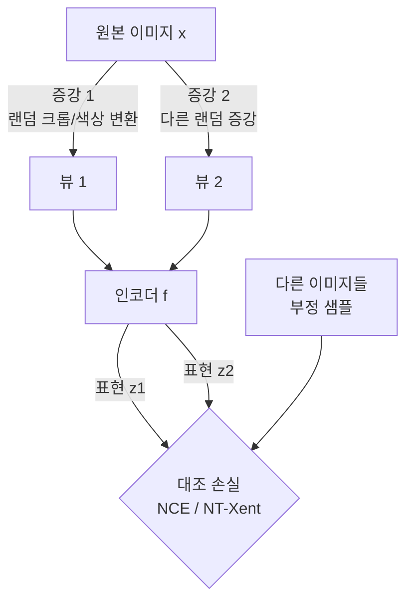

# 자기지도 학습 (Self-Supervised Learning)

레이블 없는 데이터에서 데이터 자체의 구조를 이용해 감독 신호(supervisory signal)를 만들어 표현을 학습하는 방법. 레이블 획득 비용 없이 대규모 비지도 데이터를 활용하고, 이후 소량의 레이블 데이터로 파인튜닝(fine-tuning)한다.

## Pretext Task (프리텍스트 태스크)

모델이 풀어야 할 자기 설계 과제. 이 과제를 해결하는 과정에서 데이터의 의미 있는 표현이 자연스럽게 학습된다.

- 이미지 회전 각도 예측 (0/90/180/270도)
- 퍼즐 조각 순서 복원 (Jigsaw puzzle)
- 마스킹된 패치 복원 (Masked Autoencoder, MAE)
- 다음 단어 예측 (GPT의 CLM)
- 마스킹된 토큰 예측 (BERT의 MLM)

좋은 프리텍스트 태스크는 다운스트림 태스크에 유용한 표현을 유도한다.

## 두 가지 패러다임

### 1. Contrastive Learning (대조 학습)

같은 데이터의 다른 증강(augmentation) 뷰는 가깝게, 다른 데이터는 멀게 임베딩 공간을 학습한다.

**SimCLR**: NT-Xent(Normalized Temperature-scaled Cross Entropy) 손실, 큰 배치 크기(4096+) 필요, projection head 추가

$$\mathcal{L} = -\log \frac{\exp(\text{sim}(z_i, z_j) / \tau)}{\sum_{k=1}^{2N} \mathbf{1}_{[k \neq i]} \exp(\text{sim}(z_i, z_k) / \tau)}$$

**MoCo (Momentum Contrast)**: 모멘텀 업데이트되는 key encoder와 큐(queue)로 메모리 효율적인 부정 샘플 관리. 큰 배치 없이도 가능.

**BYOL (Bootstrap Your Own Latent)**: 부정 샘플 없이 online/target 두 네트워크만으로 학습. Batch Normalization의 통계 정보가 암묵적 부정 샘플 역할을 한다.

### 2. Generative (생성/마스킹 기반)

데이터 일부를 마스킹하거나 손상시킨 후 원본을 복원하도록 학습한다.

- **BERT MLM**: 토큰의 15%를 [MASK]로 치환 후 복원 → 문맥 기반 양방향 표현 학습
- **GPT CLM**: 이전 토큰으로 다음 토큰 예측 → 단방향 인과 언어 모델
- **MAE (Masked Autoencoder)**: 이미지 패치의 75%를 마스킹 후 픽셀 복원 → 효율적 비전 표현 학습

## 비전 vs 언어 SSL 비교

| 항목 | 비전 (Vision SSL) | 언어 (Language SSL) |
|------|-----------------|-------------------|
| 증강/마스킹 | 랜덤 크롭, 색상, 블러 | 토큰 마스킹 (MLM), 순서 예측 |
| 대표 방법 | SimCLR, MoCo, MAE, DINO | BERT, GPT, T5, CLIP |
| 부정 샘플 | 다른 이미지 (대조 학습) | 불필요 (MLM은 생성 방식) |
| 전이 품질 | 이미지넷 선형 평가로 측정 | GLUE, SuperGLUE 벤치마크 |
| 모달 교차 | CLIP (이미지-텍스트 정렬) | 텍스트 단일 또는 멀티모달 |

## 주요 모델 타임라인

- 2018: BERT (MLM + NSP)
- 2019: MoCo v1
- 2020: SimCLR, BYOL
- 2021: MoCo v3, DINO (Vision Transformer + SSL)
- 2021: MAE (ViT 기반, 75% 마스킹)
- 2021: CLIP (이미지-텍스트 대조 학습)

## 실무 활용

- **파인튜닝 기반**: SSL로 사전학습된 모델을 소량 레이블 데이터로 미세조정 (가장 일반적)
- **선형 탐침 (Linear probing)**: 인코더를 고정하고 선형 분류기만 학습 - 표현 품질 평가 기준
- **k-NN 분류**: 임베딩 기반 최근접 이웃 분류 - 파인튜닝 없이 즉시 사용 가능

## 관련 문서
- [[bert-paper]] -- BERT: Pre-training of Deep Bidirectional Transformers for Language Understanding (Devlin et al., 2018)

- [[transfer-learning]]
- [[contrastive-learning]]
- [[tsne-umap]]
- [[graph-neural-networks]]
