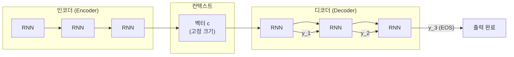

# Seq2Seq와 인코더-디코더 모델 (Sequence-to-Sequence)

## Sutskever et al. 2014

Sutskever, Vinyals, Le의 "Sequence to Sequence Learning with Neural Networks" (NeurIPS 2014)는 가변 길이 입력을 가변 길이 출력으로 변환하는 일반적 프레임워크를 제안했다. 핵심 아이디어는 두 RNN을 직렬로 연결하는 것이다.

- **인코더(Encoder)**: 입력 시퀀스 전체를 읽어 고정 크기 컨텍스트 벡터(context vector) $c$로 압축
- **디코더(Decoder)**: $c$를 초기 상태로 받아 출력 시퀀스를 자기회귀(autoregressive) 방식으로 생성

위 다이어그램은 인코더가 문맥을 압축하고 디코더가 이를 기반으로 토큰을 순차 생성하는 구조를 보여준다.

## 정보 병목 문제 (Information Bottleneck)

컨텍스트 벡터 $c$는 **고정 크기**다. 입력 시퀀스가 길어질수록 모든 정보를 단일 벡터에 욱여넣어야 하므로 성능이 급격히 저하된다. 특히 긴 문장의 기계 번역에서 BLEU 점수 하락이 두드러진다.

이 한계를 해결하기 위해 Bahdanau et al. (2014)이 **어텐션 메커니즘(attention mechanism)**을 도입했다. 디코더가 매 스텝마다 인코더의 모든 은닉 상태(hidden state)를 가중합해 동적 컨텍스트를 생성한다.

## Teacher Forcing과 Exposure Bias

**Teacher Forcing**: 학습 시 디코더의 이전 스텝 출력 대신 **실제 정답 토큰(ground truth)**을 다음 스텝 입력으로 제공한다. 학습 속도와 안정성이 향상된다.

**Exposure Bias**: Teacher Forcing으로 학습한 모델은 추론(inference) 시 자신의 예측 토큰을 입력으로 받는다. 학습과 추론의 입력 분포 불일치(train-test mismatch)로 인해 오류가 누적되는 현상이다.

| 단계 | 입력 소스 | 문제 |
|------|-----------|------|
| 학습 (Teacher Forcing) | 정답 토큰 | - |
| 추론 | 모델 예측 토큰 | Exposure Bias |

완화 방법: **Scheduled Sampling**(점진적으로 실제 예측 토큰 비율을 높임), **DAGGER** 등.

## Beam Search 디코딩

탐욕적 디코딩(greedy decoding)은 매 스텝에서 가장 높은 확률의 토큰만 선택하므로 지역 최적(local optima)에 빠진다. Beam Search는 $k$개의 후보 시퀀스(beam)를 동시에 유지하며 탐색한다.

$$\text{score}(y_1, \ldots, y_t) = \sum_{i=1}^{t} \log P(y_i \mid y_1, \ldots, y_{i-1}, c)$$

- **beam size $k$**: 클수록 품질 향상, 연산 비용 증가
- **길이 정규화(length normalization)**: $\frac{1}{T^\alpha}$ 가중으로 짧은 시퀀스 편향 완화

## Seq2Seq에서 Transformer로

Seq2Seq(RNN 기반)의 한계는 순차 연산으로 인한 병렬화 불가와 장거리 의존성(long-range dependency) 약화였다. Transformer는 어텐션만으로 인코더-디코더 구조를 재구성해 이 두 문제를 동시에 해결했다.

## 관련 문서
- [[grammatical-error-correction]] -- 문법 오류 교정 (Grammatical Error Correction)

- [[RNN과 LSTM]]
- [[attention-mechanism-overview]]
- [[transformer-architecture|Transformer 아키텍처]]
- [[language-model-foundations]]
- [[embedding-layers]]
