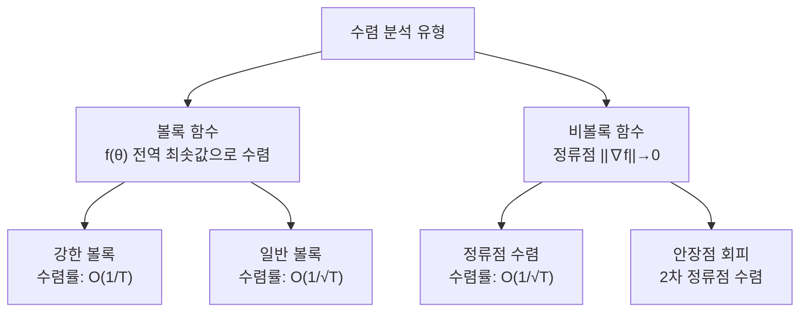

# SGD 수렴 이론 (SGD Convergence Theory)

## 정의

**확률적 경사 하강법(Stochastic Gradient Descent, SGD)**은 전체 데이터셋의 기울기 대신 **무작위로 선택된 미니배치의 기울기**로 파라미터를 업데이트하는 최적화 알고리즘이다. SGD 수렴 이론은 "어떤 조건 하에서 SGD가 최솟값으로 수렴하는가, 얼마나 빠르게 수렴하는가"를 분석하는 통계 학습 이론의 핵심 분야다.

$$\theta_{t+1} = \theta_t - \eta_t \nabla_\theta \mathcal{L}(\theta_t; \xi_t)$$

여기서 $\xi_t$는 무작위 미니배치, $\eta_t$는 학습률(step size).

## Robbins-Monro 조건

SGD 수렴의 이론적 기반은 Robbins & Monro (1951)의 확률적 근사(stochastic approximation) 이론이다.

**수렴을 보장하는 학습률 조건**:

$$\sum_{t=1}^\infty \eta_t = \infty \qquad \text{(충분히 많이 이동)} $$

$$\sum_{t=1}^\infty \eta_t^2 < \infty \qquad \text{(노이즈 억제)} $$

전형적인 예: $\eta_t = \eta_0 / t$ (다항식 감쇠)

- 첫 번째 조건: 학습률의 합이 발산해야 어떤 위치에서 출발해도 최솟값에 도달 가능
- 두 번째 조건: 학습률 제곱의 합이 수렴해야 확률적 노이즈가 잠잠해짐

## 볼록 문제에서의 수렴률

손실 함수 $f$가 볼록(convex)일 때 수렴률 분석:

### 강한 볼록성 (Strongly Convex)

$f$가 $\mu$-강한 볼록이면:

$$\mathbb{E}[f(\theta_T) - f(\theta^*)] \leq \frac{L \sigma^2}{2\mu T}$$

- $L$: 기울기 립시츠 상수
- $\sigma^2$: 기울기 분산
- **수렴률**: $O(1/T)$

학습률 $\eta_t = 2/(\mu(t+1))$로 설정 시 달성 가능.

### 일반 볼록성 (Convex)

강한 볼록성 없이도:

$$\mathbb{E}[f(\bar{\theta}_T) - f(\theta^*)] \leq \frac{R^2 + \sigma^2 \sum_t \eta_t^2}{2\sum_t \eta_t}$$

$\eta_t = 1/\sqrt{T}$로 설정 시 **수렴률** $O(1/\sqrt{T})$.

## 비볼록 문제에서의 수렴률

딥러닝 손실 함수는 비볼록이다. 이 경우 전역 최솟값 수렴 대신 **정류점(stationary point) 수렴**을 분석한다.

### 정류점 수렴

$L$-smooth 비볼록 함수에서:

$$\frac{1}{T}\sum_{t=1}^T \mathbb{E}[\|\nabla f(\theta_t)\|^2] \leq \frac{2L(f(\theta_0) - f^*)}{\eta T} + L\eta\sigma^2$$

학습률 $\eta = 1/\sqrt{T}$로 설정 시:

$$\min_t \mathbb{E}[\|\nabla f(\theta_t)\|^2] \leq O\left(\frac{1}{\sqrt{T}}\right)$$

## 분산 감소 기법 (Variance Reduction)

SGD의 핵심 문제는 확률적 기울기의 **분산**이 크다는 것이다. 분산이 크면 학습률을 키울 수 없어 수렴이 느리다. 분산 감소 기법들은 이를 해결한다:

### SVRG (Stochastic Variance Reduced Gradient)

Johnson & Zhang (2013):

$$g_t = \nabla f_{i_t}(\theta_t) - \nabla f_{i_t}(\tilde{\theta}) + \nabla f(\tilde{\theta})$$

- $\tilde{\theta}$: 주기적으로 갱신되는 스냅샷
- 기울기 분산이 $\theta_t$가 최솟값에 가까워질수록 0으로 수렴
- **볼록 문제에서**: 기하급수 수렴률 $O(\rho^T)$ 달성

### SAGA

- SVRG의 변형, 기울기 테이블 유지
- 스냅샷 재계산 없이 점진적 업데이트

### SAG (Stochastic Average Gradient)

- 각 샘플의 최근 기울기 평균 유지
- 더 낮은 분산, 메모리 요구 $O(n)$

### 비교

| 알고리즘 | 볼록 수렴률 | 메모리 | 비고 |
|---------|------------|--------|------|
| SGD | $O(1/\sqrt{T})$ | $O(1)$ | 기본 베이스라인 |
| SGD + momentum | $O(1/\sqrt{T})$ | $O(d)$ | 실용적 가속 |
| SVRG | $O(\rho^T)$ 기하 | $O(d)$ | 주기적 전체 기울기 필요 |
| SAGA | $O(\rho^T)$ 기하 | $O(nd)$ | 추가 메모리 필요 |

## 학습률 스케줄과 수렴

### 고정 학습률
- 최솟값 근처에서 진동 → 정확한 수렴 불가
- 실용적으로는 Early Stopping과 조합

### 감쇠 학습률

다항식: $\eta_t = \eta_0 / (1 + \gamma t)$

지수: $\eta_t = \eta_0 \cdot \gamma^t$

Robbins-Monro 조건 만족 → 이론적 수렴 보장

### 코사인 어닐링

$$\eta_t = \eta_{\min} + \frac{1}{2}(\eta_{\max} - \eta_{\min})\left(1 + \cos\frac{t\pi}{T}\right)$$

이론적 수렴 보장은 없지만 실용적으로 평탄 최솟값 탐색에 유리.

## 미니배치 크기와 수렴

### 선형 확장 규칙 (Linear Scaling Rule)

Goyal et al. (2017): 배치 크기를 $k$배 키우면 학습률도 $k$배로 키워야 비슷한 수렴 거동.

이론적 근거: 배치 크기 $B$에서 기울기 분산 $\sigma^2/B$이므로, 노이즈 수준 유지를 위해 학습률을 $\sqrt{B}$ 혹은 $B$로 조정.

### 배치 크기 한계

- 배치 크기가 너무 크면: **일반화 성능 저하** (Sharp minima 수렴 경향)
- 배치 크기가 너무 작으면: **노이즈 과다**, 학습 불안정
- 실용적 범위: 256 ~ 8192

## 안장점과 임계점 분석

비볼록 함수에서 임계점의 분류:

- **전역 최솟값**: 모든 방향으로 양의 곡률 → 원하는 목표
- **안장점(Saddle Point)**: 일부 방향 음의 곡률 → SGD는 노이즈로 자연 탈출
- **지역 최솟값**: 모든 방향 양의 곡률 → 전역 최솟값과 다를 수 있음

**놀라운 사실**: 충분히 과매개변수화된 네트워크에서는 지역 최솟값들이 대부분 전역 최솟값과 비슷한 함수값을 가진다 (Dauphin et al., 2014, Choromanska et al., 2015).

## SGD의 암묵적 정규화

SGD는 여러 최솟값 중 특정한 것을 선호하는 경향이 있다:

- **평탄 최솟값 선호**: 작은 배치 SGD는 날카로운 최솟값보다 넓은 최솟값으로 수렴하는 경향
- **일반화와 연결**: 평탄 최솟값이 일반화 성능이 좋다는 경험적 관찰 (Hochreiter & Schmidhuber, 1997)
- **뉴럴 탄젠트 커널(NTK)**: 무한 너비 한계에서 SGD의 암묵적 편향 분석 [[neural-tangent-kernel]]

## 적응적 옵티마이저와 수렴

Adam, AdaGrad, RMSProp 등 적응적 옵티마이저는 수렴 보장이 다르다:

| 옵티마이저 | 볼록 수렴 보장 | 비볼록 | 실용적 성능 |
|-----------|--------------|--------|-------------|
| SGD | $O(1/\sqrt{T})$ | $O(1/\sqrt{T})$ | 튜닝 어려움 |
| AdaGrad | $O(\sqrt{T})$ regret | 제한적 | 희소 데이터 |
| Adam | 일반적 보장 없음 | 발산 사례 있음 | 실용적 강자 |
| AMSGrad | $O(\sqrt{T})$ | $O(1/\sqrt{T})$ | Adam 보정 |

Adam의 이론적 수렴 반례(Reddi et al., 2018)가 발견되어 AMSGrad가 제안되었다.

## 분산 학습과 수렴

데이터 병렬 학습(data-parallel distributed training)에서 SGD 수렴:

- **동기 SGD**: 기울기 집계 후 업데이트 → 이론적으로 단일 GPU와 동일
- **비동기 SGD (Hogwild!)**: 잠금 없이 업데이트 → 희소 문제에서 충돌 허용 가능, 조밀 문제 주의
- **통신 압축**: 기울기 압축/양자화로 통신 비용 절감, 수렴 영향 분석 필요

## 관련 문서

- [[gradient-descent-backpropagation]] - SGD를 적용하기 위한 기울기 계산 방법
- [[optimization-theory]] - 볼록 최적화 이론의 일반 프레임워크
- [[neural-tangent-kernel]] - 무한 너비 한계에서 SGD 분석
- [[universal-approximation-theorem]] - 표현력 이론과의 대비
- [[adagrad-rmsprop-history]] - 적응적 옵티마이저 계보
- [[nesterov-momentum]] - 수렴률 향상을 위한 모멘텀 기법
