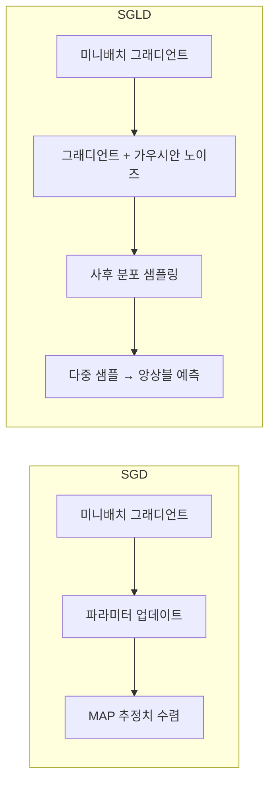

# 확률적 그래디언트 랑주뱅 동역학 (SGLD)

## 한 줄 요약

SGD에 가우시안 노이즈를 추가하면 사후 분포(posterior distribution)를 직접 샘플링하는 MCMC 알고리즘이 된다는 통찰에 기반한 베이지안 학습 기법.

## 핵심 아이디어

전통적인 SGD는 파라미터 공간에서 손실 함수의 최솟값(MAP 추정)을 찾는다. 반면 베이지안 관점에서는 단일 최솟값보다 **파라미터의 사후 분포 전체**를 추정하는 것이 바람직하다. SGLD (Stochastic Gradient Langevin Dynamics)는 이 두 방향을 우아하게 연결한다.

> "We can incorporate uncertainty into predictions by sampling from the posterior distribution of the parameters rather than doing point estimation."
> (파라미터의 점 추정 대신 사후 분포에서 샘플링함으로써 예측에 불확실성을 반영할 수 있다.)

## 랑주뱅 방정식 배경

물리학에서 **랑주뱅 방정식(Langevin equation)**은 확산 과정(diffusion process)을 기술한다:

$$d\theta = -\nabla U(\theta)\,dt + \sqrt{2}\,dW_t$$

여기서:
- $\theta$: 파라미터 (입자 위치)
- $U(\theta)$: 포텐셜 에너지 (음의 로그 사후 확률에 해당)
- $dW_t$: 위너 과정(Wiener process) - 표준 브라운 운동

이 시스템의 정상 분포(stationary distribution)가 바로 타겟 사후 분포 $p(\theta | \mathcal{D})$이다.

## SGLD 업데이트 규칙

Welling & Teh (2011)는 이 연속 랑주뱅 방정식을 미니배치 SGD 형태로 이산화했다:

$$\theta_{t+1} = \theta_t - \frac{\epsilon_t}{2}\left(\nabla \log p(\theta_t) + \frac{N}{n}\sum_{i \in S_t} \nabla \log p(x_i|\theta_t)\right) + \eta_t$$

$$\eta_t \sim \mathcal{N}(0,\, \epsilon_t \mathbf{I})$$

여기서:
- $\epsilon_t$: 학습률 (시간에 따라 감소)
- $N$: 전체 데이터셋 크기, $n$: 미니배치 크기
- $\frac{N}{n}$: 미니배치 그래디언트의 스케일 보정
- $\eta_t$: 주입하는 가우시안 노이즈

**핵심**: 일반 SGD에서 노이즈 항 $\eta_t$만 추가하면 사후 샘플러로 변환된다.

## SGD vs SGLD 비교



SGD는 하나의 점으로 수렴하는 반면, SGLD는 사후 분포 위를 확산하며 다양한 샘플을 수집한다.

## 학습률 스케줄링

SGLD가 올바른 사후 분포로 수렴하려면 학습률이 **Robbins-Monro 조건**을 만족해야 한다:

$$\sum_{t=1}^{\infty} \epsilon_t = \infty, \quad \sum_{t=1}^{\infty} \epsilon_t^2 < \infty$$

실용적 스케줄: $\epsilon_t = a(b + t)^{-\gamma}$, 보통 $\gamma \in (0.55, 1)$.

- $\epsilon_t$가 천천히 감소하는 초기 구간: 사후 분포 탐색 (번인(burn-in) 단계)
- 충분히 작아진 이후 구간: 사후 분포에서 유효 샘플 수집

## 왜 노이즈 주입이 사후 샘플링이 되는가?

세 가지 직관적 설명:

1. **MCMC 관점**: SGLD는 Metropolis-Hastings 수락 단계 없이 Langevin MCMC를 근사하는 방법. 학습률이 0에 수렴할수록 근사 오류도 0에 수렴한다.

2. **에너지 관점**: 노이즈는 파라미터가 낮은 에너지 상태(손실 극솟값)에 갇히는 것을 방지하고, 사후 확률에 비례하여 공간을 탐색하게 한다.

3. **SDE 관점**: 이산화된 랑주뱅 SDE의 정상 분포는 $p(\theta|\mathcal{D}) \propto \exp(-U(\theta))$이며, 이것이 바로 베이지안 사후 분포다.

## Python 구현 예시

```python
import torch
import numpy as np

def sgld_step(
    model: torch.nn.Module,
    optimizer: torch.optim.SGD,
    loss: torch.Tensor,
    lr: float,
    n_data: int,
    batch_size: int,
) -> None:
    """SGLD 업데이트 한 스텝."""
    loss.backward()

    # 그래디언트 스케일 보정 (미니배치 -> 전체 데이터 추정)
    scale = n_data / batch_size
    for param in model.parameters():
        if param.grad is not None:
            param.grad.data *= scale
            # 랑주뱅 노이즈 주입
            noise = torch.randn_like(param) * (2 * lr) ** 0.5
            param.grad.data += noise / lr  # 그래디언트에 노이즈 흡수

    optimizer.step()
    optimizer.zero_grad()
```

## 실무 응용

### 불확실성 정량화
SGLD로 수집한 다중 파라미터 샘플 $\{\theta^{(1)}, \ldots, \theta^{(K)}\}$으로 예측 분포를 근사:

$$p(y^*|x^*, \mathcal{D}) \approx \frac{1}{K}\sum_{k=1}^{K} p(y^*|x^*, \theta^{(k)})$$

### 번인 이후 샘플 수집 패턴

```python
burn_in = 5000
samples = []

for step, (x, y) in enumerate(dataloader):
    # SGLD 업데이트
    loss = criterion(model(x), y)
    sgld_step(model, optimizer, loss, lr=lr_schedule(step), ...)

    # 번인 이후 파라미터 스냅샷 저장
    if step > burn_in and step % 100 == 0:
        snapshot = {k: v.clone() for k, v in model.state_dict().items()}
        samples.append(snapshot)
```

## SGLD의 변형들

| 변형 | 핵심 아이디어 |
|------|------------|
| **SGHMC** (Chen et al. 2014) | 모멘텀을 포함한 해밀토니안 동역학 기반 샘플러 |
| **pSGLD** (Li et al. 2016) | RMSProp 전처리로 곡률 적응, Fisher 정보 근사 |
| **SGLD-CV** | 제어 변량으로 분산 감소 |
| **Cyclical SGLD** (Zhang et al. 2020) | 주기적 학습률로 여러 모드 탐색 |
| **BAOAB** | 더 정확한 수치 적분 방식 |

## SGLD의 장단점

**장점**:
- 기존 SGD 코드에 노이즈 한 줄만 추가하면 구현 완성
- 별도의 아키텍처 변경 없이 불확실성 정량화 가능
- 대규모 데이터셋에 스케일 가능 (미니배치 사용)
- [[mcmc]] 방법 중 수렴이 비교적 빠름

**단점**:
- 번인 구간 결정이 어려움 (수렴 진단 필요)
- 학습률 스케줄에 민감
- 여러 샘플 저장으로 메모리 증가
- Thinning(간격 샘플링)이 필요해 연산 비용 증가

## 실무에서 언제 쓰는가

1. **의료/안전 중요 예측**: 단순 점 추정보다 불확실성 구간이 필요한 상황
2. **소규모 데이터셋**: 과적합 방지 + 사전 분포 통합으로 일반화 개선
3. **능동 학습**: 높은 불확실성 지점 선택에 사후 분포 활용
4. **로버스트 예측**: 분포 이동(distribution shift) 탐지

[[mcmc]], [[bayesian-inference]], [[sgd-convergence-theory]], [[deep-ensembles]], [[gradient-descent-backpropagation]]과 달리 SGLD는 학습과 베이지안 추론을 동시에 수행한다는 점이 차별화된다.

## 관련 문서

- [[bayesian-inference]] - 베이지안 사후 추론 이론
- [[mcmc]] - MCMC 샘플링 방법 전반
- [[sgd-convergence-theory]] - SGD 수렴 이론
- [[deep-ensembles]] - 앙상블 기반 불확실성 정량화 비교
- [[gradient-descent-backpropagation]] - SGD 기초
- [[variational-inference-deep]] - 변분 추론 (SGLD의 대안)
- [[bayesian-neural-networks]] - 베이지안 신경망 전반
