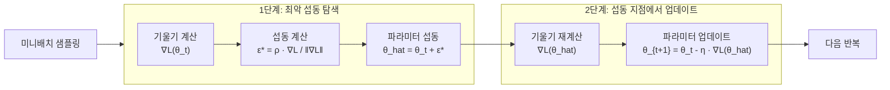

# SAM 옵티마이저 (Sharpness-Aware Minimization)

## 개요

SAM(Sharpness-Aware Minimization)은 Foret et al.(2021, Google Brain)이 제안한 옵티마이저로, 단순히 손실값이 낮은 최솟값을 찾는 것이 아니라 손실 경관(loss landscape)에서 **평탄한(flat) 최솟값**을 탐색하는 훈련 방법이다. 평탄한 최솟값은 날카로운(sharp) 최솟값보다 일반화 성능이 우수하다는 이론적·경험적 근거에 기반한다.

## 핵심 아이디어: 최악 경우 섭동 최소화

표준 경사 하강의 목표:

$$\min_\theta L(\theta)$$

SAM의 목표:

$$\min_\theta \max_{\|\epsilon\|_2 \leq \rho} L(\theta + \epsilon)$$

즉, $\theta$ 주변 반경 $\rho$ 이내에서 손실이 가장 크게 증가하는 방향 $\epsilon$을 먼저 찾고, 그 최악의 이웃에서의 손실을 최소화한다. 이 목표를 달성하면 $\theta$ 주변 전체 이웃의 손실이 낮은 평탄한 최솟값에 도달하게 된다.

## 알고리즘: 두 단계 업데이트

각 스텝마다 순전파/역전파를 **두 번** 수행한다. 이것이 SAM의 가장 큰 비용이다.

## 수학적 배경

SAM의 손실 함수 $L_S(\theta)$는 다음과 같이 근사된다:

$$L_S(\theta) \approx L(\theta) + \lambda \cdot \text{tr}(H(\theta)) / d$$

여기서 $H(\theta)$는 헤시안(Hessian) 행렬, $\text{tr}$은 대각합, $d$는 파라미터 수다. 즉 SAM은 암묵적으로 **헤시안 대각합(헤시안의 최대 고유값과 관련)을 정규화**하는 효과를 갖는다.

[[loss-landscape]]에서 이는 손실 곡면의 곡률(curvature)을 최소화하는 것에 해당한다.

## 일반화와 평탄 최솟값의 관계

평탄 최솟값이 더 잘 일반화하는 이유:

1. **파라미터 노이즈 내성**: 평탄한 최솟값에서는 파라미터가 조금 바뀌어도 손실이 크게 증가하지 않는다. 훈련-테스트 분포 차이는 파라미터에 작은 섭동을 가한 것과 유사하게 작용할 수 있다.

2. **PAC-Bayes 이론**: 일반화 오차의 상한은 최솟값의 날카로움(sharpness)과 관련되며, PAC-Bayes 경계(bound)에서 평탄성이 일반화를 보장한다.

3. **미니 배치 SGD의 한계**: 미니배치 SGD는 이미 어느 정도의 암묵적 정규화를 제공하지만, 배치 크기를 늘리면 더 날카로운 최솟값에 수렴하는 경향이 있다. SAM은 이를 명시적으로 보완한다.

## [[optimization-theory]] 관점에서의 위치

| 방법 | 특성 |
|------|------|
| SGD | 미니배치 노이즈로 암묵적 평탄화 |
| Adam | 빠른 수렴, 하지만 날카로운 최솟값 경향 |
| **SAM** | 명시적 평탄 최솟값 탐색, 2배 계산 비용 |
| SAM + SGD | 원 논문에서 가장 좋은 성능 |
| SAM + Adam | ASAM 등 변형에서 탐구 |

## SAM 변형들

| 변형 | 설명 |
|------|------|
| **ASAM** | Adaptive SAM - 파라미터별 스케일 고려 |
| **GSAM** | 경사 분해로 안정성 향상 |
| **mSAM** | 미니배치 내 서브샘플링으로 계산 효율화 |
| **LookSAM** | 섭동 방향을 주기적으로만 재계산 |
| **ESAM** | 효율적 샘플링 기반 근사 |

LookSAM과 ESAM은 2배 계산 비용을 줄이기 위한 근사 방법으로, 실용성을 높인다.

## 실험적 성능

Foret et al.(2021)의 결과:

- ImageNet: ResNet-50 기준 SAM이 SGD 대비 ~1% 상위 Top-1 정확도
- CIFAR-10/100: 다양한 아키텍처에서 일관된 개선
- 특히 **노이즈 레이블** 환경에서 두드러진 개선
- 배치 크기가 클수록 SAM의 효과가 커지는 경향

ViT(Vision Transformer)와 결합 시 더 큰 개선을 보이며, 이미지 분류뿐 아니라 NLP, 객체 탐지 등에서도 유사한 경향이 관찰된다.

## 실무 적용

- **배치 크기 큰 훈련**: 대규모 배치에서 일반화 손실을 보완하는 효과적인 방법
- **전이 학습 파인튜닝**: 사전 훈련 모델의 파인튜닝 시 날카로운 최솟값에 빠지는 것을 방지
- **계산 비용**: 순전파+역전파를 2회 수행하므로 훈련 시간이 약 2배 증가. 효율화 변형 사용 권장
- **하이퍼파라미터 $\rho$**: 이웃 반경. 너무 작으면 표준 SGD와 유사, 너무 크면 불안정. 보통 0.05-0.2 사이

## 관련 문서

- [[optimization-theory]] - 경사 하강 기반 최적화 이론 전반
- [[loss-functions]] - 최소화 대상 손실 함수의 특성
- [[loss-landscape]] - SAM이 탐색하는 고차원 손실 경관
- [[overfitting-regularization]] - SAM과 암묵적 정규화의 관계
