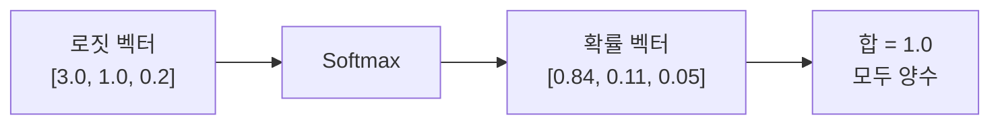
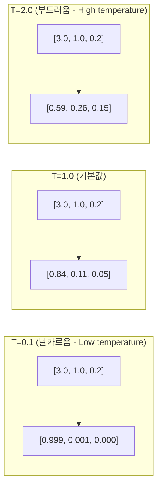

# 소프트맥스 (Softmax)

소프트맥스(Softmax) 함수는 임의의 실수 벡터를 합이 1인 확률 분포로 변환하는 함수다. 다중 클래스 분류의 출력층, [[attention-mechanism|Attention 메커니즘]]의 가중치 정규화, 언어 모델의 토큰 확률 계산 등 딥러닝 전반에서 핵심적으로 사용된다.

$$\text{Softmax}(z_i) = \frac{e^{z_i}}{\sum_{j=1}^{K} e^{z_j}}$$

- 입력: 로짓(logit) 벡터 $z \in \mathbb{R}^K$
- 출력: 확률 벡터 $p \in (0, 1)^K$, 단 $\sum_i p_i = 1$

## 핵심 특성



1. **확률 보존**: 출력 합 = 1 (항상 유효한 확률 분포)
2. **단조성 보존**: $z_i > z_j \Rightarrow \text{Softmax}(z)_i > \text{Softmax}(z)_j$ (상대적 순서 유지)
3. **평행이동 불변성**: $\text{Softmax}(z + c) = \text{Softmax}(z)$ (상수 더해도 결과 동일 - 수치 안정성에 활용)
4. **지수 증폭**: 큰 값은 더 크게, 작은 값은 더 작게 (승자독식 경향)

## 수치 안정성 (Numerical Stability)

$e^{z_i}$를 직접 계산하면 $z_i$가 크면 오버플로우(overflow), 매우 작으면 언더플로우(underflow) 발생.

**불안정한 구현:**
```python
def softmax_unstable(z):
    exp_z = torch.exp(z)  # z=1000이면 inf 반환!
    return exp_z / exp_z.sum()
```

**안정적 구현 (log-sum-exp 트릭):**

평행이동 불변성을 활용해 최대값을 빼고 계산:

$$\text{Softmax}(z_i) = \frac{e^{z_i - \max(z)}}{\sum_j e^{z_j - \max(z)}}$$

```python
def softmax_stable(z: torch.Tensor) -> torch.Tensor:
    # 수치 안정성을 위해 최대값 빼기
    z_shifted = z - z.max(dim=-1, keepdim=True).values
    exp_z = torch.exp(z_shifted)
    return exp_z / exp_z.sum(dim=-1, keepdim=True)

# PyTorch 내장 (위 방식을 자동 적용)
import torch.nn.functional as F
probs = F.softmax(logits, dim=-1)
```

**Log-Softmax:**

Softmax 후 로그를 취하는 `log_softmax`는 [[cross-entropy-loss|크로스엔트로피 손실]]과 결합 시 더 안정적이고 효율적:

```python
# 두 방식은 수학적으로 동일하지만 log_softmax + nll_loss가 더 안정
# 방식 1: softmax 후 log
loss = F.nll_loss(torch.log(F.softmax(logits, dim=-1)), labels)

# 방식 2: log_softmax + nll_loss (권장)
loss = F.nll_loss(F.log_softmax(logits, dim=-1), labels)

# 방식 3: cross_entropy = log_softmax + nll_loss 내장 (가장 간결)
loss = F.cross_entropy(logits, labels)
```

## 온도 스케일링 (Temperature Scaling)

소프트맥스에 온도 파라미터 $T$를 도입하여 분포의 "날카로움(sharpness)"을 조절한다.

$$\text{Softmax}(z_i, T) = \frac{e^{z_i/T}}{\sum_j e^{z_j/T}}$$



| 온도 | 분포 특성 | 활용 |
|------|-----------|------|
| $T \to 0$ | 승자독식 (argmax에 수렴) | 탐욕적 디코딩(greedy decoding) |
| $T = 1$ | 원래 로짓 그대로 | 기본 학습/추론 |
| $T > 1$ | 균일 분포에 가까워짐 | 창의적 텍스트 생성, 지식 증류 |
| $T \to \infty$ | 균일 분포 | 완전 무작위 |

**[[temperature-sampling|온도 샘플링]] 활용처:**
```python
def sample_with_temperature(logits: torch.Tensor, temperature: float) -> int:
    """온도 기반 다음 토큰 샘플링"""
    scaled_logits = logits / temperature
    probs = F.softmax(scaled_logits, dim=-1)
    return torch.multinomial(probs, num_samples=1).item()
```

## Attention 메커니즘에서의 소프트맥스

[[attention-mechanism|Self-Attention]]에서 소프트맥스는 쿼리-키 유사도 점수를 정규화하여 각 위치에 대한 집중(attention) 가중치를 만든다.

$$\text{Attention}(Q, K, V) = \text{Softmax}\left(\frac{QK^T}{\sqrt{d_k}}\right)V$$

**$\sqrt{d_k}$ 스케일링의 이유:**

$d_k$ 차원의 벡터 내적은 차원이 커질수록 분산이 $d_k$배 증가한다. 스케일링 없이 소프트맥스를 적용하면 특정 위치에 기울기가 극도로 집중(포화)되어 기울기 소실 발생.

$$\text{Var}(q \cdot k) = d_k \cdot \text{Var}(q_i) \cdot \text{Var}(k_i)$$

$1/\sqrt{d_k}$ 스케일링으로 분산을 1에 가깝게 유지.

**Causal Masking (인과 마스킹):**

언어 모델의 디코더에서는 미래 토큰을 참조하면 안 된다. 소프트맥스 전에 미래 위치의 점수를 $-\infty$로 마스킹하면, 소프트맥스 후 해당 위치의 가중치가 0에 수렴한다.

```python
import torch
import math

def masked_attention(Q, K, V, mask=None):
    d_k = Q.size(-1)
    scores = torch.matmul(Q, K.transpose(-2, -1)) / math.sqrt(d_k)

    if mask is not None:
        # 마스크 위치에 매우 작은 값 적용 -> softmax 후 0에 수렴
        scores = scores.masked_fill(mask == 0, float('-inf'))

    attention_weights = F.softmax(scores, dim=-1)
    return torch.matmul(attention_weights, V), attention_weights
```

## 소프트맥스와 크로스엔트로피 손실

다중 분류에서 소프트맥스 출력을 [[cross-entropy-loss|크로스엔트로피 손실]]과 함께 사용하는 것이 표준이다.

$$L = -\sum_c y_c \log p_c = -\log p_{y^*}$$

여기서 $y^*$는 정답 클래스 인덱스. 원-핫(one-hot) 레이블의 경우 정답 클래스 확률의 음의 로그만 남는다.

**역전파 시 소프트맥스의 기울기:**

소프트맥스 + 크로스엔트로피의 조합은 역전파가 특히 간단하다:

$$\frac{\partial L}{\partial z_i} = p_i - y_i$$

정답 클래스는 예측 확률 - 1, 나머지 클래스는 예측 확률 그대로. 이 단순한 형태가 학습을 안정적으로 만든다.

```python
# PyTorch에서 이미 내장됨 (위 수식이 자동 적용)
loss = F.cross_entropy(logits, labels)  # softmax + log + nll 포함
loss.backward()  # dL/dz = p - y 자동 계산
```

## 소프트맥스 vs 관련 함수 비교

| 함수 | 수식 | 특성 | 사용처 |
|------|------|------|--------|
| **Softmax** | $\frac{e^{z_i}}{\sum e^{z_j}}$ | 합 = 1, 모두 양수 | 분류 출력, attention |
| **Sigmoid** | $\frac{1}{1+e^{-z}}$ | 각 요소 독립적 (0,1) | 다레이블 분류, 이진 분류 |
| **Sparsemax** | $\arg\min_p \|p - z\|^2$ s.t. $\sum p_i=1$ | 희소 확률 분포 | 명확한 집중이 필요한 attention |
| **Gumbel-Softmax** | Softmax + Gumbel noise | 미분 가능한 이산 샘플링 | 토큰 생성 학습, 강화학습 |
| **log_softmax** | $z_i - \log \sum e^{z_j}$ | 수치 안정성 | 손실 계산 |

**Sigmoid vs Softmax:**
- Sigmoid: 각 클래스를 독립적으로 판단 → 여러 클래스 동시 해당 가능 (다레이블)
- Softmax: 클래스 간 경쟁 → 확률 합이 1 (단일 분류)

## 소프트맥스의 한계

1. **승자독식 경향**: 하나의 로짓이 조금만 커도 확률이 1에 수렴. 불확실성 표현에 한계
2. **캘리브레이션(calibration) 문제**: 모델이 과신(overconfident) 경향. 실제 정확도와 확률이 불일치
3. **차원의 저주**: 클래스 수가 많을수록 계산 비용 증가. 언어 모델에서 어휘 크기 × 배치 크기 행렬 필요

**대응 방법:**
- **Label Smoothing**: 정답 레이블을 1 대신 $(1-\epsilon)$, 나머지에 $\epsilon/(K-1)$ 분배. 과신 방지
  ```python
  loss = F.cross_entropy(logits, labels, label_smoothing=0.1)
  ```
- **Temperature Scaling**: 추론 시 온도 조정으로 캘리브레이션 개선
- **Sampled Softmax / Noise Contrastive Estimation**: 대규모 어휘에서 일부 후보만 샘플링하여 계산 효율화

## 실무 코드 예시

```python
import torch
import torch.nn as nn
import torch.nn.functional as F

class Classifier(nn.Module):
    def __init__(self, input_dim: int, num_classes: int):
        super().__init__()
        self.fc = nn.Linear(input_dim, num_classes)

    def forward(self, x: torch.Tensor) -> torch.Tensor:
        logits = self.fc(x)
        # 학습 시: cross_entropy에 로짓 그대로 전달 (내부적으로 softmax 처리)
        return logits

    def predict_proba(self, x: torch.Tensor) -> torch.Tensor:
        # 추론 시: 확률값이 필요하면 명시적으로 softmax
        with torch.no_grad():
            logits = self.fc(x)
            return F.softmax(logits, dim=-1)


# 학습
model = Classifier(128, 10)
optimizer = torch.optim.AdamW(model.parameters(), lr=1e-3)

logits = model(inputs)
loss = F.cross_entropy(logits, labels, label_smoothing=0.1)
loss.backward()
optimizer.step()

# 추론 (온도 스케일링 포함)
temperature = 0.7
probs = F.softmax(logits / temperature, dim=-1)
predicted_class = torch.argmax(probs, dim=-1)
```

## 관련 문서

- [[attention-mechanism]] - Attention에서의 소프트맥스 활용
- [[loss-functions]] - 크로스엔트로피와 소프트맥스 결합
- [[temperature-sampling]] - 온도 기반 생성 전략
- [[cross-entropy-loss]] - 분류 학습의 표준 손실 함수
- [[neural-network]] - 소프트맥스가 사용되는 신경망 구조
