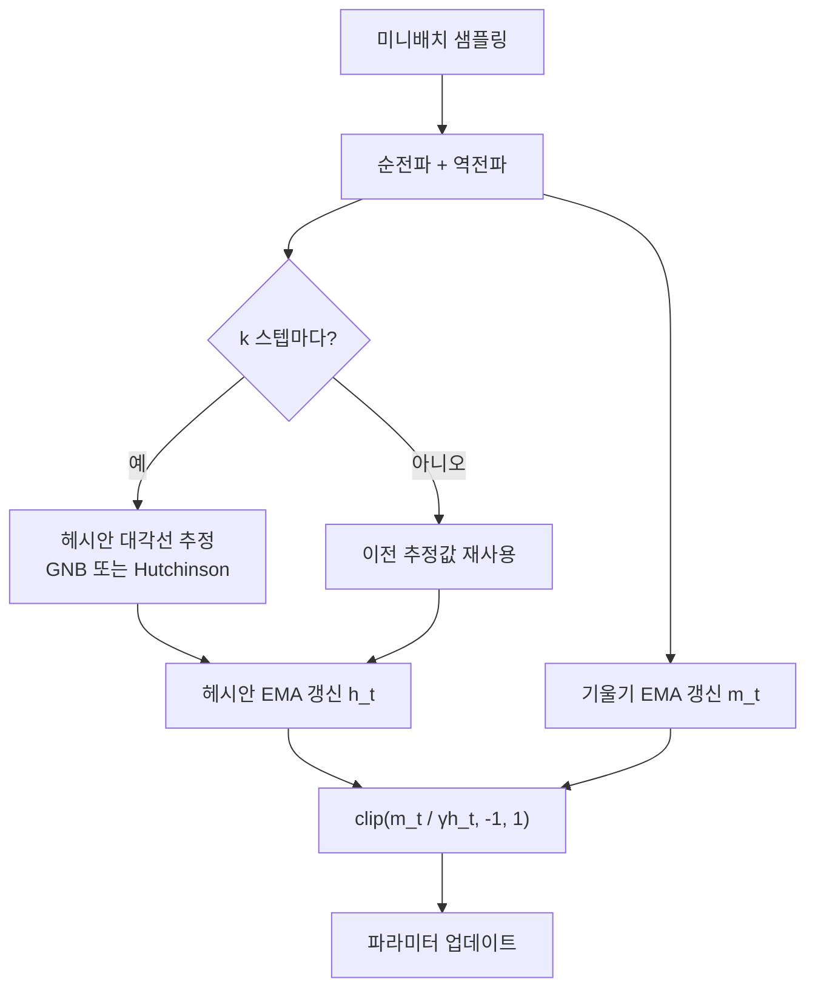

# Sophia 옵티마이저

Sophia(Second-order Clipping Heterogeneous Optimizer)는 2023년 Stanford 연구팀이 제안한 LLM 사전학습 전용 2차 최적화 알고리즘이다. 헤시안 행렬의 대각선 원소만 근사하여 2차 곡률 정보를 활용함으로써, Adam 대비 약 2배 빠른 수렴을 달성하면서도 메모리 오버헤드를 최소화한다.

## 왜 2차 옵티마이저인가

Adam과 같은 1차 최적화기는 기울기(gradient)만 사용하므로, 손실 지형의 **곡률(curvature)**을 전혀 모른다. 곡률이 방향마다 크게 다를 때 - LLM처럼 수십억 개의 파라미터를 가진 모델에서 흔한 상황 - 1차 방법은 스텝 크기를 지나치게 보수적으로 잡거나 발산 위험을 감수해야 한다.

2차 방법의 이상적인 업데이트 규칙은 뉴턴 스텝이다:

$$\theta_{t+1} = \theta_t - H^{-1} g$$

$H$는 헤시안, $g$는 기울기다. 문제는 $H$가 파라미터 수의 제곱 크기여서 LLM에서 직접 계산·역산이 불가능하다는 점이다.

## Sophia의 핵심 설계

### 헤시안 대각선 근사

Sophia는 전체 헤시안 대신 **대각선 원소** $\hat{h} = \text{diag}(H)$ 만 추정한다. 이를 위해 두 가지 추정 방식을 제공한다.

- **Gauss-Newton-Bartlett (GNB)**: 미니배치에서 샘플링한 레이블로 기울기의 제곱을 누적. 편향 없는 추정이지만 추가 순전파 필요.
- **Hutchinson 추정**: 랜덤 벡터 $v \sim \mathcal{N}(0, I)$ 로 $v^\top H v$ 를 추정. 단일 추가 역전파로 계산 가능.

헤시안 추정은 매 $k$ 스텝(보통 $k=10$)에 한 번만 수행하므로 스텝당 오버헤드는 미미하다.

### Clipping 메커니즘

Sophia의 업데이트 규칙은 단순히 $g / \hat{h}$ 를 쓰지 않는다. 헤시안 대각선이 0에 가까울 때 폭발적 스텝이 생기는 문제를 **클리핑**으로 해결한다.

$$\theta_{t+1} = \theta_t - \eta \cdot \text{clip}\!\left(\frac{m_t}{\gamma \hat{h}_t},\, -1,\, 1\right)$$

여기서 $m_t$는 기울기의 지수이동평균(1차 모멘텀), $\hat{h}_t$는 헤시안 대각선 추정값, $\gamma$는 스케일링 하이퍼파라미터다. 클리핑 덕분에 헤시안이 과소 추정될 때도 안정적인 학습이 유지된다.

위 흐름에서 헤시안 추정은 $k$ 스텝마다 한 번만 수행되어, 전체 학습 비용은 Adam 대비 약 1.1배 수준으로 유지된다.

## Adam과의 비교

| 항목 | Adam | Sophia |
|------|------|--------|
| 사용 정보 | 1차 기울기 + 기울기 제곱 | 1차 기울기 + 헤시안 대각선 |
| 상태 벡터 수 | 2 (m, v) | 2 (m, h) |
| 스텝당 추가 비용 | 없음 | 1/k 순전파 또는 역전파 |
| 수렴 속도 | 기준선 | 약 2배 빠름 (동일 토큰 기준) |
| 수치 안정성 | $\varepsilon$ 분모 | 클리핑 |

실험 결과, GPT-2 규모(125M~355M)에서 Sophia는 Adam 대비 **동일 언어 모델 손실에 도달하는 데 필요한 토큰 수를 약 절반**으로 줄였다.

## 헤시안이 학습에 주는 통찰

헤시안 대각선을 시각화하면 흥미로운 패턴이 드러난다. Attention의 출력 프로젝션(out-proj)과 피드포워드 층의 특정 뉴런들은 곡률이 특히 높다. 이는 해당 파라미터들이 손실에 매우 민감하며, Adam의 균일한 스텝 크기 가정이 취약한 지점임을 암시한다.

이 관찰은 [[second-order-optimization]] 의 일반 이론과 일치한다. 곡률이 높은 방향에서는 학습률을 줄이고, 낮은 방향에서는 적극적으로 전진하는 것이 최적이다.

## 실무 적용 시 고려사항

- **하이퍼파라미터**: $\rho$ (클리핑 임계값), $\beta_1$ (기울기 모멘텀), $\beta_2$ (헤시안 EMA 계수), $\gamma$ (헤시안 스케일) 4개가 핵심. Adam의 $\varepsilon$에 해당하는 수치 안정화 항이 없다.
- **헤시안 추정 주기** $k$: 10~100 사이로 설정. 너무 크면 오래된 곡률 정보, 너무 작으면 비용 증가.
- **배치 크기 민감도**: 헤시안 추정이 노이즈에 취약하므로 배치 크기가 작을수록 추정 오차 증가.
- **현재 지원 프레임워크**: PyTorch 기반 레퍼런스 구현이 공개되어 있으나, 분산 학습 환경에서의 공식 지원은 [교차검증 필요].

## 한계와 후속 연구 방향

1. **비대각선 곡률 무시**: 파라미터 간 상호작용(off-diagonal Hessian)은 여전히 활용하지 못한다.
2. **추정 노이즈**: GNB/Hutchinson 모두 확률적 추정이므로, 헤시안 신호가 노이즈에 묻힐 수 있다.
3. **대규모 검증 부족**: 당초 논문은 GPT-2 규모까지만 실험. 70B+ 규모에서의 효과는 [교차검증 필요].

[[second-order-optimization]], [[optimization-theory]], [[scaling-laws]] 와 함께 읽으면 2차 최적화가 대규모 LLM에서 왜 까다로운지, 그리고 Sophia가 어떤 트레이드오프를 선택했는지 더 깊이 이해할 수 있다.

## 관련 문서

- [[second-order-optimization]] - 뉴턴 방법, K-FAC 등 2차 최적화 일반론
- [[optimization-theory]] - 경사하강법 계열 옵티마이저 비교
- [[scaling-laws]] - 토큰 효율과 모델 크기 간의 법칙
- [[loss-landscape]] - 헤시안과 손실 지형의 관계
- [[natural-gradient]] - Fisher 정보 행렬 기반 2차 근사
