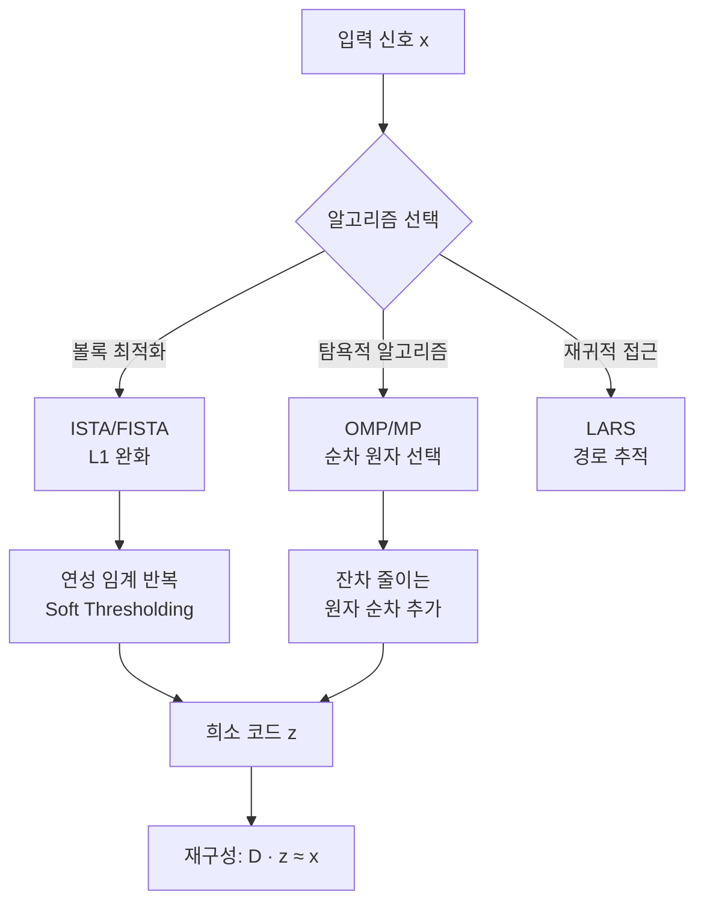

# 희소 코딩과 사전 학습

## 개요

희소 코딩(sparse coding)은 신호를 소수의 기저 원소(basis element)의 선형 결합으로 표현하는 기법이다. 대부분의 계수(coefficient)가 0이거나 0에 가까운 **희소 표현(sparse representation)**을 목표로 한다. 사전 학습(dictionary learning)은 이러한 희소 표현을 가능하게 하는 기저 집합, 즉 **사전(dictionary)**을 데이터로부터 학습하는 과정이다.

시각 피질(visual cortex)의 V1 뉴런이 자연 이미지에 대해 가바(Gabor) 필터와 유사한 수용야(receptive field)를 형성한다는 신경과학 관찰(Olshausen & Field, 1996)이 이론적 동기다.

## 문제 정식화

입력 신호 $\mathbf{x} \in \mathbb{R}^n$, 사전 $D \in \mathbb{R}^{n \times K}$ ($K$개 원자(atom)), 희소 코드 $\mathbf{z} \in \mathbb{R}^K$에 대한 기본 목적 함수:

$$\min_{D, Z} \|X - DZ\|_F^2 \quad \text{s.t.} \quad \|\mathbf{z}_i\|_0 \leq k \quad \forall i$$

- $X = [\mathbf{x}_1, \ldots, \mathbf{x}_N]$: 훈련 데이터 행렬
- $Z = [\mathbf{z}_1, \ldots, \mathbf{z}_N]$: 희소 코드 행렬
- $\|\cdot\|_0$: 비영원소 수 ($L_0$ 노름)
- $k$: 허용 희소성 수준

이 문제는 $D$와 $Z$ 중 하나를 고정하면 다른 하나에 대해 볼록(convex)이지만, 동시에 최적화하면 비볼록(non-convex)이다.

## L1 완화: LASSO

$L_0$ 제약은 NP-hard이므로 $L_1$ 노름으로 완화한다:

$$\min_{\mathbf{z}} \frac{1}{2}\|\mathbf{x} - D\mathbf{z}\|_2^2 + \lambda\|\mathbf{z}\|_1$$

이를 **LASSO(Least Absolute Shrinkage and Selection Operator)** 또는 **Basis Pursuit Denoising**이라 한다. $L_1$ 정규화는 볼록 최적화이므로 전역 최솟값이 보장되며, 해가 희소한 경향을 갖는다.

### 왜 L1이 희소성을 유도하는가

$L_1$ 페널티의 하위미분(subdifferential)이 0에서 불연속적이어서 많은 계수를 정확히 0으로 수렴시키는 "연성 임계(soft thresholding)" 효과를 낸다. 반면 $L_2$ 페널티는 계수를 0에 가깝게 만들 뿐 정확히 0으로 만들지 않는다.

## 희소 코드 추정 알고리즘

### 1. ISTA (Iterative Shrinkage-Thresholding Algorithm)

LASSO 문제를 반복적으로 푸는 알고리즘. 각 반복은 두 단계로 구성된다:

1. **경사 스텝**: $\mathbf{u} = \mathbf{z}^{(t)} - \frac{1}{L}\nabla_\mathbf{z} \frac{1}{2}\|\mathbf{x} - D\mathbf{z}^{(t)}\|^2 = \mathbf{z}^{(t)} + \frac{1}{L}D^\top(\mathbf{x} - D\mathbf{z}^{(t)})$
2. **연성 임계(soft thresholding)**: $\mathbf{z}^{(t+1)} = S_{\lambda/L}(\mathbf{u})$

연성 임계 함수:

$$[S_\tau(u)]_i = \text{sign}(u_i) \max(|u_i| - \tau, 0)$$

수렴 속도: $O(1/t)$ ($L$은 $D^\top D$의 최대 고유값, 리프시츠 상수).

### 2. FISTA (Fast ISTA)

Nesterov 가속(momentum)을 적용한 ISTA. 수렴 속도 $O(1/t^2)$:

$$\mathbf{y}^{(t+1)} = \mathbf{z}^{(t)} + \frac{t-1}{t+2}(\mathbf{z}^{(t)} - \mathbf{z}^{(t-1)})$$

$$\mathbf{z}^{(t+1)} = S_{\lambda/L}\left(\mathbf{y}^{(t+1)} + \frac{1}{L}D^\top(\mathbf{x} - D\mathbf{y}^{(t+1)})\right)$$

### 3. OMP (Orthogonal Matching Pursuit)

탐욕적(greedy) 알고리즘. $k$번의 반복에서 잔차와 가장 상관이 높은 사전 원자를 순차 선택:

1. 잔차 $\mathbf{r} = \mathbf{x}$, 선택 집합 $\Lambda = \emptyset$
2. $j^* = \arg\max_j |\langle d_j, \mathbf{r} \rangle|$ (최고 상관 원자 선택)
3. $\Lambda \leftarrow \Lambda \cup \{j^*\}$
4. 직교 투영으로 $\mathbf{z}$ 업데이트, 잔차 갱신
5. $k$번 반복

희소 코드 추정의 세 가지 주요 알고리즘 경로를 나타낸다.

## 사전 학습 (Dictionary Learning)

사전 $D$와 코드 $Z$를 번갈아 최적화하는 교대 최소화(alternating minimization):

### K-SVD 알고리즘

Aharon et al. (2006)이 제안한 방법. OMP로 희소 코드를 고정 후, 각 원자를 SVD로 업데이트:

1. **코드 스텝**: 각 샘플에 대해 OMP로 $\mathbf{z}_i$ 계산 (D 고정)
2. **사전 업데이트**: 각 원자 $d_j$에 대해:
   - 원자 $j$를 사용한 샘플 집합 $\mathomega_j$ 추출
   - 잔차 행렬 $E_j = X_{\omega_j} - \sum_{l \neq j} d_l z_l^\top_{\omega_j}$
   - $E_j = U\Sigma V^\top$로 SVD 분해
   - $d_j \leftarrow u_1$ (첫 번째 좌 특이 벡터), 코드 업데이트

K-SVD는 K-means(각 원자에 가장 유사한 샘플 할당)와 유사한 구조를 가지므로 이름이 붙었다.

### 온라인 사전 학습

Mairal et al. (2009)는 미니배치를 사용한 온라인 버전을 제안, 대규모 데이터셋에 적용 가능:

$$D_t = \arg\min_D \frac{1}{t}\sum_{i=1}^t \left( \frac{1}{2}\|\mathbf{x}_i - D\mathbf{z}_i^*\|^2 + \lambda\|\mathbf{z}_i^*\|_1 \right)$$

블록 좌표 하강(block coordinate descent)으로 각 원자를 순차 업데이트.

## 사전의 성질

### 완비성 (Completeness)

- **과완비(overcomplete)**: $K > n$, 사전 원자 수가 신호 차원보다 많음. 더 유연한 표현 가능
- **완비(complete)**: $K = n$, 정방 행렬 (Fourier basis 등)
- **불완비(undercomplete)**: $K < n$, PCA 등

딥러닝의 은닉층은 과완비 사전에 해당한다.

### 상호 일관성 (Mutual Coherence)

사전 원자 간 최대 내적:

$$\mu(D) = \max_{i \neq j} \frac{|\langle d_i, d_j \rangle|}{\|d_i\|\|d_j\|}$$

$\mu$가 작을수록 원자들이 서로 구별되며, 희소 복원 보장이 강해진다. 동일 신호 복원이 가능한 충분 조건: $\|\mathbf{z}\|_0 < (1 + \mu^{-1})/2$.

## 신경과학적 기원: V1 단순 세포

Olshausen & Field (1996)는 자연 이미지 패치에 희소 코딩을 적용하여 얻은 사전 원자가 V1 단순 세포의 수용야와 시각적으로 유사한 가보 필터(방향성 에지 검출기)를 학습함을 보였다. 이는 뇌가 효율적 부호화(efficient coding) 원리로 감각 정보를 표현한다는 가설을 지지한다.

## 딥러닝과의 관계

### LISTA (Learned ISTA)

Gregor & LeCun (2010)은 ISTA를 전개(unrolling)하여 고정 횟수의 반복을 신경망으로 구현:

- ISTA 각 반복 = 신경망 1개 레이어
- 경사 하강으로 사전 $D$와 임계값 $\lambda$를 함께 학습
- 추론 시간 크게 단축 (ISTA 대비 10-100배)

이 "알고리즘 전개(algorithm unrolling)" 패러다임은 딥러닝과 최적화 알고리즘을 연결한다.

### 트랜스포머와의 관계

최근 연구들은 어텐션 메커니즘이 희소 코딩과 수학적으로 동등하거나 유사한 최적화를 수행함을 보였다. 키-값(key-value) 저장소가 사전 역할을 하며, 어텐션이 희소 코드를 출력한다는 해석이 존재한다.

### 오토인코더와의 관계

희소 오토인코더(sparse autoencoder)는 은닉층 활성화에 $L_1$ 페널티를 추가:

$$L = \|x - \hat{x}\|^2 + \lambda\|\mathbf{z}\|_1$$

Anthropic의 해석 가능성(interpretability) 연구에서 이 구조를 사용해 LLM 내부 표현을 분해하는 연구가 있다.

## 응용 분야

| 분야 | 응용 |
|------|------|
| 이미지 복원 | 잡음 제거, 초해상도 (딕셔너리로 패치 복원) |
| 압축 센싱 | 언더샘플링된 신호 복원 (의료 영상, MRI) |
| 음악 분리 | 드럼/보컬/악기 신호 분리 |
| 얼굴 인식 | 훈련 얼굴로 사전 구성, 쿼리 얼굴의 희소 표현 분류 |
| LLM 해석 | 활성화 패치를 개념으로 분해 |
| 이상 탐지 | 정상 데이터 사전으로 재구성 오차 측정 |

## 관련 문서

- [[representation-learning-theory]] - 표현 학습 이론: 희소 코딩의 이론적 기반
- [[optimization-theory]] - ISTA/FISTA의 수렴 분석
- [[gradient-descent-backpropagation]] - 사전 학습의 기울기 기반 최적화
- [[autoencoders-vae]] - 오토인코더와 희소 코딩의 관계
- [[kernel-methods]] - RKHS와 표현 이론의 연결
