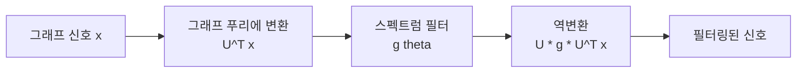

# 스펙트럼 GNN / WL 표현력

그래프 라플라시안의 고유분해를 기반으로 합성곱을 정의하는 **스펙트럼 GNN**과, [[graph-neural-networks|GNN]]의 표현력 한계를 규정하는 **Weisfeiler-Lehman(WL) 동형 테스트** 이론.

## 스펙트럼 합성곱

그래프 라플라시안 $L = D - A$의 고유벡터 $U$를 사용해 그래프 푸리에 변환을 정의한다. [[graph-transformer|그래프 트랜스포머]]의 위치 인코딩에도 이 고유벡터가 활용된다.

GCN의 1차 근사: $H^{(l+1)} = \sigma(\tilde{D}^{-1/2}\tilde{A}\tilde{D}^{-1/2} H^{(l)} W^{(l)})$는 스펙트럼 필터의 1차 체비쉐프 근사.

## WL 표현력 한계

Xu et al. (2019, GIN 논문)의 핵심 결과:

> 메시지 패싱 GNN은 1-WL 동형 테스트와 **동일한 표현력**을 가진다.

즉, 1-WL로 구분 불가능한 두 그래프는 어떤 MPNN도 구분할 수 없다. 이 한계를 넘기 위해:
- **고차 WL**: k-WL 근사 (k-GNN)
- **[[graph-transformer|그래프 트랜스포머]]**: 전역 어텐션으로 구조 정보 보완

## 관련 문서

- [[graph-neural-networks]] -- GNN 기초
- [[graph-transformer]] -- 그래프 트랜스포머
- [[graph-attention-network]] -- GAT
- [[spectral-methods-ml]] -- 스펙트럼 방법 일반
