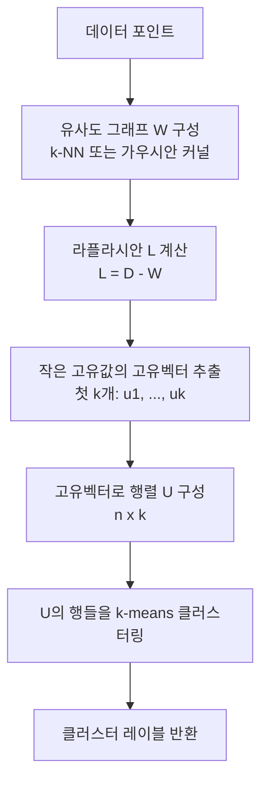

# 스펙트럼 방법 (ML)

스펙트럼 방법(Spectral Methods)은 행렬이나 그래프의 **고유값/고유벡터(eigenvalue/eigenvector)** 구조를 활용해 데이터의 기하학적 특성을 분석하는 수학적 기법 체계다. 머신러닝에서는 클러스터링, 차원 축소, 그래프 신경망, 신호 처리 등 광범위한 영역에 핵심 이론으로 쓰인다.

## 라플라시안 행렬과 그래프 구조

그래프 $G = (V, E)$에서 가장 중요한 행렬은 **그래프 라플라시안(Graph Laplacian)**이다.

**정의**:
$$L = D - A$$

- $A$: 인접 행렬(adjacency matrix), $A_{ij} = w_{ij}$ (간선 가중치)
- $D$: 차수 행렬(degree matrix), $D_{ii} = \sum_j w_{ij}$
- $L$: 그래프 라플라시안

**정규화 라플라시안**:
$$L_{sym} = D^{-1/2} L D^{-1/2} = I - D^{-1/2} A D^{-1/2}$$

라플라시안의 핵심 성질은 다음과 같다:
- 항상 반양정치(positive semi-definite): 고유값 $0 = \lambda_1 \leq \lambda_2 \leq \cdots \leq \lambda_n$
- 최소 고유값 0의 중복도 = 그래프의 연결 컴포넌트 수
- 고유벡터들이 그래프 구조의 "주파수(frequency)" 기저를 형성

## 스펙트럼 클러스터링

스펙트럼 클러스터링은 라플라시안의 고유벡터 공간에서 클러스터를 발견하는 알고리즘이다. 핵심 아이디어는 **그래프를 최소 비용으로 절단(cut)하는 문제**를 고유값 분해로 해결하는 것이다.

**왜 고유벡터를 쓰는가?** 정규 절단(Normalized Cut) 최소화 문제:

$$\min \frac{\text{cut}(A, B)}{\text{vol}(A)} + \frac{\text{cut}(A, B)}{\text{vol}(B)}$$

는 NP-hard이지만, 연속 완화(continuous relaxation)를 취하면 라플라시안의 두 번째 고유벡터(Fiedler 벡터) 기준으로 이분이 최적 근사가 된다.

### k-way 스펙트럼 클러스터링

$k$개 클러스터로 나누려면 첫 $k$개 고유벡터를 쓴다. 고유벡터 공간에서는 데이터가 선형적으로 잘 분리되므로 k-means가 효과적으로 작동한다. 이것이 [[pca]] 와의 유사점이자 차이점이다 - PCA는 분산 보존, 스펙트럼 클러스터링은 그래프 연결 구조 보존.

## 스펙트럼 방법과 그래프 신경망

[[graph-neural-networks]](GNN)의 이론적 토대가 스펙트럼 방법이다. 특히 스펙트럼 GNN(Spectral GNN)은 그래프 푸리에 변환을 기반으로 한다.

**그래프 푸리에 변환**: 라플라시안의 고유벡터 $U = [u_1, \ldots, u_n]$를 기저로 사용:

$$\hat{x} = U^\top x \quad \text{(그래프 푸리에 계수)}$$
$$x = U \hat{x} \quad \text{(역변환)}$$

**스펙트럼 합성곱**: 필터 $g_\theta$를 고유값 공간에서 정의:

$$g_\theta \star x = U \cdot g_\theta(\Lambda) \cdot U^\top x$$

ChebNet과 GCN은 이 필터를 다항식으로 근사하여 계산 효율을 높인 모델이다. GCN의 업데이트 규칙:

$$H^{(l+1)} = \sigma\!\left(\tilde{D}^{-1/2} \tilde{A} \tilde{D}^{-1/2} H^{(l)} W^{(l)}\right)$$

은 1차 체비쇼프 근사에 해당한다.

## 스펙트럼 방법 응용 영역

| 응용 | 핵심 행렬 | 활용 방식 |
|------|-----------|-----------|
| 스펙트럼 클러스터링 | 라플라시안 $L$ | 작은 고유벡터 → k-means |
| 차원 축소 (LLE, Isomap) | 커널 행렬 | 주요 고유벡터 투영 |
| [[pca]] | 공분산 행렬 | 큰 고유값 기저 |
| 그래프 신경망 | 라플라시안 $L$ | 스펙트럼 필터링 |
| 신호 처리 | 푸리에/웨이블릿 기저 | 주파수 필터링 |
| 추천 시스템 | 사용자-아이템 행렬 | SVD 분해 |

## 라플라시안 스무딩과 과평활화

GNN의 여러 층을 쌓으면 라플라시안 스무딩이 반복 적용된다. 신호 $x$에 $L$을 반복 곱하면:

$$x^{(k)} = (I - \alpha L)^k x$$

$k$가 커질수록 모든 노드의 표현이 비슷해지는 **과평활화(over-smoothing)**가 발생한다. 스펙트럼 관점에서는 고주파 성분이 지수적으로 감쇠하여 저주파(글로벌 구조)만 남는 현상이다.

## 계산 복잡도와 확장성

라플라시안의 전체 고유분해는 $O(n^3)$이므로 대규모 그래프에서는 비현실적이다. 대안:

1. **희소 고유값 분해**: Lanczos 알고리즘, $O(k \cdot \text{nnz})$
2. **국소 근사**: ChebNet처럼 다항식으로 근사하여 전역 분해 회피
3. **무작위 방법**: 확률적 SVD로 주요 성분 추출

## 관련 문서
- [[neural-operators]] -- 신경 연산자 - DeepONet과 FNO

- [[graph-neural-networks]] - 스펙트럼 방법의 딥러닝 응용
- [[pca]] - 공분산 행렬의 스펙트럼 분해
- [[tsne-umap]] - 비선형 차원 축소와 스펙트럼 방법의 비교
- [[neural-tangent-kernel]] - 커널 행렬의 스펙트럼과 학습 동역학
- [[k-means-clustering]] - 스펙트럼 클러스터링의 최종 단계
