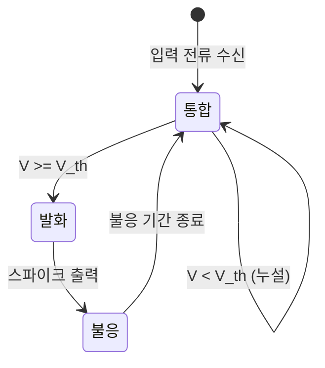

# 스파이킹 신경망 (Spiking Neural Networks, SNN)

## 정의

스파이킹 신경망(Spiking Neural Networks, SNN)은 생물학적 뇌 신경망의 동작 방식을 모방한 3세대 신경망이다. 기존의 인공 신경망이 부동소수점 활성화 값을 연속적으로 전달하는 것과 달리, SNN의 뉴런은 이산적인 **스파이크(spike, 활동 전위)** 이벤트를 시간축에 따라 발생시킨다. 정보는 스파이크의 **발생 유무, 타이밍, 빈도** 등으로 부호화된다.

## 세대별 신경망 비교

| 세대 | 대표 모델 | 정보 표현 | 특징 |
|------|-----------|-----------|------|
| 1세대 | 퍼셉트론 | 이진 출력 | 선형 분리 가능한 문제만 해결 |
| 2세대 | MLP, CNN, Transformer | 연속 실수 활성화 | 역전파 학습, 범용 근사 |
| 3세대 | SNN | 시간적 스파이크 이벤트 | 에너지 효율, 시간적 정보 처리 |

## 뉴런 모델: 리키 인티그레이트-앤드-파이어 (LIF)

가장 널리 사용되는 SNN 뉴런 모델은 **리키 인티그레이트-앤드-파이어(Leaky Integrate-and-Fire, LIF)** 모델이다.

### LIF 방정식

$$\tau_m \frac{dV}{dt} = -(V - V_{\text{rest}}) + R \cdot I(t)$$

- $V$: 막 전위(membrane potential)
- $\tau_m$: 막 시상수(membrane time constant)
- $V_{\text{rest}}$: 휴지 전위
- $R$: 막 저항
- $I(t)$: 입력 전류

**발화 규칙**: $V \geq V_{\text{th}}$이면 스파이크 발생 후 $V_{\text{reset}}$으로 초기화 (불응 기간 적용)

LIF 모델의 상태 전이: 뉴런이 입력을 통합하다가 임계값에 도달하면 스파이크를 발생시키고, 불응 기간 후 다시 통합 상태로 돌아간다.

## 정보 부호화 방식

SNN에서 정보는 다양한 방식으로 스파이크에 인코딩된다:

### 속도 부호화 (Rate Coding)
- 일정 시간 내 스파이크 발생 빈도로 정보 표현
- 통계적으로 안정적, 기존 ANN과 변환 용이
- 높은 발화율 = 큰 활성화 값에 대응

### 시간 부호화 (Temporal Coding)
- 스파이크 발생 **타이밍** 자체가 정보를 담음
- "누가 먼저 발화하는가"로 입력 강도 표현 (rank order coding)
- 에너지 효율 높음, 소수의 스파이크로 풍부한 정보 전달

### 위상 부호화 (Phase Coding)
- 배경 진동(gamma oscillation 등)의 위상에 대한 스파이크 타이밍
- 뇌 신경과학에서 관찰되는 실제 부호화 방식

## 학습 알고리즘

표준 역전파는 스파이크의 불연속성 때문에 직접 적용 불가하다. 여러 대안이 개발되었다:

### 대용 기울기 (Surrogate Gradient)
- 스파이크 함수를 미분 가능한 근사 함수로 대체 (시그모이드, piecewise linear 등)
- 현재 SNN 학습의 주류 방법
- SpyTorch, snnTorch 라이브러리에서 지원

### ANN-to-SNN 변환
- 학습된 ANN 가중치를 그대로 SNN으로 변환
- 속도 부호화 기반: ReLU 활성화 = 발화율로 대응
- 추론 정확도 유지하면서 뉴로모픽 하드웨어에서 실행

### STDP (Spike-Timing Dependent Plasticity)
- 생물학적 헤비안 학습 규칙의 구현
- "이전에 발화한 뉴런이 이후 발화 뉴런의 가중치 강화"
- 비지도 특징 학습에 활용

## 뉴로모픽 하드웨어

SNN의 강점은 전용 뉴로모픽 하드웨어에서 극대화된다:

| 칩 | 개발사 | 특징 |
|----|--------|------|
| Intel Loihi 2 | Intel | 1백만 뉴런, 온칩 학습, 학술 연구 제공 |
| IBM TrueNorth | IBM | 4096 코어, 256 뉴런/코어, 70mW |
| BrainScaleS-2 | 하이델베르크 대학 | 아날로그 회로, 실시간 속도 10,000배 |
| SpiNNaker 2 | 맨체스터 대학 | 분산 ARM 코어, 대규모 연결 모델 |

## 에너지 효율성

기존 GPU 기반 ANN 대비 SNN의 에너지 효율 우위:

- **희소 활성화**: 대부분의 타임스텝에서 스파이크 발생 안 함 (희소성 90%+ 가능)
- **이진 통신**: 스파이크 = 1비트 이벤트, 곱셈 없이 덧셈만 수행
- **이벤트 구동**: 변화가 있을 때만 연산 (카메라 DVS와 궁합)
- 뉴로모픽 칩에서 1000배 이상 에너지 절감 보고 사례 존재

## 응용 분야

### 이벤트 기반 센서와의 결합
- **동적 비전 센서(DVS/이벤트 카메라)**: 픽셀 단위 밝기 변화만 기록
- 움직임 감지, 고속 물체 추적에 최적
- 전통 카메라 대비 높은 동적 범위, 낮은 지연

### 에지 AI 추론
- 배터리 구동 IoT, 웨어러블 디바이스
- 항상 켜져 있는(always-on) 저전력 감지

### 신경과학 시뮬레이션
- 뇌 회로 모델링 및 신경 질환 연구
- NEST, Brian2 같은 뇌 시뮬레이터

## 현재 한계

- **학습 어려움**: 대용 기울기도 ANN 역전파만큼 안정적이지 않음
- **긴 시뮬레이션 타임스텝**: 속도 부호화 시 많은 타임스텝 필요
- **벤치마크 성능 격차**: ImageNet 등 표준 벤치마크에서 ANN 대비 여전히 열세
- **하드웨어 생태계**: 아직 GPU 생태계 대비 제한적

## 실무에서의 위치

2024-2025년 기준으로 SNN은 **엣지 추론의 에너지 효율 요구**와 **뇌 모사 AI 연구** 맥락에서 주목받지만, 범용 딥러닝 태스크에서 ANN 대체는 아직 이르다. Intel Loihi, IBM TrueNorth의 상용화와 함께 특정 영역(이벤트 카메라 처리, 저전력 감지)에서 실용적 배포가 늘고 있다.

## 관련 문서

- [[perceptron-mlp]] - 2세대 신경망 기반
- [[rnn-lstm-gru]] - 시간적 정보 처리의 다른 접근
- [[energy-based-models]] - 에너지 함수 기반 신경망
- [[neural-ode]] - 연속 시간 신경망의 또 다른 형태
- [[gradient-descent-backpropagation]] - SNN에서 직접 적용이 어려운 표준 학습 알고리즘
