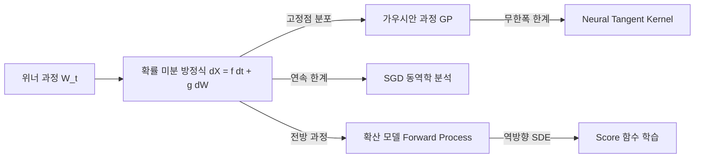

# 확률 과정과 머신러닝

확률 과정(Stochastic Process)은 시간(또는 공간)에 따라 확률적으로 변화하는 수학적 대상이다. 머신러닝에서는 [[gaussian-process]] 로 대표되는 비모수적 모델링, 최신 [[diffusion-models]] 의 이론적 토대, 그리고 SGD 자체의 동역학 분석에 이르기까지 핵심 수학 언어로 자리잡았다.

## 위너 과정 (Brownian Motion)

위너 과정(Wiener Process, 표준 브라운 운동) $W_t$는 가장 기본적인 연속시간 확률 과정이다.

**정의 (비공식)**:
- $W_0 = 0$
- 독립 증분: $W_t - W_s \perp W_s - W_r$ ($r < s < t$)
- 정규 증분: $W_t - W_s \sim \mathcal{N}(0, t-s)$
- 연속 경로 (거의 확실히)

위너 과정은 불규칙한 연속 경로를 가지며 어디서도 미분 불가능하다. 그러나 이토 적분(Ito integral)을 통해 이 경로를 기반으로 한 적분과 미분 방정식을 정의할 수 있다.

## 확률 미분 방정식 (SDE)

SDE(Stochastic Differential Equation)는 일반 미분 방정식에 확률적 노이즈 항을 추가한 것이다:

$$dX_t = f(X_t, t)\, dt + g(X_t, t)\, dW_t$$

- $f(X_t, t)$: 드리프트(drift) - 결정론적 방향
- $g(X_t, t)$: 확산 계수(diffusion coefficient) - 노이즈 강도
- $dW_t$: 위너 과정의 미소 증분

이 언어로 SGD의 연속시간 근사를 쓸 수 있다:

$$d\theta_t = -\nabla \mathcal{L}(\theta_t)\, dt + \sqrt{\frac{2\eta}{\beta}}\, dW_t$$

학습률 $\eta$, 역온도 $\beta$로 제어되는 **확률적 그래디언트 흐름**이 된다.

## 가우시안 과정 (GP)

[[gaussian-process]]는 함수에 대한 확률 분포로, "어떤 유한한 입력 집합에 대한 함수값들이 결합 가우시안 분포를 따른다"는 일관성 조건으로 정의된다.

$$f \sim \mathcal{GP}(m(x), k(x, x'))$$

- $m(x)$: 평균 함수 (보통 0으로 설정)
- $k(x, x')$: 공분산(커널) 함수 - 데이터 포인트 간 상관 구조

GP 회귀는 SDE와 동등하다. 예컨대 Matérn 커널을 가진 GP는 특정 SDE의 고정점 분포(stationary distribution)와 정확히 대응된다. 이 연결이 상태공간 GP(State-Space GP)의 이론적 기반이다.

## 확산 모델과 SDE의 연결

[[diffusion-models]] 의 핵심 수학은 SDE다. Song et al. (2020)의 SMLD/DDPM 통합 프레임워크에서:

**전방 과정 (Forward SDE)**:
$$dX_t = f(X_t, t)\, dt + g(t)\, dW_t$$

데이터 $X_0$에서 시작하여 순수한 가우시안 노이즈 $X_T \approx \mathcal{N}(0, I)$ 로 점진적으로 파괴한다.

**역방향 과정 (Reverse SDE)**: Anderson (1982)의 결과에 의해:

$$dX_t = \left[f(X_t, t) - g(t)^2 \nabla_{X_t} \log p_t(X_t)\right] dt + g(t)\, d\bar{W}_t$$

여기서 $\nabla_x \log p_t(x)$가 **스코어 함수(score function)**다. 신경망으로 스코어 함수를 학습하면 임의의 분포에서 샘플링이 가능하다.

DDPM의 이산 가우시안 마르코프 체인은 이 연속 SDE의 오일러-마루야마(Euler-Maruyama) 이산화다.

## 마르코프 과정과 강화학습

[[markov-decision-process]](MDP)는 이산시간 마르코프 과정의 특수한 형태다. 상태 전이 $P(s' | s, a)$가 과거에 무관하고 현재 상태와 행동에만 의존하는 마르코프 성질을 가진다.

연속시간으로 확장하면 **마르코프 결정 확산 과정(Controlled SDE)**이 되며, 이는 연속 제어(continuous control) 강화학습의 이론적 기반이다.

## 포커-플랑크 방정식

SDE $dX_t = f dt + g\, dW_t$에서 $X_t$의 확률밀도 $p(x, t)$의 진화를 기술하는 결정론적 PDE가 **포커-플랑크 방정식**이다:

$$\frac{\partial p}{\partial t} = -\nabla \cdot (fp) + \frac{1}{2} \nabla^2(g^2 p)$$

이 방정식은 확산 모델의 학습 타겟 분포 $p_t$를 해석적으로 계산하는 데 쓰인다. 또한 SGD 수렴 분석에서 파라미터 분포의 시간적 변화를 추적하는 도구로도 사용된다.

## ML에서의 주요 확률 과정 분류

| 과정 | 시간 | 상태 | ML 응용 |
|------|------|------|---------|
| 위너 과정 | 연속 | 연속 | 확산 모델, SGD 근사 |
| 가우시안 과정 | 임의 | 연속 | 비모수 회귀, BO |
| 마르코프 체인 | 이산 | 이산/연속 | RL, MCMC |
| 오른스타인-율렌베크 | 연속 | 연속 | 확률 임베딩, 노이즈 스케줄 |
| 포아송 과정 | 연속 | 이산 | 이벤트 모델링 |

## 관련 문서

- [[gaussian-process]] - 확률 과정의 가장 중요한 ML 응용
- [[diffusion-models]] - SDE 전방/역방향 과정으로 구현된 생성 모델
- [[score-matching-diffusion]] - 스코어 함수 추정 방법론
- [[markov-decision-process]] - 이산 마르코프 과정의 강화학습 응용
- [[bayesian-inference]] - 확률 과정과 베이즈 프레임워크의 연결
