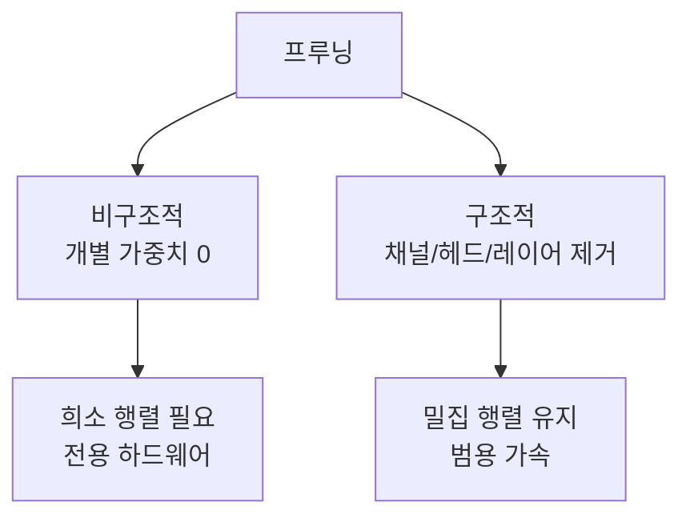

# 구조적 프루닝 이론

채널, 어텐션 헤드, 레이어 등 **구조적 단위**로 파라미터를 제거하여 모델을 실제로 축소하는 기법. 비구조적 프루닝(개별 가중치 0으로)과 달리 하드웨어 가속 없이도 실제 속도 향상을 얻는다.

## LLM 프루닝 기법

| 기법 | 원리 | 유형 |
|------|------|------|
| **SparseGPT** | 헤시안 기반 최적 가중치 제거 + 잔여 보정 | 비구조적 |
| **Wanda** | 가중치 크기 x 활성값 크기 = 중요도 | 비구조적 |
| **SlimGPT** | 채널 단위 구조적 프루닝 | 구조적 |
| **LLM-Pruner** | 그래디언트 기반 구조 중요도 | 구조적 |

## [[lottery-ticket-hypothesis|복권 티켓]]과의 관계

복권 티켓 가설은 "밀집 네트워크 안에 희소 승리 서브네트워크가 존재한다"를 주장. 구조적 프루닝은 이를 실전에서 찾아 **실제 모델 크기를 줄이는** 방법론.

## 관련 문서

- [[quantization-model-compression]] -- 양자화와 모델 압축
- [[lottery-ticket-hypothesis]] -- 복권 티켓 가설
- [[nm-sparsity]] -- N:M 희소성
