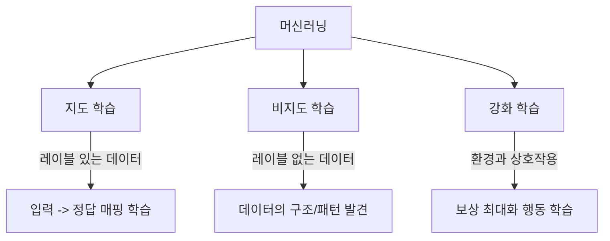
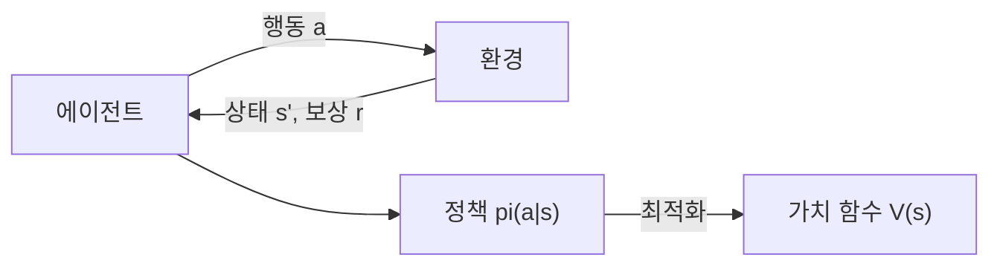

# 지도/비지도/강화 학습 (Supervised, Unsupervised & Reinforcement Learning)

머신러닝은 학습 데이터의 성격과 피드백 방식에 따라 세 가지 핵심 패러다임으로 나뉜다. 각 패러다임은 서로 다른 문제 유형에 적합하며, 현대 AI 시스템은 이들을 조합하여 사용한다.

## 세 패러다임 비교

| 특성 | 지도 학습 | 비지도 학습 | 강화 학습 |
|------|----------|------------|----------|
| 데이터 | 레이블 있음 | 레이블 없음 | 보상 신호 |
| 목표 | 입출력 매핑 | 구조 발견 | 보상 최대화 |
| 피드백 | 즉각적 (정답과 비교) | 없음 | 지연적 (보상) |
| 대표 과제 | 분류, 회귀 | 군집화, 차원 축소 | 게임, 로봇, 대화 |

## 지도 학습 (Supervised Learning)

레이블이 붙은 데이터(입력-정답 쌍)로부터 입력과 출력의 관계를 학습한다.

### 분류 (Classification)

이산적인 클래스를 예측한다:
- 이진 분류: 스팸/정상, 양성/음성
- 다중 분류: 이미지의 카테고리, 감정 분석 (긍정/부정/중립)
- [[loss-functions|교차 엔트로피 손실]]이 표준

### 회귀 (Regression)

연속적인 값을 예측한다:
- 주가 예측, 온도 예측, 부동산 가격
- [[loss-functions|MSE 손실]]이 표준

### 대표 알고리즘

- 선형/로지스틱 회귀
- 결정 트리, 랜덤 포레스트
- SVM (서포트 벡터 머신)
- 신경망 (CNN, RNN, Transformer)

### 장단점

- **장점**: 명확한 학습 목표, 성능 측정이 직관적
- **단점**: 대규모 레이블 데이터 필요 (비용 높음), [[overfitting-regularization|과적합]] 위험

## 비지도 학습 (Unsupervised Learning)

레이블 없이 데이터 자체의 구조와 패턴을 발견한다.

### 군집화 (Clustering)

유사한 데이터를 그룹으로 묶는다:
- K-Means: 가장 기본적인 중심 기반 군집화
- DBSCAN: 밀도 기반 군집화
- 계층적 군집화: 덴드로그램 기반

### 차원 축소 (Dimensionality Reduction)

고차원 데이터를 저차원으로 투영한다:
- PCA: [[linear-algebra-for-ml|고유값 분해]] 기반, 분산 최대 방향 추출
- t-SNE, UMAP: 시각화 목적의 비선형 차원 축소

### 밀도 추정 (Density Estimation)

데이터의 확률 분포를 추정한다:
- GMM (가우시안 혼합 모델): [[probability-statistics-for-ml|확률 분포]]의 혼합
- 이상 탐지: 정상 분포에서 벗어난 데이터 식별

### 자기지도 학습과의 관계

최근 LLM 사전학습(next-token prediction)은 레이블 없는 텍스트에서 학습하지만, 자기 자신이 레이블을 생성하므로 "자기지도 학습(self-supervised learning)"이라는 별도 범주로 분류되기도 한다.

## 강화 학습 (Reinforcement Learning)

에이전트가 환경과 상호작용하며 보상을 최대화하는 행동 정책을 학습한다.

### 핵심 구성 요소

- **에이전트 (Agent)**: 행동을 선택하는 학습 주체
- **환경 (Environment)**: 에이전트가 상호작용하는 세계
- **상태 (State)**: 현재 상황의 표현
- **행동 (Action)**: 에이전트가 취할 수 있는 선택
- **보상 (Reward)**: 행동의 결과에 대한 피드백
- **정책 (Policy)**: 상태에서 행동으로의 매핑

### 탐색-활용 딜레마 (Exploration-Exploitation)

- **탐색**: 새로운 행동을 시도하여 더 나은 전략을 찾는다
- **활용**: 현재까지 알려진 최선의 행동을 실행한다
- 이 균형이 강화 학습의 핵심 도전과제

### 대표 알고리즘

- Q-Learning, DQN (Deep Q-Network)
- Policy Gradient, PPO
- Actor-Critic (A2C, A3C)

### LLM과 강화 학습

현대 LLM의 정렬(alignment)에서 강화 학습이 핵심 역할을 한다:
- RLHF: 인간 피드백 기반 강화 학습
- RLVR: 검증 가능한 보상 기반 강화 학습
- GRPO, DAPO: 그룹 기반 정책 최적화

## 패러다임의 융합

현실의 ML 시스템은 한 가지 패러다임만 사용하지 않는다:

- **GPT 학습 파이프라인**: 자기지도(사전학습) -> 지도(SFT) -> 강화(RLHF)
- **추천 시스템**: 비지도(사용자 군집화) + 지도(클릭 예측) + 강화(실시간 최적화)
- **반지도 학습 (Semi-supervised)**: 소량의 레이블 + 대량의 비레이블 데이터 결합

## 관련 문서

- [[loss-functions]] -- 각 패러다임에 적합한 손실 함수
- [[bias-variance-tradeoff]] -- 지도 학습의 핵심 트레이드오프
- [[cross-validation-model-evaluation]] -- 지도 학습 모델의 평가 방법
- [[overfitting-regularization]] -- 지도 학습에서의 일반화 개선
- [[feature-engineering]] -- 지도/비지도 학습 전 데이터 전처리

## 참고 자료

- [Supervised vs Unsupervised vs Reinforcement Learning - NVIDIA Blog](https://blogs.nvidia.com/blog/supervised-unsupervised-learning/)
- [Supervised vs. Unsupervised vs. Reinforcement Learning - GeeksforGeeks](https://www.geeksforgeeks.org/machine-learning/supervised-vs-reinforcement-vs-unsupervised/)
- [Types of Machine Learning - DigitalOcean](https://www.digitalocean.com/resources/articles/types-of-machine-learning)
