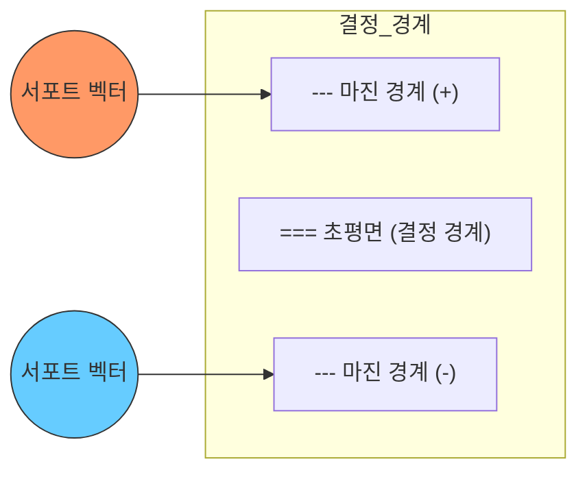
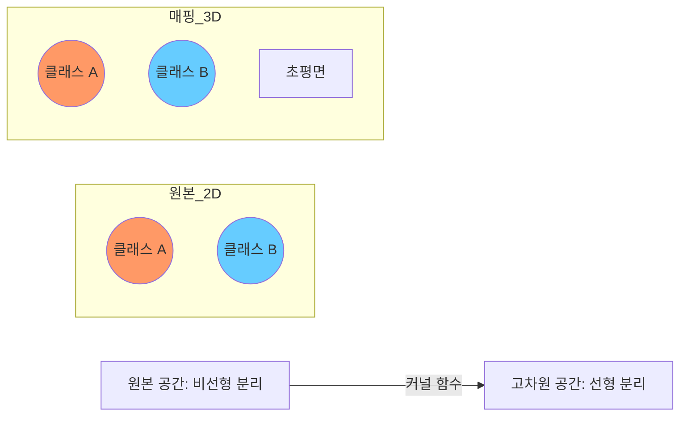

## 개요

서포트 벡터 머신(Support Vector Machine, SVM)은 데이터를 분류하는 최적의 초평면(hyperplane)을 찾는 지도 학습 알고리즘이다. AT&T Bell Laboratories에서 Vapnik과 동료들이 개발했으며, 두 클래스 사이의 마진(margin)을 최대화하는 결정 경계를 학습한다. 커널 트릭(kernel trick)을 통해 비선형 분류를 수행할 수 있으며, 고차원 데이터에서 특히 강력한 성능을 보인다. [[logistic-regression]]이 확률적 접근이라면, SVM은 기하학적 마진 기반 접근이다.

## 핵심 개념

### 최대 마진 분류기 (Maximum Margin Classifier)

SVM의 핵심 원리는 두 클래스를 분리하는 초평면 중 **가장 넓은 마진**을 가진 것을 선택하는 것이다. 마진이 넓을수록 새로운 데이터에 대한 일반화 성능이 좋아진다.

### 서포트 벡터 (Support Vectors)

서포트 벡터는 결정 경계에 가장 가까이 위치한 데이터 포인트들이다. 이 점들만이 초평면의 위치와 방향을 결정하며, 나머지 데이터 포인트는 분류기에 영향을 주지 않는다. 이 특성 때문에 SVM은 전체 데이터가 아닌 소수의 핵심 샘플에 의존하는 효율적인 모델이다.

### 하드 마진 vs 소프트 마진

**하드 마진(Hard Margin)**: 모든 데이터가 완벽히 분리될 수 있다고 가정. 노이즈나 이상치에 매우 민감.

**소프트 마진(Soft Margin)**: Cortes & Vapnik(1995)이 도입. 일부 오분류를 허용하면서 마진을 최대화한다. 하이퍼파라미터 C가 마진 크기와 오분류 허용 사이의 트레이드오프를 조절한다.

| C 값 | 동작 |
|------|------|
| 높은 C | 오분류 최소화 우선 (좁은 마진, 과적합 위험) |
| 낮은 C | 넓은 마진 우선 (일부 오분류 허용, 일반화) |

이는 [[bias-variance-tradeoff]]의 직접적 사례다.

## 커널 트릭 (Kernel Trick)

현실의 데이터는 선형으로 분리되지 않는 경우가 많다. 커널 트릭은 입력 데이터를 **고차원 특성 공간으로 암묵적으로 매핑**하여 비선형 분류를 가능하게 한다. 실제로 고차원 좌표를 계산하지 않고 내적만 커널 함수로 대체하므로 계산 효율이 높다.

### 주요 커널 함수

| 커널 | 수식 | 특성 |
|------|------|------|
| 선형(Linear) | K(x,y) = x . y | 선형 분리 가능한 데이터, 고차원 텍스트 |
| 다항식(Polynomial) | K(x,y) = (x . y + c)^d | 차수 d로 비선형성 조절 |
| RBF(Gaussian) | K(x,y) = exp(-gamma * \|\|x-y\|\|^2) | 가장 범용적, gamma로 영향 범위 조절 |
| Sigmoid | K(x,y) = tanh(alpha * x . y + c) | 신경망과 유사한 특성 |

RBF 커널이 실무에서 가장 널리 사용되며, gamma와 C 두 하이퍼파라미터를 [[cross-validation-model-evaluation]]로 최적화한다.

## 장점과 한계

### 장점

- **고차원 데이터에 강함**: 특성 수가 샘플 수보다 많을 때도 효과적 (텍스트 분류, 유전체 데이터)
- **메모리 효율**: 서포트 벡터만 저장하면 되므로 전체 데이터를 유지할 필요 없음
- **커널 유연성**: 문제에 맞는 커널을 설계하여 도메인 지식 반영 가능
- **이론적 기반**: VC 이론(Vapnik-Chervonenkis theory)에 의한 일반화 보장

### 한계

- **대규모 데이터에서 느림**: 학습 복잡도가 O(n^2)~O(n^3)으로 대량 데이터에 비실용적
- **확률 출력 부재**: 기본적으로 결정 경계만 제공. Platt scaling으로 확률 추정 가능하나 추가 비용
- **커널/하이퍼파라미터 선택**: 성능이 커널과 C, gamma 선택에 민감
- **다중 클래스**: 이진 분류가 기본. One-vs-One/One-vs-Rest 전략 필요

## 현대적 위치

딥러닝 이전 시대에 SVM은 텍스트 분류, 이미지 인식, 생물정보학에서 최고 성능 모델이었다. 현재는 [[perceptron-mlp]]와 딥러닝이 대부분의 영역에서 SVM을 대체했지만, 소규모 데이터셋, 고차원 특성 공간, 해석 가능성이 중요한 의료/과학 분야에서는 여전히 유효한 선택이다. [[decision-trees-random-forests]]의 XGBoost/LightGBM이 정형 데이터에서 SVM보다 선호되는 추세이나, 커널 SVM의 이론적 우아함은 ML 교육에서 핵심적 지위를 유지한다.

## 관련 문서

- [[logistic-regression]] - 확률적 선형 분류의 대안
- [[decision-trees-random-forests]] - 정형 데이터의 또 다른 강력한 모델
- [[bias-variance-tradeoff]] - C 파라미터에 의한 트레이드오프
- [[cross-validation-model-evaluation]] - 커널 및 하이퍼파라미터 최적화
- [[feature-engineering]] - SVM 입력을 위한 특성 스케일링
- [[pca]] - SVM 전처리를 위한 차원 축소
